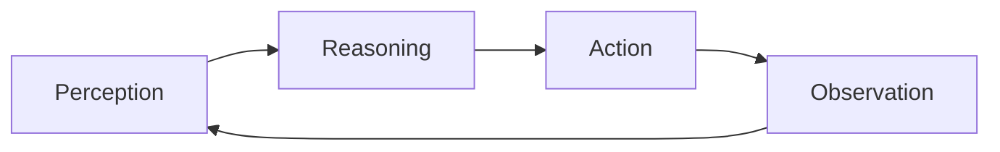
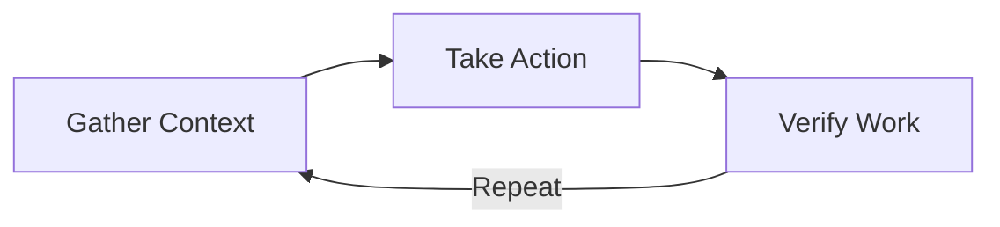
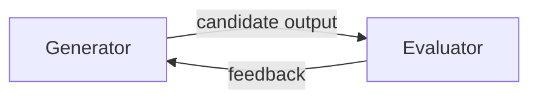
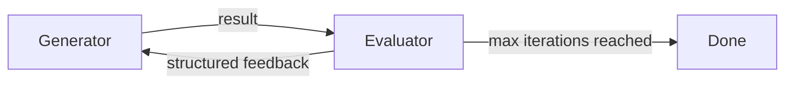

# Agentic Architecture — Complete Course Notes

*Foundations · Task Decomposition & Planning · Multi-Agent Orchestration · Reliability & Human Oversight*

---

## How to Read This Document

Autonomy increases along a spectrum:

```
Chatbot ──────────────► Workflow ──────────────► Agent
        (increasing autonomy)
```

| | Chatbot | Workflow | Agent |
|---|---|---|---|
| Control flow | None — one text response | Fixed, developer-authored | Model-selected at runtime |
| Decides next step | N/A | Developer (design time) | Model (inference time) |

---

# MODULE 1 — FOUNDATIONS

## 1. The Augmented LLM: The Base Building Block

Every agentic system is built from an **Augmented LLM** — a base model enhanced with three capabilities:

| Capability | What it means |
|---|---|
| **Retrieval & Tools** | The model generates its own search queries and selects the tools it needs, rather than waiting for a fixed script to hand it results. |
| **Memory** | The model decides what information to retain across steps, so context carries forward instead of resetting on every call. |

**Why an LLM alone is not an agent:** a bare LLM is text-in/text-out. It has:
- No direct access to files, APIs, or the real world
- Cannot execute code or perform actions
- No persistent memory between interactions
- Cannot observe results or learn from feedback

```
Files ⊘        APIs/Web ⊘
        LLM  (Text in → Text out)
Databases ⊘    Code Execution ⊘
```

A **chatbot** takes a message, processes it with an LLM, and predicts the next most likely tokens based on training patterns. The output is text — nothing more. It **cannot**: access files, call APIs, query databases, run code, or persist state.

## 2. Three Core Architectural Distinctions

| Term | Definition |
|---|---|
| **Agentic System** | A language model autonomously pursues a goal by selecting actions, invoking tools, and iterating until the goal is reached. |
| **Workflow (Deterministic)** | A fixed, developer-authored sequence of steps that runs predictably. Control flow is decided up front at design time. |
| **Autonomous Agent** | An agent that operates without step-by-step human direction, making its own decisions to reach the goal. |

**What makes a system agentic:** model-controlled flow at inference time.

| | Chatbots | Workflows | Agents |
|---|---|---|---|
| Behavior | Respond with text — do not act | Deterministic — author defines the flow | Dynamic — model selects tools while running |

```
Deterministic Workflow:              Agentic System:
Input/Trigger → Step 1 → Step 2 → Output      ┌── Goal ──┐
                                          Observe      Choose
                                          Result  ←   Tool
                                              ↑___Execute___|
                                          (repeat until goal met)
```

## 3. Beyond Text Generation: Three More Patterns

| Pattern | Description |
|---|---|
| **Tool Use** | LLMs call external tools and use the results in their reasoning: `LLM → Tool → Result` |
| **Prompt Chaining** | Break complex tasks into a sequence of smaller LLM calls, each step building on the last: `LLM1 → LLM2 → LLM3` |
| **Action-Environment Gap** | LLMs operate in text space while real-world actions happen outside; tool use bridges that gap: `LLM Output → Real World` |

*These patterns are not mutually exclusive — effective agents combine them.*

## 4. When to Choose an Agentic Architecture

Not every problem needs an agent — start by understanding the trade-off.

```
                   ┌── Choose a Workflow ──┐        ┌── Choose an Agent ──┐
                   │ Steps are predictable  │        │ Path to goal cannot │
                   │ and auditing matters   │        │ be scripted upfront │
                   └────────────────────────┘        └──────────────────────┘
```
> Higher autonomy means higher capability — and higher risk surface. Use minimal footprint and human-in-the-loop checkpoints.

---

## 5. Tool Use — The Foundation of Agency

Tool use turns a language model into a system that acts in the world.

### Building Blocks

| Block | Description |
|---|---|
| **Tool Definition** | A schema passed at inference time — name, description, parameter spec — that the model reads to decide whether to invoke the tool. |
| **Tool Call** | The structured output emitted when the model decides to use a tool: tool name plus JSON arguments the runtime will execute. |
| **Observation** | The result returned after a tool call executes, injected into context so the model can plan its next step. |

### The Tool Call Lifecycle (4 phases)

```
1. Model emits a structured  → 2. Runtime intercepts the call → 3. Result is captured and  → 4. Observation is added to
   tool-call output              and runs the underlying          formatted as an                the next context window
                                  function                          observation                    so the model can read it
```
The model then updates its plan based on what just happened.

### Pre-Scripted vs. Model-Driven Tool Use

| | Pre-Scripted (Workflow) | Model-Driven (Agentic) |
|---|---|---|
| Who decides | The developer decides which tools run, and their order, at design time | The model selects tools at inference time based on context and goal |
| Sequence | Fixed | Varies across runs |
| Note | Predictable and auditable when the task path is known | Higher adaptability, higher risk, requires robust guardrails |

### Description Quality Drives Tool Selection

Claude selects tools using natural-language descriptions in the schema, **not** by reading code. Poor descriptions are among the most common causes of unreliable agentic behavior.

| Vague | Precise |
|---|---|
| "Does something with data" — ambiguous, model cannot reliably decide when to call this | "Queries inventory by SKU, returns stock count" — clear, model knows exactly when and why to invoke this tool |

### Common Tool Categories

| Category | Examples |
|---|---|
| **Data Access** | Read files, query databases, fetch web content, or retrieve documents from a knowledge base |
| **Computation** | Execute code, run calculations, parse structured data, or call a sandboxed interpreter |
| **External APIs** | Write to outside services: send messages, create calendar events, update records, trigger workflows |

### How Observations Update the Model's Plan

The observation phase is what makes the agentic loop self-correcting:
- A successful result confirms progress → the model moves to the next step
- An error or unexpected result triggers **replanning**
- Partial results may prompt a follow-up tool call before proceeding

> This feedback loop distinguishes an **agent** from a **pipeline** — the model responds to what it learns.

### Three Runtime Concepts

| Concept | Description |
|---|---|
| **Tool Result Injection** | Formatting a tool's output as a context message so the model can incorporate the observation into its next response |
| **Parallel Tool Calls** | The model emits multiple tool-call outputs in one response; the runtime executes them concurrently and returns all observations |
| **Tool Call Loop** | The iterative cycle of tool call, execution, observation, and model response that runs until the agent hits its goal or a stop condition |

### Practical Examples Across Tool Types

| Tool Type | Behavior | Typical Failure Modes |
|---|---|---|
| **Web Search** | Model calls search tool, receives ranked results as observation | Stale index, throttling, irrelevant results |
| **File Read/Write** | Model reads a document, edits content, and saves it | File not found, permission errors, encoding issues |
| **Code Execution** | Model generates code, sandbox runs it, stdout as observation | Runtime errors, timeouts, sandbox limits |

---

## 6. The Four-Phase Agentic Loop

Every agent runs on a repeating cycle:



| Phase | Role |
|---|---|
| **Perception** | Reads and interprets the full context window: instructions, history, tool results. Identifies current goal state and available information. |
| **Reasoning** | Selects the next action from available tools/outputs. Weighs intermediate results against the goal. Dynamic planning lets the decision change as new information arrives. |
| **Action** | The agent emits a structured tool-call or final output — the step where it interacts with the external world: invoking APIs, running code, or writing a response. |
| **Observation** | The runtime returns the tool result into context. The agent reads this, updates its understanding, and feeds it into the next perception phase. |

**Core Loop Vocabulary:**

| Term | Definition |
|---|---|
| **Agentic Loop** | The repeating perceive-plan-act-observe cycle; the model reads context, selects an action, receives a result, and decides whether to continue or stop. |
| **Tool Use** | The capability to invoke external functions/APIs by emitting structured tool-call outputs that the runtime executes and returns as observations. |
| **Dynamic Planning** | A capability where the plan is generated or modified at runtime based on intermediate results. Steps are not predetermined. |

### Context Window as Working Memory

```
┌─────────────────── Context Window ───────────────────┐
│  Inputs                        Actions                │
│  Instructions, user message,   Each tool call emitted │
│  initial documents              by the agent this run │
│                                                         │
│  Observations                   Reasoning              │
│  Tool results returned by       Intermediate model     │
│  the runtime after each action  outputs capturing plan │
└─────────────────────────────────────────────────────────┘
```

### Memory and State Concepts

| Term | Definition |
|---|---|
| **Agentic System** | An architecture where a language model pursues a goal by perceiving context, selecting actions, and iterating until a termination condition is met |
| **In-Context Memory** | State stored in the active context window. Immediately accessible but ephemeral — lost when the session ends or context is cleared |
| **Tool Result** | The structured data returned after a tool call runs. Becomes an observation the agent incorporates into its next decision |

### Worked Example — Multi-Step Research Agent

```
Perception (reads query & prior results) → Reasoning (decides which search query to run next)
        ↑                                                    ↓
Observation (returns ranked results to context) ← Action (queries the search API)
```
The returned results become the next observation, and the loop continues.

**Key takeaways:** Perception reads context; reasoning picks the next step. Action invokes tools; observation returns results to context. The context window is the agent's ephemeral working memory. Each phase feeds the next in a continuous, adaptive cycle.

---

## 7. Loop Control — Stop, Iterate, Escalate

Knowing when to stop the loop, retry, or hand off is what makes an agent reliable.

```
                          ┌──► ITERATE
STOP ──► (evaluate) AGENT ┤
                          └──► ESCALATE
```

### Anthropic's Canonical Loop

Anthropic frames the agent loop as three blended phases that repeat until the job is done:



| Step | Description |
|---|---|
| **Gather context** | Pull in the information needed to decide the next move |
| **Take action** | Use a tool to actually change or query the world |
| **Verify work** | Check the result against the goal before continuing |

Loop control is simply deciding when this gather/act/verify cycle should stop.

### Loop Control Vocabulary

| Term | Definition |
|---|---|
| **Termination Condition** | An explicit rule that stops the loop: task done, error threshold hit, or a stop signal |
| **Turn Budget** | A hard cap on loop iterations, enforced by the runtime to stop runaway execution |
| **Escalation** | A controlled handoff to a human or fallback when the agent can't safely proceed |

### Four Termination Conditions

| Condition | Trigger |
|---|---|
| **Task Complete** | The agent has achieved its goal and produced final output |
| **Error Threshold** | Too many consecutive failures — the agent stops rather than cycling further |
| **Budget Exhausted** | Turn limit or token budget reached; execution halts programmatically |
| **Stop Signal** | Orchestrator or user explicitly instructs the agent to halt immediately |

### Infinite Loop Risks

Without explicit termination conditions, agents can loop forever:
- **Missing stop condition** — the agent never declares the task complete
- **Always-failing tools** — a broken API call retried endlessly
- **Circular reasoning** — the model revisits the same decision without new information

> An infinite loop is a design failure, not a feature.

### Turn Budgets and Max-Iteration Guards

- Set a `max_iterations` limit before the agent begins
- Track iteration count in the **orchestration layer**, not the model
- When the limit is reached, halt and surface whatever progress was made

> Guards belong in the runtime, not left to the model to self-enforce.

### Progress vs. Spinning

| Making Progress | Spinning |
|---|---|
| Each iteration produces a new observation, advances toward the goal, or closes an open question. Context shows forward movement. | The agent repeats similar actions without new results. Tool calls return the same errors. The plan doesn't change across iterations. Context grows but the goal state doesn't get closer. |

**Detecting spinning in practice:**
- Compare successive observations: are they meaningfully different?
- Track repeated tool calls with identical parameters
- Monitor the gap between goal state and current state across turns

> If the gap isn't closing, the agent is likely spinning.

### Iterate vs. Escalate — The Decision

```
                    Blocked?
                   /         \
             Iterate         Escalate
       (agent has new data   (at authorization boundary
        or another way to     or lacking needed
        try)                  information)
```
> Escalation is a designed safety valve, not a failure.

**Loop control as reliability design:** Runaway agents can burn through API quotas and incur unexpected costs. Agents that don't escalate can make unrecoverable decisions on their own. Proper termination conditions make agent behavior predictable and auditable.

> Reliability requires that every agent has a defined exit condition from day one.

---

## 8. Choosing Workflow vs. Agent

### When Workflows Outperform Agents

Deterministic workflows deliver **lower cost, higher reliability, and easier auditing** than agents for many problems.

### Three Core Contrasts

| Term | Definition |
|---|---|
| **Workflow (Deterministic)** | A fixed, developer-authored sequence of steps that executes predictably. Control flow decided up front, not while the model is running. |
| **Agentic System** | An architecture in which an LLM autonomously pursues a goal by selecting actions and invoking tools until a termination condition is met. |
| **Prompt Chaining** | A workflow pattern passing one LLM call's output as input to the next, creating a sequential pipeline with narrow, individually testable steps. |

### The Core Tradeoff

```
Predictability ◄─────────────────────────► Flexibility
```
- Workflows trade adaptability for predictability
- Agents trade predictability for open-ended flexibility
- Most real tasks fall closer to the workflow end

> Choosing agents when workflows suffice adds cost and risk without adding value.

### Workflow vs. Agent — Direct Comparison

| | Workflow | Agent |
|---|---|---|
| Control flow | Fixed | Dynamic, adaptive (with replanning) |
| Output | Predictable, auditable | Higher capability ceiling |
| Cost/Latency | Lower | Higher token cost, higher latency |
| Testability | Each step individually testable — failures easy to localize | Broader failure surface, harder to audit |

### Signals a Workflow Is Enough

All three must hold:
1. Input format is predictable and well-defined
2. Output format is known and testable
3. Every step can be specified at design time

### Five Core Workflow Patterns

```
Prompt Chaining:  A → B → C
Routing:          Input → (classifier) → branch
Parallelization:  Input → fan-out → {agents} → collect
Orchestrator-Subagent:  central node → {worker nodes}
Evaluator-Optimizer:    Generator ⇄ Evaluator (feedback loop)
```

### Routing and Parallelization

| Pattern | Behavior |
|---|---|
| **Routing** | Uses a classifier to sort inputs before processing. The router may call an LLM, but the topology stays fixed. |
| **Parallelization** | Fans out work and collects results at a sync point. |

Both patterns scale well and remain fully auditable.

### Cost and Reliability Levers

| Lever | Workflow Advantage |
|---|---|
| **Token Cost** | Fewer unplanned LLM calls; each step is scoped, so usage is predictable and budgetable |
| **Latency** | Steps can be pipelined or parallelized deliberately (vs. variable latency from unplanned replanning loops) |
| **Reliability** | Deterministic steps are individually testable; a workflow failure localizes to one step rather than spreading across a long reasoning trace |

### When NOT to Over-Index on Agents

- Agents increase token spend per task run
- Every autonomous decision is a failure surface
- Debugging agentic traces is harder than workflow logs

> Reach for agents only when workflows demonstrably fall short.

### Framework Vocabulary

| Term | Definition |
|---|---|
| **Incremental Complexity** | Start with the simplest architecture that solves the problem, then add agent behavior only where workflows demonstrably fall short |
| **Orchestrator** | The controlling component that decomposes a high-level goal, assigns subtasks to subagents/tools, and synthesizes the final result |
| **Over-Engineering** | Adding complexity — like agentic autonomy — that adds cost and risk without proportional benefit |

### Start With the Simplest Architecture

```
Prompt → (simple chain) → Agent
```
- A simple prompt chain beats a complex agent for scoped tasks
- Simplicity reduces cost, latency, and failure surface
- You can always add agent behavior later — starting complex and simplifying is much harder

### Signals That Agents Are Warranted

1. The goal is open-ended and cannot be fully pre-specified
2. Tool sequences are unpredictable at design time
3. The task requires dynamic replanning mid-execution

> If none of these apply, a workflow is likely sufficient.

### Three Tradeoff Axes

| Axis | Workflow | Agent |
|---|---|---|
| **Cost** | Lower | Higher — spend more tokens per run; justify only with genuine need |
| **Auditability** | Step-by-step auditable | Trades auditability for runtime flexibility |
| **Reliability** | Fails predictably at known steps | Adapts but introduces variable, harder-to-reproduce failure modes |

### Incremental Complexity in Practice

```
Workflow → Agent Step → Workflow
```
1. Build and validate the workflow version first
2. Identify the specific step where the workflow breaks down
3. Replace only that step with agent behavior

### Three Decision Scenarios

| Scenario | Description | Right Fit |
|---|---|---|
| **Workflow** | Extract structured data from a fixed document; predictable input, known output schema | Prompt chain with validation |
| **Agent** | Research a topic from open-ended web sources; unbounded goal, unpredictable tool sequences | Agent with planning |
| **Hybrid** | Route inquiries to specialists, then synthesize responses | Fixed routing topology + dynamic synthesis step feeding an agent |

### Evaluating Your Own Task — 4 Diagnostic Questions

1. Can every step be authored at design time?
2. Is the result format known and testable?
3. Does the task require runtime tool selection?
4. Does failure require dynamic recovery mid-run?

> Two or more "no" answers suggest agentic complexity is warranted.

**Choose the Right Architecture — Summary:**
- Incremental complexity keeps systems maintainable and debuggable
- Agents are warranted for open-ended goals and dynamic replanning
- Three tradeoff axes: cost, auditability, reliability (+ adaptability)
- Hybrid architectures combine workflow structure with targeted agent behavior

> Match architecture to what the task actually demands.

---

# MODULE 2 — TASK DECOMPOSITION & PLANNING

## 1. Breaking Goals Into Subtasks

Task decomposition is the skill of breaking complex goals into actionable subtasks.

```
                  Goal
          /         |         \
     Subtask     Subtask     Subtask   ✓
```

### Three Core Decomposition Terms

| Term | Definition |
|---|---|
| **Task Decomposition** | Breaking a high-level goal into smaller subtasks that can be assigned to agents, tools, or workflow steps |
| **Handoff Point** | The boundary between subtasks where one step's output becomes the next step's input. Requires an explicit schema. |
| **Orchestrator** | The controlling agent that decomposes goals, assigns subtasks, manages execution order, and synthesizes results |

### Why Decomposition Matters

Agentic systems require explicit structure — agents cannot infer what a complex goal demands.
- Large monolithic tasks are hard to retry on failure
- Smaller subtasks allow targeted error recovery
- Clear boundaries let multiple agents work together

### The Decomposability Spectrum

```
Monolithic ◄──────────── Well-decomposed ────────────► Over-decomposed
```

| Extreme | Problem |
|---|---|
| **Monolithic** | One large task, hard to retry, hard to delegate |
| **Well-decomposed** | Clear subtasks with defined inputs and outputs *(the goal)* |
| **Over-decomposed** | Too many tiny steps create coordination overhead |

### Monolithic vs. Decomposed Tasks

| | Monolithic Task | Decomposed Task |
|---|---|---|
| Structure | One agent handles everything | Goal split into well-defined subtasks |
| Failure | Fails completely on any error | Each piece can be retried, delegated, tested on its own |
| Cost | Simple to assign at first | Upfront design cost offset by long-term reliability |

### Analyzing a Goal for Decomposition

1. Can any part run independently of the rest?
2. Does one step's output feed directly into another?
3. Are there distinct capability domains that need different agents?

### What Makes a Good Subtask

| Trait | Description |
|---|---|
| **Single Responsibility** | Each subtask does one thing with a clear, testable output another step can consume |
| **Defined Inputs** | The subtask knows exactly what context and data it receives — nothing assumed from ambient state |
| **Bounded Scope** | Scope is contained enough to retry on failure without re-running the whole job |
| **Clean Output** | Output is structured and explicit, so the orchestrator can route results without parsing raw text |

### Designing Handoff Points

- Pass only what the next step needs — minimize payload size
- Use structured schemas so subagents don't misinterpret context
- Document what is **NOT** passed to prevent false assumptions

### The Cost of Decomposition

Decomposition isn't free — every boundary added introduces coordination overhead:
- More subtasks means more orchestration logic and latency
- Each handoff is a potential failure point in the chain
- Deeply decomposed systems are harder to trace and debug

> Balance reliability gains against the cost of more moving pieces.

---

## 2. Three Decomposition Patterns

```
Hierarchical:            Sequential:              Parallel:
      ○                  A → B → C                    ○
    /   \                                          /  |  \
   ○     ○                                        ○   ○   ○
```

| Pattern | Definition |
|---|---|
| **Hierarchical Decomposition** | Goals split into subgoals across multiple levels, forming a tree. Orchestrators delegate down; results flow back up. |
| **Sequential Execution** | Tasks performed in order, where each step may depend on the previous step's output before proceeding. |
| **Parallel Execution** | Independent subtasks run concurrently, reducing total runtime. Requires a synchronization point to collect results. |

### Hierarchical Decomposition

```
                    Goal
              /              \
         Subgoal           Subgoal
         /    \             /    \
      Task   Task        Task   Task
                (results flow back up)
```
- Top-level orchestrator holds the overall goal and delegates subgoals
- Each level handles only its tier of complexity
- Results flow back up through the hierarchy to be synthesized

*This mirrors how human organizations delegate work across management layers.*

**Depth vs. flatten:** Go deeper when subtasks require fundamentally different capabilities. Flatten when subtasks are similar enough to share one agent. Each added level increases error propagation surface.

### Sequential Decomposition

```
Step 1 → Step 2 → Step 3 → Step 4
output    output    output
```
- Step order is enforced because downstream steps need upstream output
- Easier to reason about and debug than parallel workflows
- Any failed step halts the chain until it's resolved

*Appropriate whenever genuine data dependencies exist between steps.*

### Parallel Decomposition

```
              Start
        /       |       \
   Branch    Branch    Branch
        \       |       /
              Fan-in
```
- Each parallel branch must be truly independent — no shared state
- A fan-in step collects all branch results before continuing
- Partial failure (some succeed, some fail) requires *explicit* handling

*This pattern is powerful but introduces failure scenarios sequential patterns avoid.*

### Combining Patterns in Real Systems

| Combination | Use Case |
|---|---|
| **Hierarchical + Sequential** | Orchestrator delegates to subagents that each run a sequential pipeline internally. Common in multi-stage document workflows. |
| **Hierarchical + Parallel** | Orchestrator fans out to multiple specialized subagents running concurrently. Used in multi-source research. |
| **Sequential + Parallel** | Pipeline stages run sequentially, but within each stage independent subtasks run in parallel to reduce latency. |

### Decomposition Anti-Patterns

| Anti-Pattern | Failure |
|---|---|
| **Over-decomposition** | So many steps that coordination costs exceed execution costs |
| **Under-decomposition** | Tasks too large to retry or delegate reliably |
| **False parallelism** | Treating dependent steps as independent, causing data hazards |

---

## 3. Sequential Pipelines — Design & Tradeoffs

### Three Pipeline Concepts

| Term | Definition |
|---|---|
| **Sequential Execution** | Tasks run one at a time in order. Each step may use the earlier output. Easy to debug, harder to speed up. |
| **Prompt Chaining** | One LLM call's output becomes the next call's input. Each step has a single, narrow job. |
| **Dependency Graph** | A map of which steps depend on which others. Reveals required ordering and steps that could run in parallel. |

### Pipeline Structure

```
Step One → Step Two → Step Three
output/input  output/input  output/input
```
- Step one produces a result, step two consumes it as its input
- Execution order is fixed and deterministic — no branching by default
- The pipeline halts if any step fails — there's no parallel fallback

### Dependency Graphs — Mapping Order

```
        A
       / \
      B   D
       \ /
        C
```
- Draw an edge from step A to step B if B needs A's output to run
- Steps with no incoming edges can run first — or potentially in parallel
- Steps with multiple incoming edges are synchronization points

### When to Use Sequential

| Trigger | Explanation |
|---|---|
| **Data Dependency** | Step B cannot start until step A finishes — the two cannot run at once |
| **State Accumulation** | Each step builds on context that earlier steps produced |
| **Ordered Transforms** | Operations run in a strict order, one stage at a time |
| **Simplicity Goal** | Debugging and auditability matter more than raw speed |

### Simplicity vs. Latency Accumulation

| Sequential Strengths | Sequential Costs |
|---|---|
| Easy to debug step by step; clear data flow; failures are isolated and easy to trace; no synchronization logic to manage | Total latency = sum of every step's latency; independent steps that could run concurrently are forced to wait; wasted wall-clock time when data dependencies don't actually exist |

### Designing Clean Handoff Schemas

```
Step N ──[schema]──► Step N+1
```
- Output schema of step N becomes the input contract for step N+1
- Explicit schemas catch mismatches early — before runtime failures
- Include required fields, types, and nullability in every handoff spec

> Loose handoffs cause silent data loss and hard-to-diagnose downstream errors.

### Error Cascades in Sequential Pipelines

```
Step 1 → [FAIL: Step 2] → Step 3 ✗ → Step 4 ✗
```
- Step three can't run if step two failed — no input to use
- Cascade risk grows with depth — more steps, more failure surface
- Early validation at step entry reduces how far bad data travels

> Design error handling at each step boundary, not only at the pipeline exit.

### True vs. Artificial Dependencies

| True | Artificial |
|---|---|
| `A → B` (needs output) | `A ⇢ B` (only by convention) |
| Step B reads a field produced by step A — ordering is required | Steps are sequential only by convention, not necessity |

> Removing artificial dependencies lets independent steps run at the same time. Audit your pipeline before committing to sequential ordering throughout.

---

## 4. Parallel Execution — Fan-Out and Fan-In

### Three Parallel Execution Terms

| Term | Definition |
|---|---|
| **Parallel Execution** | Multiple independent tasks run concurrently, reducing wall-clock time. Requires a synchronization point to collect outputs and handle partial failures. |
| **Fan-Out** | The step where a single task splits into multiple concurrent subtasks dispatched simultaneously. |
| **Fan-In** | The synchronization step that collects and aggregates results from parallel branches. Handles partial failures. |

```
         ┌─► Task ─┐
Start ───┼─► Task ─┼─► Fan-In
         └─► Task ─┘
```

### Fan-Out: Spawning Parallel Branches

```
                 ┌─► Branch 1
Trigger ─────────┼─► Branch 2
                 └─► Branch 3
```
- All branches are dispatched at the same time from a single control point
- Each branch runs independently with its own inputs and context
- Branches can be agents, tool calls, or subworkflows — not just simple functions

> Fan-out increases throughput but requires every branch to be truly independent.

### The Independence Test

Before fanning out, ask:
1. Can branch B start without waiting for any output from branch A?
2. Do branches write to shared state that could cause race conditions?
3. Would running branches in any order produce the same result?

> If any answer reveals a dependency, fan-out is incorrect for those branches.

### Four Fan-In Responsibilities

| Responsibility | Description |
|---|---|
| **Collect Results** | Gather outputs from every branch that completed successfully before timeout |
| **Handle Failures** | Decide what to do when one or more branches returned errors or timed out |
| **Order Results** | Reassemble outputs in the right order when sequence matters |
| **Merge and Continue** | Aggregate collected results and pass them to the next pipeline step cleanly |

### Partial Failure Handling

| Strategy | Description |
|---|---|
| **Fail the Pipeline** | Any branch failure aborts the whole operation |
| **Proceed with Partial Results** | Continue with what succeeded, flag what failed |
| **Retry Failed Branches** | Re-dispatch individual branches that returned errors |

> Silently dropping failed branches introduces silent failures — always handle explicitly.

### Result Merging Strategies

| Strategy | Description |
|---|---|
| **Voting** | Multiple branches answer the same question: majority result wins |
| **Concatenation** | Outputs from independent branches are joined into one list |
| **Structured Aggregation** | Each branch contributes a named field to a shared object |

> Choose the merge strategy before designing the branches — it shapes what each branch returns.

### Parallel vs. Sequential Tradeoffs

| | Parallel Execution | Sequential Execution |
|---|---|---|
| Total time | Reduces wall-clock time when branches are independent | Equals the sum of all step latencies |
| Cost | More tokens per unit time; introduces partial-failure scenarios | Cheaper per-run token spend; no synchronization needed |

### Cost vs. Latency in Parallel Execution

- Three branches running simultaneously use three times tokens per second
- Total token cost equals the sum across all branches, not just the longest one
- Rate limits and quotas may constrain how much concurrency is actually achievable

> Model the cost increase explicitly before choosing parallel over sequential.

---

## 5. Adaptive Planning Mid-Execution

Agentic systems don't always follow the plan they start with.

```
Agent ──► Plan ──[new info]──► replan ──► (updated Plan)
```

### Three Planning Concepts

| Term | Definition |
|---|---|
| **Static Planning** | A fixed sequence of steps authored before execution begins. Every action is known at design time; the agent follows the script without deviation. |
| **Dynamic Planning** | The model generates or revises its plan at runtime based on intermediate results, new information, or unexpected states. |
| **Replanning** | Revising the current plan in response to a failed step, unexpected tool output, or changed environmental state. |

### Static vs. Dynamic — Core Difference: *When* Steps Get Decided

| | Static (Design Time) | Dynamic (Inference Time) |
|---|---|---|
| Predictability | Predictable, auditable, cost-efficient. Every step pre-audited and testable in isolation — failures easy to localize | Adaptable and powerful for open-ended goals. Requires stronger monitoring, explicit fallbacks, tighter logging |
| Best for | Well-scoped, repeatable tasks with known inputs | — |

*Most production systems combine elements of both approaches.*

### Four Replanning Triggers

| Trigger | Description |
|---|---|
| **Tool Call Failure** | A tool returns an error, timeout, or empty result the plan did not anticipate |
| **Unexpected Output** | A step returns valid output that contradicts the assumption the next step was built on |
| **State Change** | The environment changes mid-execution, making earlier plan steps invalid or irrelevant |
| **Constraint Violation** | A proposed next action would breach a goal constraint or safety boundary |

*Each trigger requires the agent to adapt or escalate.*

### Replan vs. Continue — The Decision

```
Replan ──► Assumption still valid? ──► Continue
```
- Replan when a core assumption has been invalidated
- Continue when the deviation is minor and recoverable
- Check whether the original goal is still achievable

> Unnecessary replanning wastes tokens and adds latency to every run.

### Limiting Replanning Cycles

| Safeguard | Description |
|---|---|
| **Maximum Iterations** | A hard cap on the number of replanning cycles the agent is allowed. Prevents infinite loops when every new plan hits the same obstacle. |
| **Goal Constraint Check** | A validation step that confirms the revised plan still satisfies the original task requirements before execution continues. |
| **Loop Termination** | The condition that halts replanning: either the iteration limit is reached or the new plan clears all goal constraints. |

### Preventing Goal Drift

Replanning without constraint checking is one of the most dangerous agent failure modes.

```
Agent → Obstacle → (wandering) → Goal Anchor → Goal
```
- Each new plan should be validated against original intent
- **Drift** occurs when the revised plan solves the obstacle but ignores the goal
- Preserving plan state across cycles keeps the agent anchored

> Log the original goal and check every revised plan against it explicitly.

---

## 6. Handling Ambiguity and Incomplete Specifications

Agents rarely receive perfectly specified goals.

```
Ambiguous Goal ──┬──► Clarify
                 └──► Assume & Proceed
```

### Three Ambiguity Concepts

| Term | Definition |
|---|---|
| **Ambiguous Goal** | A task specification that does not fully define the expected outcome, leaving multiple valid interpretations open to the agent at execution time |
| **Clarify-First Strategy** | Pausing execution to request more information from a human before proceeding, used when the cost of a wrong assumption is high |
| **Assume-and-Proceed** | Making a reasonable inference and continuing without human input, used when the action is low-stakes, reversible, or time-sensitive |

### When to Clarify Upfront

| Signal | Description |
|---|---|
| **Irreversible actions** | Deletions, sends, or external commits |
| **High-cost operations** | Expensive API calls or long batch runs |
| **Scope uncertainty** | The agent doesn't know what's in or out |

> In these cases, a brief clarification prevents large downstream errors.

### When to Assume and Proceed

| Signal | Description |
|---|---|
| **Low-stakes or easily reversible actions** | Safe to assume on |
| **Time-sensitive tasks** | May not allow clarification delays |
| **Well-constrained context** | Can make the right interpretation obvious |

> Clarifying every ambiguity makes agents slow and annoying to use. The goal is appropriate judgment, not maximum caution.

### Clarify or Assume — Decision Criteria

| Criterion | Question |
|---|---|
| **Reversibility** | If the action can be undone easily, proceeding on an assumption carries lower risk than pausing |
| **Stake Level** | High-cost or high-impact operations justify clarification delays that would be unacceptable for routine tasks |
| **Scope Clarity** | Unclear task boundaries mean a wrong assumption can send the agent operating on entirely the wrong data |

### Iterative Refinement Loops (Evaluator-Optimizer)

When a single pass isn't enough, generate-evaluate-refine cycles close the quality gap.



| Role | Description |
|---|---|
| **Generator Agent** | Produces the initial or revised output. Receives structured feedback from the evaluator and applies it on the following pass. |
| **Evaluator Agent** | Assesses the generator's output against a rubric. Returns structured critique, not just a pass/fail signal. |
| **Convergence Criteria** | The threshold or condition that stops the loop: either a quality bar is met or an iteration cap is hit. |

### Documenting Assumptions

When an agent proceeds on assumptions, those assumptions should be visible:
- State assumptions explicitly in agent output or logs
- This enables human review without rerunning the full task
- Well-documented assumptions reduce audit burden significantly

> Designing goal specs to be precise at the source reduces ambiguity from the start.

**Handling Ambiguity — Summary:**
- Clarify upfront for irreversible, high-cost, or scope-uncertain tasks
- Assume and proceed for low-stakes, reversible, or time-sensitive tasks
- Evaluator-optimizer loops refine output iteratively with bounded iterations
- Document assumptions in agent output to support human reviewability

---

# MODULE 3 — MULTI-AGENT ORCHESTRATION

## 1. The Orchestrator Role

The orchestrator is the central controller that decomposes goals, delegates subtasks, and synthesizes results.

```
                Orchestrator
              /      |       \
         Subagent Subagent Subagent
```

### Three Orchestration Concepts

| Term | Definition |
|---|---|
| **Orchestrator** | The controlling agent that breaks a high-level goal into subtasks, assigns them to subagents, and aggregates the results |
| **Task Decomposition** | Breaking a complex goal into smaller, manageable subtasks that can be delegated to individual agents or tools for execution |
| **Result Aggregation** | Collecting outputs from multiple subagents, validating them, and synthesizing them into a single coherent response to the original goal |

### Three Functions of the Orchestrator

```
Decompose → Assign → Aggregate
```

| Function | Description |
|---|---|
| **Decompose** | Break the high-level goal into bounded subtasks |
| **Assign** | Route each subtask to the appropriate subagent or tool |
| **Aggregate** | Collect, validate, and synthesize subagent outputs |

*All three must be designed explicitly — none happen automatically.*

### Task Assignment: Matching Subtasks

- Each subtask should have a clear, narrow scope before assignment
- Match based on tool access, context, and output format requirements
- The orchestrator holds the routing logic — subagents don't self-select

> Poorly scoped subtasks are the most common cause of subagent failure.

### What the Orchestrator Retains

| Component | Holds |
|---|---|
| **Orchestrator** | Master plan, execution state, error handling logic, aggregation rules, final synthesis. The **only** component with visibility across all subtask results. |
| **Subagents** | Only what the orchestrator explicitly provides: their specific instructions, the context for their subtask, and the tools needed. Nothing more. |

### Result Aggregation — Three Steps

```
Collect → Validate → Synthesize
```
| Step | Description |
|---|---|
| **Collect** | Gather all subagent outputs once they complete |
| **Validate** | Check each output against expected format or schema |
| **Synthesize** | Combine validated outputs into one coherent result addressing the original goal |

### Error Handling at the Orchestrator

```
                 ┌─► Retry (reissue with same/adjusted instructions)
Subagent fails ──┼─► Substitute (route to an alternate agent/tool)
                 └─► Escalate (surface failure to a human)
```
> Error handling logic lives in the orchestrator, not in subagents.

### Hub-and-Spoke Topology

The orchestrator pattern maps directly to a hub-and-spoke topology:

```
        Subagent       Subagent
              \         /
             Orchestrator
              /         \
        Subagent       Subagent
```
- The orchestrator is the hub — all coordination flows through it
- Subagents are spokes — they don't communicate with each other
- All state and routing decisions are centralized at the hub

*Tradeoff: a single point of failure and a coordination bottleneck.*

### Designing for Observability

```
AUDIT LOG
• Assign task A to Subagent 1
• Task A completed
• Error occurred while handling task B
```
- Log each task assignment decision with its routing rationale
- Record progress state after each subagent completes
- Capture error events with the context that triggered them

> Observability logging turns the orchestrator from a black box into an audit trail.

**Orchestrator Role — Summary:** Three functions (decompose, assign, aggregate) directing all shared state. Task assignment matches subtasks to capable subagents by scope and format. Error handling: retry, substitute, or escalate.

---

## 2. Subagent Design — Scope and Authority

Subagents are most reliable when narrowly scoped, operating within explicit authority limits, and receiving only the context they need.

```
Orchestrator ───► Subagent
```

### Three Subagent Concepts

| Term | Definition |
|---|---|
| **Subagent** | A separate agent instance spawned by a parent orchestrator to handle a delegated subtask within its own bounded context and tool permissions |
| **Context Isolation** | Subagents operate in their own context window. No information passes from orchestrator to subagent unless directly handed over |
| **Authority Boundary** | The defined set of actions a subagent is permitted to take — exactly what the task needs and nothing more |

### Context Isolation Explained

```
Orchestrator                    Subagent
[CONTEXT: history, state] ─X──► [CONTEXT: (empty by default)]
              explicitly passed ───►
```
- Each subagent has its own separate context window
- Information must be explicitly passed by the orchestrator
- Nothing in the orchestrator's history or state is visible unless passed

> *This is the most frequently missed fact in orchestrator-subagent design.*

**Why context isolation matters** (it is a deliberate benefit, not a limitation):

| Benefit | Description |
|---|---|
| **Less Bloat** | Subagents don't carry irrelevant history |
| **Less Leakage** | Limits information leaking between tasks and agents |
| **Lower Cost** | Minimal context per subagent reduces token cost |

*Isolation also makes subagents individually testable without the full orchestrator.*

### What to Pass vs. What to Withhold

| Pass Explicitly | Withhold by Default |
|---|---|
| Task-specific instructions, the data/content needed for this subtask, required output format and success criteria, any constraints the subagent must respect | Full orchestrator conversation history, outputs from other subagents, system prompts, credentials, and context not relevant to this specific subtask |

### Scoping Subagent Authority

| Principle | Description |
|---|---|
| **Least Privilege** | Grant access only to the tools and data the subtask requires. No extra permissions by default. |
| **Explicit Boundaries** | State clearly in instructions what actions are permitted and what is out of scope. |
| **No Side Effects** | Don't modify shared state or act outside assigned scope without orchestrator approval. |

```yaml
allowed_tools: ["read_file", "search"]
deny: ["write", "delete", "shell"]
```

### Writing Effective Subagent Instructions

- **Define narrow scope** — exactly what the task is and isn't
- **Specify the output format** precisely so aggregation is reliable
- **State success criteria** explicitly so the subagent knows when it's done

```
Subagent Prompt:
Task: extract all dates
Output: JSON list of dates
Done: every date captured
```
> Vague instructions produce inconsistent outputs that break aggregation.

### Testing Subagents Independently

Well-designed subagents are substitutable and independently testable:
- A subagent should run correctly given only its explicit inputs
- No hidden dependencies on orchestrator state or other subagents
- Being swappable means changing implementations without breaking the system

> If a subagent can't be tested alone, it's probably doing too much.

### Anti-Patterns in Subagent Design

| Anti-Pattern | Failure Mode |
|---|---|
| **Overly Broad Scope** | The subagent is asked to do too much at once |
| **Underpowered Context** | Critical information wasn't passed explicitly |
| **Unclear Success Criteria** | The subagent doesn't know when it's done |

*Each anti-pattern produces a different failure mode but all are preventable.*

**Subagent Design — Summary:** Context isolation (subagents receive only what's explicitly passed), authority boundaries (least privilege, no side effects), instruction design (narrow scope, specific output format, clear success criteria). Subagents built to be swappable are independently testable and more dependable.

---

## 3. Multi-Agent Topologies

### Three Topology Patterns

```
Hub-and-Spoke:      Pipeline:              Peer-to-Peer:
    ○   ○           ○→○→○                  ○───○
     \ /                                    │╳│
      ○                                     ○───○
     / \
    ○   ○
```

| Topology | Definition |
|---|---|
| **Hub-and-Spoke** | A central orchestrator routes all tasks and communication to peripheral agents. Spokes do not communicate with each other. |
| **Pipeline** | Agents arranged in a linear sequence. Each agent processes input from the previous agent and passes output to the next. |
| **Peer-to-Peer** | Agents communicate directly with each other without a central coordinator. No single node controls all communication. |

### Hub-and-Spoke: Structure, Strengths, Failure Modes

**Structure:** all communication routes through a central orchestrator; spokes do not talk directly.

| Strengths | Costs / Failure Modes |
|---|---|
| Centralized state management | Single point of failure at the hub |
| Simple failure handling owned by one node | Hub's capacity caps total system throughput |
| Clear audit trail for every decision | Hub context grows with each active spoke — token bloat risk |
| Easy to enforce consistent delegation policies | More spokes amplify both bottleneck and risk |

### Pipeline Topology: Strengths and Failure Modes

```
Stage 1 → Stage 2 → Stage 3 → Stage 4
```
**Strengths:** Every agent has a narrow, single responsibility within the sequence. Stages are modular and easy to swap, test, or replace independently. Each stage produces a clean artifact the next stage uses as full input.

*Ideal when transformations are strictly ordered and each output is testable.*

**Failure modes:** Latency and failure risk accumulate as the chain grows longer.
- Total latency = sum of all stage latencies — no stage runs concurrently
- A failed mid-stage agent blocks every downstream stage that needs its output
- Cascade failure risk grows with depth

> Design explicit error handling at every stage boundary, not only at the exit.

### Peer-to-Peer Topology Tradeoffs

| Low Latency | Resilient | Emergent Risk | Hard to Audit |
|---|---|---|---|
| Agents talk directly, skipping a central coordinator for every message | No single agent failure takes down the whole system | Complex inter-agent behavior is harder to predict, test, and control | No central log or state, so tracing decisions means inspecting every agent |

### P2P vs. Hub-and-Spoke — Key Contrasts

They sit at opposite ends of the coordination spectrum:
- P2P has no single point of failure — any agent can fail without halting the system
- P2P removes the hub bottleneck and cuts message routing overhead
- P2P has no central state — coordination is distributed and harder to reason through

> Choose based on whether auditability or resilience is the higher priority.

### Three Topologies — Core Tradeoffs

| Topology | Optimizes For | Cost |
|---|---|---|
| **Hub-and-spoke** | Centralized control, simple auditing | Single point of failure |
| **Pipeline** | Modular stages, clean handoffs | Latency accumulation, cascade risk |
| **Peer-to-peer** | Low latency, resilience | Hard to audit and predict |

> Knowing each topology's failure mode matters as much as knowing where it wins.

### Three Advanced Topology Concepts

| Term | Definition |
|---|---|
| **Evaluator-Optimizer** | One agent produces a result; a second reviews it and feeds back fixes |
| **Hybrid Topology** | Combines two or more topology patterns when no single one fits all parts of the workflow |
| **Topology Anti-Pattern** | Using a topology that clashes with the work structure, adding cost and failures |

### Decision Framework — Map Task to Topology

| Task Structure | Topology |
|---|---|
| Natural hierarchy — one controller delegating to specialists? | **Hub-and-Spoke** |
| Strict ordered transformation — each step depends on the last? | **Pipeline** |
| Loosely coupled — no shared state, no required ordering? | **Peer-to-Peer** |

> The topology that matches the task's natural structure minimizes coordination overhead.

**When to choose each:**
- **Hub-and-Spoke:** natural hierarchy exists, auditing/compliance demand a single decision log, clear delegation paths exist and spokes have no need to talk directly. *With no natural hierarchy, forcing hub-and-spoke creates unnecessary bottlenecks.*
- **Pipeline:** each stage depends on the previous stage's output (ordering required by data), each stage produces a clean testable artifact, swapping/upgrading one stage without touching others is a design requirement. *If stages can run concurrently, pipeline forces unnecessary sequential latency.*
- **Peer-to-Peer:** agents are loosely coupled with no shared state/ordering, the system needs to keep running even if individual agents fail, low message-routing latency is a primary requirement. *Do not use P2P when regulatory/operational needs demand a complete audit trail.*

### Evaluator-Optimizer Pattern (Detailed)



| Component | Role |
|---|---|
| **Generator** | Produces the initial draft, plan, or answer |
| **Evaluator** | Critiques against a defined rubric, returns feedback |
| **Iteration Loop** | Generator revises until the quality threshold is met |
| **Termination** | A maximum iteration count prevents infinite loops |

### Topology Anti-Patterns

| Anti-Pattern | Failure |
|---|---|
| **Hub-and-Spoke Anti-Pattern** | Applying hub-and-spoke to a task with no natural hierarchy. Spokes could talk directly, yet every message routes through a coordinator that adds no value. |
| **P2P Anti-Pattern** | Using peer-to-peer when a complete audit trail is required. Distributed state makes the full decision log impossible to rebuild, so auditing/debugging needs go unmet. |

### Hybrid Topologies in Practice

```
    Orchestrator ──► Pipeline ──► P2P
   (hub-and-spoke)  (A→B→C)   (mesh subagents)
```
- A hub-and-spoke orchestrator can delegate to an internal pipeline for ordered transforms
- A pipeline stage can spawn P2P agents for parallel subtasks with loose coupling
- Each boundary between patterns needs an explicit handoff

> Identify which subsystem each pattern serves before designing the boundaries. Hybrids are valid — every pattern boundary needs an explicit handoff.

---

## 4. Designing Agent-to-Agent Schemas

Freeform handoffs produce brittle systems; well-designed schemas make them reliable.

```
Sender Agent ──► [SCHEMA] ──► Receiver Agent
```

### Three Schema Concepts

| Term | Definition |
|---|---|
| **Handoff Message** | A structured payload with task, context, output format, and constraints the receiver needs |
| **Context Isolation** | Subagents have their own context; nothing passes unless the handoff includes it |
| **Schema Versioning** | Version tags on handoff formats so receivers parse messages even as the schema evolves |

### Why Unstructured Handoffs Fail

| Failure | Description |
|---|---|
| **Missing Context** | Receiver lacks the information needed to act correctly |
| **Inconsistent Format** | No agreed structure means brittle, error-prone parsing |
| **Implicit Assumptions** | Sender assumes the receiver knows things it does not |

> Structured schemas eliminate each of these failure modes explicitly.

### Core Schema Components — 4 Required Elements

```json
{
  "task": "...",
  "context": [".."],
  "format": "json",
  "constraints": [".."]
}
```
| Element | Description |
|---|---|
| **Task description** | What the receiver is asked to produce |
| **Relevant context** | Only the facts the receiver needs |
| **Output format** | Exactly what structure the result takes |
| **Constraints** | Boundaries, scope limits, safety restrictions |

### Include vs. Exclude in Handoffs

| Include | Exclude |
|---|---|
| Task, relevant facts, output format, and explicit constraints the receiver needs to act without the sender's context | Full conversation history, internal deliberation, sender state, and redundant context |

### Two Handoff Failure Patterns

| Pattern | Failure |
|---|---|
| **Under-Specified** | Receiver lacks enough context to act, so it guesses or fails. The sender assumed it knew more than it did. |
| **Over-Specified** | Receiver gets the full sender context. This inflates cost, adds noise, and slows parsing with irrelevant detail. |

### Schema Versioning Principles

```json
{ "schema_version": "2.1", "task": "..." }
```
- Tag every message with a schema version field
- Receivers handle missing optional fields gracefully
- New required fields need a migration path for older senders

> Forward compatibility keeps multi-agent systems stable during updates.

### Testing Handoff Schemas

```
Build message → Validate schema → Receiver runs
                       ↓ (fail)
                    Reject
```
- Contract tests confirm required fields are present
- Simulate the receiver with the schema alone to check sufficiency
- Test with missing fields to verify graceful degradation

> A schema test suite is the simplest form of inter-agent integration testing.

### Designing for Agent Substitutability

```
        SCHEMA
       /   |   \
  Rcvr A  Rcvr B  Rcvr C
```
- Specify the interface, not the receiver's implementation
- Avoid fields only one specific agent knows how to use
- Receivers that share a schema should be interchangeable

> Substitutability lets you swap implementations without rewriting callers.

**Agent Handoff Schema Design — Summary:** Include task/context/format/constraints; exclude everything unneeded; version schemas and test for forward compatibility; design against an interface, not a specific receiver implementation.

---

## 5. Handoff Protocols and Agent Continuity

Passing a message isn't a completed handoff — verification and continuity make it reliable.

```
Sender ──handoff──► Receiver
   ▲───────ack───────┘
```

### Three Handoff Protocol Concepts

| Term | Definition |
|---|---|
| **Handoff Verification** | Confirming the receiver is prepared before the sender hands off the task |
| **Error Propagation** | How subagent failures surface back to the controller so it can respond |
| **Silent Failure** | A handoff that looks successful but loses critical info, with no error signal |

### Handoff Verification Steps

```
Sender                          Receiver
  │──① send handoff─────────────►│
  │◄────② acknowledge receipt────│
  │──③ confirm ready─────────────►│
```
> Without verification, the sender assumes success with no confirmation.

### Designing Error Propagation

- Subagents return structured error payloads, not silent nulls
- Error payloads include failure type, context, and recovery hints
- Orchestrators need explicit error paths, not only happy paths

```json
{ "type": "timeout", "context": "...", "recovery": "retry" }
```

### Transparent vs. Silent Failure

| Transparent Failure | Silent Failure |
|---|---|
| The subagent returns a structured error with type and context, so the orchestrator can retry or halt | The handoff looks successful but drops critical info. No error is raised, so the failure surfaces much later |

### Two Propagation Anti-Patterns

| Anti-Pattern | Description |
|---|---|
| **Swallowing Errors** | A subagent catches an exception and returns empty output. The orchestrator assumes success and never learns it failed. |
| **Undifferentiated Errors** | Every failure returns the same generic code. The orchestrator can't tell a retryable timeout from a hard violation. |

### Continuity Across Handoff Failures

```
Task step → [CHECKPOINT] → Task step → Task step → ✗ Failed handoff
                ▲──────────────────resume────────────┘
```
- Save task state before initiating any handoff
- Record the last confirmed good checkpoint, not just latest attempt
- Retry resumes from the checkpoint, not from the beginning

> Without checkpointing, a failed handoff forces the full workflow to restart.

### Designing for Agent Substitutability (Protocols)

```
       Protocol
       /   |   \
 Agent A Agent B Agent C
```
- Protocols specify behavior, not the implementing agent
- Any compliant receiver can process the same handoff
- Swapping one implementation for another needs no protocol change

### Audit Logging for Handoffs

```
audit log
handoff A → B    ok
verify   ack      ok
error    timeout  B
```
- Log every handoff: sender, receiver, timestamp, payload summary
- Log verification results: acknowledgement received or timeout
- Log errors with enough context to reconstruct what the receiver had

**Reliable Handoffs — Summary:** Verify handoffs (receiver acknowledges receipt/readiness before release); propagate errors with structure (type, context, recovery hints); checkpoint state before handoffs so failures don't force full restarts; audit every handoff so silent failures become visible.

---

## 6. Memory and State Management

### In-Context State vs. External Memory

```
In-Context State  ◄──read/write──►  External Memory
```

### Three Memory Concepts

| Term | Definition |
|---|---|
| **In-Context State** | What the agent knows right now, inside its live context |
| **External Memory** | Persistent stores outside the model that survive truncation |
| **Semantic Retrieval** | Querying a vector index by meaning to recall relevant chunks |

### In-Context State — Speed and Limits

- Zero retrieval latency — read inline, no fetch step
- Bounded by the context window — can't hold unlimited info
- Lost when the session ends or the window fills up

> Fast and simple, but not durable — any interruption can erase unwritten state.

### External Memory — Persistence and Query

```python
memory.write(key, value)
memory.read(key)
```
- Persistent across sessions — survives truncation and restarts
- Requires explicit read and write tool calls, adding latency
- Searchable and structured — key lookup, filtering, semantic search

### In-Context vs. External Memory — Comparison

| | In-Context State | External Memory |
|---|---|---|
| Latency | Instant, no tool call | Tool call needed |
| Durability | Lost on truncation | Persists between runs |
| Best for | Transient state | Durable state |

### Types of External State Stores

| Store Type | Access Pattern |
|---|---|
| **Key-Value Store** | Fast exact match by ID — user profiles, session data |
| **Relational DB** | Structured queries, joins, filtering — audit logs, records |
| **Vector Index** | Semantic similarity search — history/document recall |

### Where Should State Live? (Core Question)

Does state need to survive beyond the current context?

| State Type | Description |
|---|---|
| **Hot State** | Actively changing this turn, referenced often — keep in context |
| **Cold State** | Rarely read, needed across sessions — persist externally |
| **Reconstructable** | Can be rebuilt from tools or sources — skip storing it |

> Default to in-context for speed; escalate to external only when durability requires it.

### Four State Survival Questions

1. **Survives interruption?** If the session ends mid-task, is this state recoverable without external persistence?
2. **Needs semantic query?** Does the agent retrieve state by meaning or similarity rather than exact key?
3. **Shared across sessions?** Does another session or user need to read the same state later?
4. **Reconstructable?** Can the state be rebuilt cheaply from source data or tool calls if lost?

### Hybrid Approaches — Hot and Cold Tiers

```
Hot Tier (in-context): Active plan, current step, recent tool outputs
        ▲── load minimal state on resume ──▼
Cold Tier (external): Completed results, configuration, history
```
> Hot tier keeps the active plan, current step, and recent outputs in context.

**In-Context and External Memory Tradeoffs:**
- **In-context:** zero-latency, lost on truncation or session end
- **External:** persistent, queryable, requires tool call per access
- Choose by whether state must survive interruption
- **Hybrid:** keep hot state in context, cold state externally

---

## 7. Session Continuity — Turns and Failures

Sessions can be interrupted at any point; agents must resume without losing progress.

```
●──checkpoint──●──resume──►✗ interruption
```

### Three Continuity Concepts

| Term | Definition |
|---|---|
| **Session Resumption** | Resuming a task from a checkpoint after interruption, without repeating completed steps |
| **Checkpoint** | A saved snapshot of task progress at a phase boundary to recover after a failure |
| **State Versioning** | Tracking which environment version a checkpoint used, to detect conflicts on resume |

### What Session Resumption Requires

| Requirement | Description |
|---|---|
| **Completed Steps** | What has already been executed and confirmed |
| **Current Inputs** | What the next step needs to proceed |
| **Prior Results** | Outputs from earlier steps still needed downstream |

> Without all three, the agent repeats completed work or starts from scratch.

### Checkpoint Design — What to Persist

```json
{ "phase": 3, "steps_done": 12, "ts": "14:02" }
```
- Persist at the end of each **major phase**, not after every tool call
- Include completed step count, phase identifier, and next-phase inputs
- Write the checkpoint before any irreversible action

### Checkpoint Minimum Contents

| Field | Description |
|---|---|
| **Phase Marker** | Which phase completed, so resumption skips all prior phases |
| **Step Outputs** | Results from completed steps that downstream phases depend on |
| **Task Inputs** | The original task parameters, so context can be reconstructed |
| **Timestamp** | When the checkpoint was written, for conflict detection and ordering |

### Coarse vs. Fine-Grained Checkpoints

| Coarse Checkpoints | Fine-Grained Checkpoints |
|---|---|
| Saved at phase boundaries only. Fewer saves, simpler state. May repeat some work in the current phase. **Best for most agentic workflows.** | Saved after every step. Minimal repeated work, but high write volume and complex state. Justified only when steps are costly. |

### Failure Detection and Recovery

```
Session start ──► Checkpoint exists? ──No──► Begin fresh
                          │Yes
                          ▼
                    Verify integrity
```
- On start, check for an existing checkpoint before beginning fresh
- If one exists, verify its integrity before trusting it
- Load it and skip all phases already marked completed

### State Versioning and Conflict Resolution

```
Checkpoint (saved v1) ⇄ CONFLICT ⇄ Current Environment (live v2)
```
- Version the checkpoint with a timestamp and environment hash
- On resume, compare the current environment to the recorded version
- If it changed, flag the conflict instead of proceeding on stale state

### Memory Hygiene — Pruning Stale State

- Identify state no longer relevant to current or future phases
- Before pruning, confirm whether content should be archived first
- Prune from context to free tokens and from stores to cut noise

> Stale state can cause the agent to act on outdated facts.

**Session Continuity — Summary:** Checkpoints capture phase progress, step outputs, and task inputs. Coarse phase-boundary checkpoints are simpler and enough for most workflows. State versioning detects conflicts when the environment shifts between saves. Memory hygiene prunes stale state before it misleads future decisions.

> Partial state beats no state — design for graceful degradation at every phase.

---

## 8. Multi-Agent Cost and Fit

More agents can outperform one, but they cost far more and add coordination overhead.

```
Orchestrator
  /    |    \
Sub  Sub   Sub
```

### Three Terms to Anchor

| Term | Definition |
|---|---|
| **Single Agent** | One model running in a loop, calling tools and holding the whole task in one context window |
| **Orchestrator** | A lead agent that plans work and spawns subagents, then combines their results |
| **Subagent** | A worker agent given a scoped slice of the task, running in its own separate context |

### The Token Economics

| Configuration | Relative Token Cost |
|---|---|
| **Chat** | 1× (baseline) |
| **Single Agent** | ~4× chat tokens |
| **Multi-Agent** | ~15× chat tokens |

- More agents means more model calls, so more tokens
- A plain chat turn is the one-times baseline
- A single agent runs about four times chat tokens
- A multi-agent system runs about fifteen times chat tokens

### Where the Cost Comes From

| Source | Description |
|---|---|
| **Orchestrator Overhead** | The lead agent spends tokens planning, delegating, and merging before real work |
| **Parallel Fan-Out** | Each subagent repeats its own setup context and reasons independently |
| **Result Stitching** | Combining every subagent output into one answer takes another expensive model pass |

### Coordination and Latency

```
Orchestrator ──► Subagent ──► Subagent, Subagent ──► Reconcile
```
- Splitting work adds complexity, not just cost
- The orchestrator must decompose the task cleanly up front
- Subagents can drift or duplicate effort without tight instructions
- Results must be gathered and reconciled before you answer

### Good Fit vs. Poor Fit

| Good Fit | Poor Fit |
|---|---|
| Breadth-first work you can split into many independent directions that explore in parallel, like researching a large set of separate sources | Tightly-coupled work where agents share one context and depend on each other, where a single agent stays cleaner, faster, and cheaper |

### Two Task Shapes and a Trap

| Shape | Description |
|---|---|
| **Breadth-First** | Work that branches into many independent lines, each explorable on its own thread |
| **Tightly-Coupled** | Work where each step depends on the last and everything needs one shared context |
| **The Coding Trap** | Most coding tasks have fewer parallel pieces than research, so they often fit one agent |

### The Fit Rule

```
Parallel? → Own context? → Worth the cost? → Multi-Agent
```
- Multi-agent shines when subtasks are truly independent
- Can the work split into parallel directions that barely touch?
- Does each piece fit its own context with no shared state?
- Is the task valuable enough to justify the token bill?

### Matching Models to Roles

```
Orchestrator: Opus 4.8
       ↓
Worker: Sonnet 4.6   Worker: Haiku 4.5
```
- Soften the cost by matching models to roles
- A stronger model like Opus 4.8 leads as orchestrator
- Lighter workers like Sonnet 4.6 or Haiku 4.5 handle subtasks
- Reserve the design for high-value tasks that repay the spend

**When Multi-Agent Earns Its Price:**
- Multi-agent power comes at a steep, multiplying token cost
- Roughly fifteen times chat tokens versus four for one agent
- Cost stacks from planning, fan-out, and merging results
- Good fit is breadth-first, independent, parallel work
- Poor fit is tightly-coupled work needing shared context

> Reach for it only when the value clearly repays the bill.

---

# MODULE 4 — RELIABILITY & HUMAN OVERSIGHT

## 1. Error Classification

Agentic systems fail in three distinct ways, each requiring a different recovery strategy.

```
                Agent
        /         |         \
  Tool Error  Reasoning   Environment
              Error        Error
```

### Three Error Categories

| Category | Description |
|---|---|
| **Tool Error** | An external tool, API, or service errors or times out. May be transient or permanent. |
| **Reasoning Error** | The model produces a wrong plan or misreads a result. Retrying identical input fails again. |
| **Environment Error** | Infrastructure below the tool fails: network, database, or file system. Often transient. |

### Why Classification Matters for Recovery

Misclassifying wastes retries or misses escalation.

| Error Type | Correct Strategy |
|---|---|
| **Tool Errors** | Retry with backoff, or switch to a fallback tool |
| **Reasoning Errors** | Modify the prompt or correct context — do **not** retry blindly |
| **Environment Errors** | Often resolved by waiting and retrying after a delay |

### Tool Errors: Transient vs. Permanent

```
Tool Error
   /            \
Transient      Permanent
```

| Transient | Permanent |
|---|---|
| Network timeout, rate limit, temporary unavailability. Retry with backoff. | Invalid input, permission denied, resource not found. Do not retry. |

> HTTP signals the category: 5xx transient, 4xx typically permanent.

**Transient tool error examples:**

| Error | Description |
|---|---|
| **Network Timeout** | API did not respond in the allowed window. Retriable with a short delay. |
| **Rate Limit** | Too many requests in a window. Wait for the backoff period, then retry. |
| **Temporary Unavailability** | Service is momentarily down. Use exponential backoff with a max retry limit. |

**Permanent vs. Transient (full detail):**
- **Permanent:** Invalid input, permission denied, resource not found. The identical call fails again. Recovery needs a fallback tool, a different input, or escalation. Never retry blindly.
- **Transient:** Timeout, rate limit, temporary unavailability. The same call may succeed if retried after a delay. Use exponential backoff with a max retry count. Log each attempt.

### Reasoning Errors — Internal Failures

Reasoning errors come from within the model, not from external tools or infrastructure.
- The model makes a wrong plan, picks the wrong tool, or misreads a result
- Retrying identical input fails again — the model's context hasn't changed
- Recovery needs prompt modification, context correction, or escalation

> Reasoning errors are the only category where the model itself is the failure point.

### Environment Errors — Below the Tool

```
Agent (plan)
Tool (logic)
Environment (network, database, file system)
```
Examples: network partition, database down, file permission failure. The tool's logic and the model's plan are correct — the environment blocks execution. Often transient; resolves without model or tool changes.

> Distinguish from tool errors by *where the failure originates*, not its symptom.

### The Classification Rule

Ask: **where did the failure originate?** The answer determines the recovery route.

| Origin | Category |
|---|---|
| The tool/API reports failure | **Tool Error** — failure is in the external service |
| The tool ran, but the plan/interpretation was mistaken | **Reasoning Error** — the model is at fault |
| The tool couldn't reach its own dependencies | **Environment Error** — failure is in infrastructure |

> Misclassifying an error type delays recovery and risks cascading failures downstream.

---

## 2. Error Detection — Catching Failures Early

Silent failures raise no error signal; downstream proceeds on bad data without warning.

```
[validation gate] → silent failure → □ → □
        └──────── bad data propagates ────────┘
```

### Three Detection Concepts

| Term | Definition |
|---|---|
| **Silent Failure** | Output looks successful but is wrong, incomplete, or corrupted. No error signal is raised. |
| **Validation Gate** | A checkpoint that inspects step output against criteria before letting execution continue |
| **Error Propagation** | A failure in one stage flows downstream, causing cascading failures across the pipeline |

### Silent Failures — Why They're Dangerous

- No exception or error code is raised — execution continues normally
- Downstream stages receive bad data and build further work on top of it
- By the time the error surfaces, its origin may be several steps back

> Silent failures need validation gates — error-code retry logic won't catch them.

### Detection Strategy 1: Output Validation

Validate a step's result against a defined schema or constraint before it moves forward.

| Check | Description |
|---|---|
| **Schema Checks** | Required fields present; correct types, no unexpected nulls |
| **Range Checks** | Numeric values stay in bounds; string lengths stay capped |
| **Completeness Checks** | All required sections populated; no truncated responses |

*Output validation catches structural errors and silent failures status codes miss.*

**Schema vs. Semantic Validation:**

| Schema Validation | Semantic Validation |
|---|---|
| Verifies structure: required fields, correct types, no unexpected nulls. Fast and automatable. Catches formatting errors and truncated output. Does not check whether content is correct. | Verifies meaning: is the output plausible given the input? Are values in expected ranges? Catches silent failures that pass schema checks but are logically wrong. |

### Detection Strategy 2: State Verification

Check whether the world matches what the agent expects after a step.

| Check | When |
|---|---|
| **After a Write** | Confirm the record was actually persisted correctly |
| **After a Transform** | Verify the output reflects the intended change |
| **After an API Call** | Validate the side effect occurred, not just that the call returned |

*State verification catches actions that appeared to succeed but had no real effect.*

### Detection Strategy 3: Sanity Checks

Ask whether an output is plausible given the input, beyond schema checks.
- Is output length reasonable? A one-word answer to a complex query signals trouble
- Are key entities from the input present in output? Missing actors suggest truncation
- Does the output contradict known facts provided in the input context?

> Sanity checks are the last line before semantic errors silently enter downstream stages.

### Four Validation Gate Responsibilities

```
Inspect Output → Trigger Retry → Trigger Fallback → Trigger Escalation
```
| Step | Description |
|---|---|
| **Inspect Output** | Check schema, ranges, completeness, and plausibility |
| **Trigger Retry** | If validation fails, retry the step with corrected input or prompt |
| **Trigger Fallback** | If retry is exhausted, route to a fallback path or degrade gracefully |
| **Trigger Escalation** | If fallback fails, surface the error to a human reviewer or monitor |

### Logging and Observability Strategies

```
Trace
12:00:01  ●
12:00:03  ●
12:00:05  ●  (anomaly flagged)
12:00:07  ●
12:00:09  ●
```
- Log inputs and outputs at every stage boundary, not only on errors
- Use structured log formats so fields are queryable and filterable
- Execution traces record the full sequence of steps, tool calls, and outcomes
- Anomaly detection flags unusual patterns before users report failures

> Observability turns a silent failure into a diagnosable, fixable event.

**Detection Closes the Observability Gap** — Silent failures are hardest, since they produce no error signal:
- Output validation checks schema, ranges, and completeness
- State verification confirms actions had their intended effect
- Sanity checks verify output plausibility against the input
- Validation gates intercept failures before downstream propagation

---

## 3. Retry Logic — When to Retry, When to Abort

Not every failure deserves a retry; classify the error, then choose a policy or abort.

```
Failure
  /       \
Transient  Persistent
 →Retry     →Abort
```

### Three Retry Concepts

| Term | Definition |
|---|---|
| **Transient Error** | A temporary failure likely to resolve on its own: timeouts, rate limits, network blips |
| **Persistent Error** | A failure retrying will not fix: invalid input, permission denied, reasoning errors |
| **Exponential Backoff** | Wait time doubles after each failure, with jitter, to prevent retry storms |

### The Core Retry Question

Before retrying any failure, ask one question: **is this error likely to resolve if I try again?**

```
Likely to resolve on retry?
     Yes → Transient (a retry policy is appropriate)
     No  → Persistent (retrying just delays the real fix)
```
> Answering the wrong way costs tokens, adds latency, and masks the root cause.

### Transient vs. Persistent Error Classes

| Transient | Persistent |
|---|---|
| Rate limit hit, request timeout, temporary network failure, service overload. Likely to clear on its own — retry with a policy. | Invalid input format, permission denied, authentication failure, reasoning error. Will not clear — abort and escalate. |

> Ambiguous (e.g. a 500): use one conservative retry with a delay, then treat as persistent.

### Immediate vs. Delayed Retry Policies

| Immediate Retry | Fixed Delay |
|---|---|
| Only for momentary glitches that resolve in milliseconds. Rare in agentic workflows. Spamming retries under load makes overload worse — rarely the right default. | Simpler to implement. Adds a constant wait between attempts. Does not adapt to bursts or system overload. Better than immediate, but backoff is more reliable. |

### Exponential Backoff with Jitter

*The gold-standard retry policy for most transient errors.*

```
1s → 2s → 4s → 8s (cap)
```
- Wait time doubles after each failure: 1s, 2s, 4s, 8s, up to a cap
- Jitter adds randomness to prevent synchronized retry storms across clients
- Apply only to transient errors — backoff on persistent errors only postpones failure

### Retry Policies by Error Type

| Error | Policy |
|---|---|
| **Transient: Rate Limit** | Exponential backoff with jitter. Respect `Retry-After` headers when present. |
| **Transient: Timeout** | Fixed delay or short exponential backoff. One to three retries max. |
| **Persistent: Invalid Input** | Abort immediately. Retrying identical input produces identical failure. |
| **Persistent: Reasoning Error** | Abort and escalate. The same prompt cannot fix the plan. |

### Retry Budgets — Cost and Latency Limits

```
MAX 3 ATTEMPTS
● ● ● ○ ○ → 3 attempts → ✗
```
- A retry budget sets the maximum number of attempts before aborting
- Each additional retry multiplies token spend and total wait time
- Retry budgets keep pipeline latency bounded and predictable

> Design the budget around acceptable latency and cost, not just error probability.

### When to Abort — Abort Conditions

| Condition | Description |
|---|---|
| **Budget Exhausted** | Maximum attempts reached, still failing. Abort and escalate. |
| **Persistent on First Try** | No retry is warranted. Abort immediately, before spending further. |

> Abort is not silent failure — it triggers escalation and surfaces the error upstream.

**Retry Logic — Summary:** Transient errors are retriable; persistent errors should abort immediately. Exponential backoff with jitter is the standard policy for transient failures. Retry budgets bound cost and latency — uncapped retries are a design flaw. Abort triggers escalation, not silent failure.

---

## 4. Fallback Chains and Graceful Degradation

When a primary action fails and retrying won't help, the agent needs an alternative path.

```
✗ Tool A → Tool B → Cached Result → Escalate
```

### Three Fallback Concepts

| Term | Definition |
|---|---|
| **Fallback Chain** | An ordered sequence of alternatives tried when the primary action fails, ending in escalation |
| **Graceful Degradation** | Returning a useful but incomplete result while explicitly signaling the reduced quality downstream |
| **Silent Degradation** | Returning a degraded result with no signal; downstream wrongly treats it as full success |

### Fallback Chains — Structure and Purpose

- Each step is a pre-validated alternative: Tool B, cached result, simplified approach
- Steps execute in order, each one only if the previous step also failed
- The chain always ends in an explicit terminal: escalate or return a partial result

> Fallback chains make failure handling systematic rather than ad-hoc.

### Pre-Validating Every Fallback Step

```
Fallback 1 ✓ ─┐
Fallback 2 ⚠ ─┼─ (each must be validated before deployment)
Fallback 3 ✓ ─┘
```
- An untested fallback may introduce new failure modes under the same conditions
- Validate that each alternative actually works when the primary fails
- Confirm fallback outputs meet the minimum quality bar downstream requires

> An untested fallback looks like a safety net but may not hold under real conditions.

### Graceful vs. Silent Degradation

| Graceful Degradation | Silent Degradation |
|---|---|
| Returns a partial/lower-quality result and explicitly signals the degradation downstream. The limitation is visible. Downstream logic can adjust or escalate based on the signal. | Returns a degraded result with no signal. Downstream treats it as full quality. Errors compound silently and surface later as incorrect results that are hard to trace. |

### Propagating Degradation Signals

```
Fallback fires [DEGRADED] → Result + flag → Downstream adjusts
```
- Include a degradation flag or metadata field in the output object
- Downstream components check the flag and adjust confidence or routing
- Signals prevent downstream from treating partial results as authoritative

### Fallback Chain Anti-Patterns

| Anti-Pattern | Failure |
|---|---|
| **Untested Fallbacks** | Deploying a fallback never validated in production introduces new failure modes exactly when the system can least afford them |
| **Silent Masking** | A fallback chain that hides degradation from downstream components produces silent failures that compound undetected across the pipeline |

### Partial Success vs. Full Failure

```
Partial result safe to use?
     Yes → Partial Success (return useful/incomplete + degradation signal)
     No  → Full Failure (return nothing, escalate)
```
> The choice depends on whether a partial result causes downstream harm.

### When to Escalate vs. Degrade

| Low Risk, Reversible | High Risk, Irreversible |
|---|---|
| Degraded output is acceptable. Propagate the signal and continue. | Degraded output may cause unrecoverable harm. Escalate to a human. |

*Irreversible actions — deletions, payments, communications — demand a higher threshold.*

**Fallback Design — Summary:** Pre-validate every fallback step before production. Graceful degradation requires explicit signals, not silent quality reduction. Partial success is valid when downstream can handle incomplete data. Irreversible, high-risk actions require escalation rather than degraded output.

> The worst fallback is one that masks failure entirely and lets silent errors compound.

---

## 5. Guardrails — Prompts vs. Programmatic Enforcement

Prompt guardrails are useful behavioral guidance — but **probabilistic, not guaranteed.**

| Prompt Guardrail (~probabilistic) | Code Enforcement (guaranteed) |
|---|---|
| "You must never issue a refund over $100 without a manager sign-off." | `if refund > 100: require_approval() else: process(refund)` |

### Three Core Concepts

| Term | Definition |
|---|---|
| **Prompt Guardrail** | A behavioral rule in a system prompt. Easy but probabilistic; it can fail. |
| **Programmatic Enforcement** | Code-layer checks that enforce limits the model cannot bypass |
| **Silent Failure** | A response that looks successful but is actually wrong; validation gates catch it |

### What Prompt Guardrails Actually Are

Prompt guardrails are behavioral guidance embedded in instructions:
- They ask the model to avoid certain outputs or actions
- They rely on the model choosing compliance at inference time
- They are **not** code checks and produce no deterministic guarantee

> Compliance is the expected outcome, but it is not architecturally enforced.

### The Probabilistic Problem

LLM outputs are probabilistic — "usually follows" is not a guarantee.

| Failure Source | Description |
|---|---|
| **Context Drift** | Long conversations erode the salience of prompt instructions |
| **Adversarial Inputs** | Crafted prompts can elicit non-compliant outputs |
| **Edge Cases** | Novel inputs fall outside training distribution coverage |

> Each failure mode is rare — but rare is not acceptable in high-stakes paths.

### Sufficient vs. Insufficient Use Cases

| Sufficient: Low-Stakes | Insufficient: High-Stakes |
|---|---|
| Tone, style, formatting, reversible actions with no legal/financial consequence. A failure here is recoverable and low-cost. Probabilistic compliance is acceptable. | Financial transactions, PII handling, safety-critical or irreversible actions. A failure here can cause legal, financial, or safety harm. This level of risk is not tolerable. |

### Three Prompt-Only Failure Modes

| Mode | Description |
|---|---|
| **Adversarial Inputs** | Crafted user inputs steer the model past its prompt instructions. No wording fully resists a determined attacker. |
| **Context Drift** | In long runs, early constraints lose salience as new context accumulates. Effective attention shifts. |
| **Edge Case Coverage** | Unusual inputs not seen in training can produce non-compliant outputs even with no attack. |

### The Core Design Principle

**Prompts guide. Code enforces.** These are different roles.

| Prompts Guide | Code Enforces |
|---|---|
| Reduce the frequency of non-compliant outputs | Prevent non-compliant outputs from reaching the execution layer |

> Using a prompt to replace a code check is an architectural mistake, not a shortcut.

### When Code Must Enforce

The cost of non-compliance determines what layer must do the enforcing:
- **Financial transactions:** amount limits and authorization checks in code
- **PII handling:** redaction and masking enforced by output filters
- **Safety-critical actions:** hard blocks before execution, not after

> When the cost of a single failure is high, enforcement belongs in code.

---

## 6. Layered Enforcement Architecture

Reliable high-stakes systems use multiple enforcement layers together — no single layer is sufficient alone.

```
Prompt Layer → Validation Layer → Runtime Layer
```

| Layer | Function |
|---|---|
| **Prompt Layer** | Behavioral guidance and tone — first line of intent |
| **Validation Layer** | Schema and business-rule checks in code |
| **Runtime Layer** | Live monitoring for cost, scope, and anomaly signals |

### Three Enforcement Concepts

| Term | Definition | Example |
|---|---|---|
| **Validation Gate** | A checkpoint that inspects a step's output before execution continues | A schema check on tool output |
| **Escalation Trigger** | A condition that pauses the agent and routes to human review, balancing safety against friction | A $10,000 transfer pauses for human approval |
| **Programmatic Enforcement** | Code-layer constraints the model is unable to override | Code blocks any refund above the set limit |

### Programmatic Validation Layers

```
Request → [Pre-Execution] → [Post-Execution] → [Runtime] → Action
```

**Pre-Execution Validation** — checks inputs before the agent takes any action:

| Check | Description |
|---|---|
| **Schema Validation** | Confirm inputs match the expected structure and types |
| **Range Checks** | Verify numeric values fall within allowed parameter bounds |
| **Permission Check** | Confirm the caller is authorized to request this action |

> Invalid inputs stopped early cost far less than invalid actions caught later.

**Post-Execution Validation** — checks outputs before they're acted upon downstream:

| Check | Description |
|---|---|
| **Schema Compliance** | Confirm the response matches the required structure |
| **Business Rules** | Verify the output satisfies domain-specific constraints |
| **Anomaly Detection** | Flag outputs that are valid in form but semantically unusual |

> Post-execution gates catch model errors that pre-execution checks can't see.

### Pre-Execution vs. Post-Execution Gates

| Pre-Execution Gate | Post-Execution Gate |
|---|---|
| Runs before the agent acts. Catches invalid inputs, out-of-range parameters, unauthorized requests. Keeps bad inputs from reaching the model. Lower cost than catching errors later. | Runs after the agent produces output but before it is committed. Catches output schema violations, business-rule failures, semantic anomalies input checks couldn't anticipate. |

### Two Gate Response Patterns

| Pattern | Description |
|---|---|
| **Hard Block** | Rejects the output and halts/retries. Applied to non-negotiable constraints: financial limits, permissions, safety boundaries. |
| **Soft Warning** | Flags and logs the output but allows execution to continue. Used for advisory constraints where human judgment adds value. |

### Runtime Checks During Execution

Runtime checks monitor the agent continuously while it's running, not just at boundaries.

| Check | Description |
|---|---|
| **Cost limits** | Token budgets and API spend caps enforced mid-run |
| **Iteration caps** | Maximum loop counts to prevent runaway agent cycles |
| **Scope enforcement** | Detect when the agent accesses out-of-bounds resources |

> Runtime checks are the safety net when pre- and post-execution gates aren't enough.

### Layered Enforcement in Practice

```
Prompt Layer (lowest cost) → Pre-Execution → Post-Execution → Runtime
```
Depth is what makes a high-stakes pipeline defensible across failure modes.

### Balancing Strictness and Flexibility

Over-strict enforcement creates friction that stalls legitimate workflows:
- Use hard blocks only for non-negotiable safety and compliance constraints
- Use soft warnings for advisory constraints where human review adds value
- Reserve escalation triggers for ambiguous cases requiring human judgment

> Calibration means matching the enforcement response to the actual risk level.

**Layered Enforcement — Summary:**
- **Pre-execution:** schema, range, and permission checks before the agent acts
- **Post-execution:** output schema, business rules, and anomaly detection after generation
- **Runtime:** cost limits, iteration caps, plus scope enforcement during execution
- Match enforcement response to risk: hard block, soft warning, or escalation

> Layered enforcement is the architecture that makes probabilistic LLM results reliable.

---

## 7. Claude Code Hooks — Lifecycle-Based Enforcement

Claude Code hooks run your own commands at specific moments in an agent's lifecycle.

```
Session (SessionStart / SessionEnd)
  └─ Turn (UserPromptSubmit / Stop)
       └─ Tool (PreToolUse / PostToolUse)
```

### Three Ideas Behind Hooks

| Term | Definition |
|---|---|
| **Hook** | A command you register to run automatically when a specific lifecycle event fires in Claude Code |
| **Lifecycle Event** | A named moment, like a tool call or session start, where hooks get a chance to run |
| **Blocking Hook** | A hook that can stop the action from happening, signaled by exiting with code two |

### Events Grouped by Cadence

| Cadence | Events |
|---|---|
| **Once per session** | Fires once at session start/end |
| **Once per turn** | Fires around each prompt submit and stop |
| **Every tool call** | Wraps every pre-tool-use and post-tool-use call |

### Session-Level Events

```
[SessionStart] ────────────────────── [SessionEnd]
```
- **SessionStart** runs when a session begins or resumes
- **SessionEnd** runs when the session terminates
- Both are **observe-only**, so they cannot block anything
- Set up context on entry or clean things up on the way out

### Turn-Level Events

```
UserPromptSubmit ────────────────── Stop
```
- **UserPromptSubmit** fires when you send a prompt, before Claude reads it
- **Stop** fires when Claude finishes responding
- Both **can block**, which makes them useful gates
- Prompt-submit can reject or reshape a prompt; stop can force more work

### PreToolUse vs. PostToolUse

| PreToolUse | PostToolUse |
|---|---|
| Fires **before** a tool runs. It can block the call — your gate for guarding risky or unwanted tool use. | Fires **after** a tool succeeds. It cannot block (the tool already ran) — use it to react, log, or check output. |

### Moment-Specific Events

| Event | Description |
|---|---|
| **PreCompact** | Fires just before context compaction and can block it — protect what gets summarized away |
| **Notification** | Fires when Claude Code sends a notification; observe-only, for alerting you |
| **Permission events** | Fire around permission prompts; a permission request can be denied by a blocking hook |

### How a Hook Speaks Back

| Exit Code | Meaning |
|---|---|
| **Exit zero** | Success. Claude Code reads any structured output the hook printed and continues normally. |
| **Exit two** | A blocking signal. For hooks that can block, exit two stops the action and feeds your message back. |
| **Other codes** | Treated as a non-blocking error for most events, so the action still proceeds anyway. |

### Block vs. Observe

```
Block: PreToolUse, Stop, PreCompact
Observe: PostToolUse, SessionStart/End, Notification
```
- **PreToolUse** blocks a tool; **Stop** keeps the agent working
- **PreCompact** can block compaction before context is trimmed
- **PostToolUse** only reacts, since the tool already finished
- Pick a blocking event for a gate, an observe-only one for a log

### Choosing the Right Hook

| Goal | Hook |
|---|---|
| Guard a dangerous command? | Reach for **PreToolUse** |
| Auto-format or lint after an edit? | Use **PostToolUse** |
| Load project context on entry? | Use **SessionStart** |

> Cadence tells you *when*; the blocking column tells you *whether you can intervene*.

**Right Hook for the Job — Summary:** Session start/end bracket the session, observe-only. Prompt submit and stop bracket each turn, can block. Pre-tool-use blocks a tool, post-tool-use only reacts. Exit code two lets a blocking hook stop an action. Pick cadence for *when*, blocking for *whether* you step in.

---

## 8. Escalation Trigger Design — Human-in-the-Loop (HITL)

Human-in-the-loop escalation is a risk-mitigation strategy, not a fallback of last resort.

```
Agent → Trigger → [Human Review] → Resume
```

### Three Escalation Concepts

| Term | Definition |
|---|---|
| **Human-in-the-Loop (HITL)** | A human is placed in the agent's path at defined checkpoints to review or approve actions |
| **Escalation Trigger** | A defined condition that pauses an agent for human review, such as a confidence drop |
| **Programmatic Enforcement** | Code-layer mechanisms that enforce constraints no matter what the model outputs |

### HITL as Risk Mitigation

HITL is a deliberate architectural choice to manage risk at specific decision points:
- **Not** a fallback when the agent is confused — a proactive safety gate
- Placed where the consequences of an error are high and hard to reverse
- Misuse as a general fallback trains reviewers to approve reflexively

> Effective HITL is targeted, not ubiquitous.

### Valid Trigger: Irreversible + High-Stakes

The strongest signal for a valid escalation trigger is **irreversibility combined with stakes**:
- Financial transactions, data deletion, account changes — hard to undo if wrong
- The cost of a mistake exceeds the cost of a human review cycle
- Irreversibility means the agent cannot self-correct after the fact

> If the agent cannot undo it alone, gate it with a human first.

### Valid Trigger: Confidence and Scope

| Trigger | Description |
|---|---|
| **Low Confidence** | Model uncertainty on ambiguous inputs exceeds the safe operating range |
| **Scope Boundary** | The task drifts beyond authorized bounds or expected parameters |
| **Retry Exhausted** | Repeated failure after defined retries signals a structural problem |

> Each trigger shares one feature: the agent has reached the limit of its authority.

### Invalid Triggers — Over-Escalation

| Invalid Trigger | Why |
|---|---|
| **Every Uncertain Move** | Escalating on every uncertain step erodes automation value |
| **Low-Stakes Reversible** | If the action is easily undone, HITL only creates friction |
| **Code-Covered** | Actions already handled by code need no human review |
| **Gut Feel** | Ungrounded triggers cause inconsistent escalation |

### Under-Escalation vs. Over-Escalation

| Under-Escalation | Over-Escalation |
|---|---|
| The agent acts on high-stakes decisions without review. Irreversible errors occur before humans can intervene. Low friction, but high tail risk on a consequential action. | The agent interrupts constantly on low-stakes steps. Reviewers grow fatigued and approve without reading. Defeats automation's purpose; friction becomes the dominant cost. |

### Designing Triggers as Conditions

Escalation triggers must be defined as **explicit, testable conditions** before deployment:
- "Confidence score below 0.7 on classification" — not "when it seems unsure"
- "Cost estimate exceeds $500" — not "when the action feels expensive"
- "Third retry failure" — not "when it keeps failing"

> Condition-based triggers are auditable, adjustable, and consistent across runs.

### The Calibration Tradeoff

```
Too Tight ◄──────── threshold ────────► Too Loose
(excessive interruptions)        (unchecked risk)
```
- Too tight creates excessive interruptions — automation value erodes
- Too loose allows unchecked risk — safety gates stop doing their job
- Monitor escalation rates in production and tune from reviewer input

> The right threshold today may be wrong after workflow changes.

**Escalation Trigger Design — Summary:**
- HITL is a risk-mitigation strategy, not a general fallback for uncertainty
- Valid: irreversible actions, confidence drops, scope violations, retry exhaustion
- Invalid: low-stakes reversible actions, or steps already covered by code
- Define triggers as explicit testable conditions, not gut feel
- Calibrate thresholds continuously — friction and risk both have real costs

---

## 9. Interruption Points and Review Workflows

Where you place interruption points decides whether human review adds safety or just slows things down.

```
▶ ──────► ‖(pause/Human Review)──────► ● ──────► 🔒
```

### Three Review Workflow Concepts

| Term | Definition | Example |
|---|---|---|
| **Interruption Point** | A defined point where the agent pauses for human input | `if tool == "transfer": await human_review()` |
| **State Management** | Persist progress and decisions outside the context window | `state = {"step": 3, "done": results}; save(thread_id, state)` |
| **Fallback Chain** | Try pre-validated alternatives when the primary action fails | `try: primary() except: fallback()` |

### Where to Place Interruption Points

| Placement | Rationale |
|---|---|
| **Before Irreversible Actions** | The most critical placement; prevents uncorrectable errors |
| **At Phase Boundaries** | Natural transition points where scope or authority shifts |
| **On Anomaly Detection** | Unexpected inputs, unusual patterns, or out-of-range values |

> Placing interruptions after irreversible actions provides no meaningful safety benefit.

### Designing Handoff Messages That Work

A handoff that dumps raw tool output forces reviewers to do the agent's analysis work.
- State **what the agent was doing** — context the reviewer needs to orient quickly
- State **what decision is required** — a specific question, not an open-ended request
- State **the consequences** — outcomes if approved, outcomes if denied

> Reviewers decide faster when the message does the translation work for them.

### Four Handoff Message Components

| Component | Description |
|---|---|
| **Context** | What was the agent doing, and why did it stop? Brief, no jargon. |
| **Decision Required** | Exactly what is the reviewer being asked to approve or reject? |
| **Consequences** | What follows from approval? What follows from rejection? |
| **Deadline** | When does this review expire, and what happens at timeout? |

### State Preservation During Interruption

An agent that can't resume after approval forces the workflow to restart from scratch.
- Persist task progress — which steps completed and what outputs were produced
- Persist agent decisions — what the model chose at each branch point
- Do not rely on in-context state — context can be truncated or the session can end

> State preservation separates a resumable workflow from a disposable one.

### Synchronous vs. Async Escalation

| Synchronous Escalation | Async Escalation |
|---|---|
| The agent halts and waits for human approval before proceeding. Simple to implement, but the whole workflow is blocked during review. Best when dependent work cannot proceed without that decision. | The agent queues the review and continues work elsewhere. Non-blocking, but requires more state management. Best when independent branches can proceed while the review is pending. |

### Resumption Design After Approval

When approval arrives, the agent needs enough context to continue without re-running completed work:
- The approval message should include the decision and any reviewer notes
- The agent loads persisted state and resumes from the interruption point
- Re-running completed steps wastes time and may produce different outputs

> Design the resumption path explicitly — don't assume the agent can reconstruct context.

### Async Patterns and Timeout Handling

Async escalation requires explicit design for what happens when no human responds in time:
- **Queue and continue:** work on independent branches while awaiting approval
- **Timeout threshold:** define how long to wait before triggering a fallback
- **Timeout action:** escalate further, abort, or apply a safe default — never silently hang

> An unhandled timeout is a silent failure. Define the timeout action before deployment.

**Review Workflow Design — Summary:**
- Place interruptions before irreversible actions, at phase boundaries, on anomalies
- Handoff messages need: context, required decision, and consequences — no jargon
- Persist state externally — in-context state cannot survive session ends or truncation
- Async escalation is non-blocking but requires explicit timeout handling

> Resumption design makes paused workflows recoverable, not disposable.

---

# Appendix — Full Glossary (All Modules)

| Term | Definition |
|---|---|
| Agentic System | A language model autonomously pursues a goal by selecting actions, invoking tools, and iterating until a termination condition is met |
| Workflow (Deterministic) | A fixed, developer-authored sequence of steps that runs predictably; control flow decided at design time |
| Autonomous Agent | An agent operating without step-by-step human direction, making its own decisions to reach a goal |
| Augmented LLM | A base model enhanced with retrieval, tools, and memory — the foundational building block of every agentic system |
| Tool Definition / Tool Call / Observation | The schema → structured call → returned result cycle of one tool interaction |
| Agentic Loop | The repeating perceive → reason → act → observe cycle |
| Termination Condition / Turn Budget / Escalation | The three core loop-control safeguards |
| Task Decomposition / Handoff Point / Orchestrator | The three core decomposition primitives |
| Hierarchical / Sequential / Parallel Decomposition | The three ways to structure subtasks |
| Fan-Out / Fan-In | Dispatch and collection steps of parallel execution |
| Static Planning / Dynamic Planning / Replanning | The three planning modes and the trigger to move between them |
| Subagent / Context Isolation / Authority Boundary | The three subagent design primitives |
| Hub-and-Spoke / Pipeline / Peer-to-Peer | The three multi-agent topologies |
| Handoff Message / Schema Versioning | Structured, versioned inter-agent communication |
| In-Context State / External Memory / Semantic Retrieval | The three memory concepts |
| Checkpoint / Session Resumption / State Versioning | The three continuity concepts |
| Tool Error / Reasoning Error / Environment Error | The three failure categories |
| Silent Failure / Validation Gate / Error Propagation | The three detection concepts |
| Transient Error / Persistent Error / Exponential Backoff | The three retry concepts |
| Fallback Chain / Graceful Degradation / Silent Degradation | The three resilience concepts |
| Prompt Guardrail / Programmatic Enforcement | The two enforcement layers (probabilistic vs. guaranteed) |
| Hook / Lifecycle Event / Blocking Hook | The three Claude Code hook primitives |
| Human-in-the-Loop (HITL) / Escalation Trigger | The core human-oversight mechanisms |
| Interruption Point / State Management / Fallback Chain | The three review-workflow concepts |

---

*End of notes — compiled from the 303-slide "Agentic Architecture" deck (Foundations · Task Decomposition & Planning · Multi-Agent Orchestration · Reliability & Human Oversight).*
