# Claude Code Configuration & Architecture (CCA-F Reference)

## Overview
Claude Code is Anthropic's agentic command-line tool: it plans, calls tools, and observes results in a loop until a task is complete, rather than responding once like a chatbot or suggesting completions like an IDE plugin. This document consolidates the full CCA-F configuration curriculum — architecture, context and memory management, permissions, CLAUDE.md authoring, slash commands, skills, subagents, plan mode, hooks, the Agent SDK, and CI/CD integration — into a single structured reference.

---

## 1. Architecture Foundations

### 1.1 What Claude Code Is
- **Definition**: An agentic CLI that runs in the terminal and executes multi-step tasks autonomously via a loop of planning, tool use, and observation.
- **Key characteristics**:
  - It *acts*, it does not just respond — a single instruction can trigger dozens of tool calls before finishing.
  - It reads files, runs shell commands, edits code, and calls the web without further prompting once given a goal.
  - **Not a chat tool**: it doesn't suggest completions or wait for the next message: it executes tasks end to end.
  - **Not an IDE plugin**: plugins (e.g., Copilot) respond to keystrokes and offer inline suggestions with no shell access. Claude Code receives a goal, reasons, and takes autonomous action with full Bash access across the codebase.

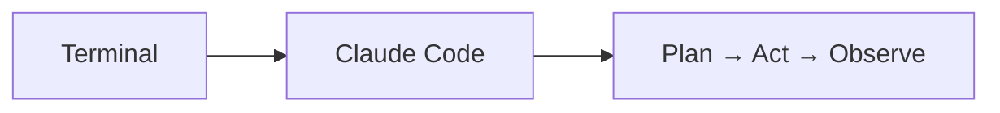

### 1.2 The Planning Loop (Agentic Loop)
The core execution cycle has four phases, repeated until the task is complete or needs clarification:

| Phase | Action |
|---|---|
| **Plan** | Reason about what the task needs and pick the next action |
| **Tool Call** | Invoke a specific tool with chosen parameters |
| **Observe** | Read the tool result and update understanding of state |
| **Repeat** | Loop until the task is complete *or* needs clarification |

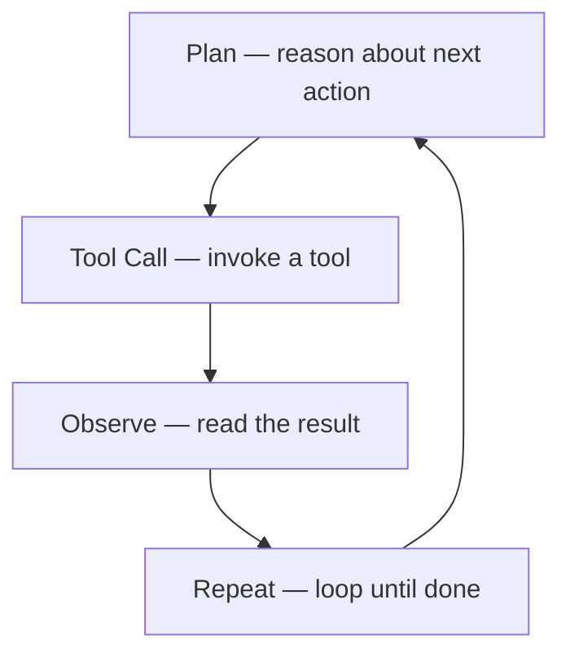

**Agentic Loop vs. Single-Shot Call**

| | Agentic Loop | Single-Shot Call |
|---|---|---|
| Behavior | Plans, acts, observes, decides the next step; many tool calls per task | One input, one response, done |
| Self-correction | Self-corrects on surprises, keeps going until goal is reached | No follow-up actions, no observing results |
| Best for | Multi-step work (e.g., *refactor across 12 files*) | Simple generation (e.g., *summarize a paragraph*) |

### 1.3 The Permission Model
Claude Code's permission model gates every tool call, and **hooks run alongside it as a second, independent gate**.

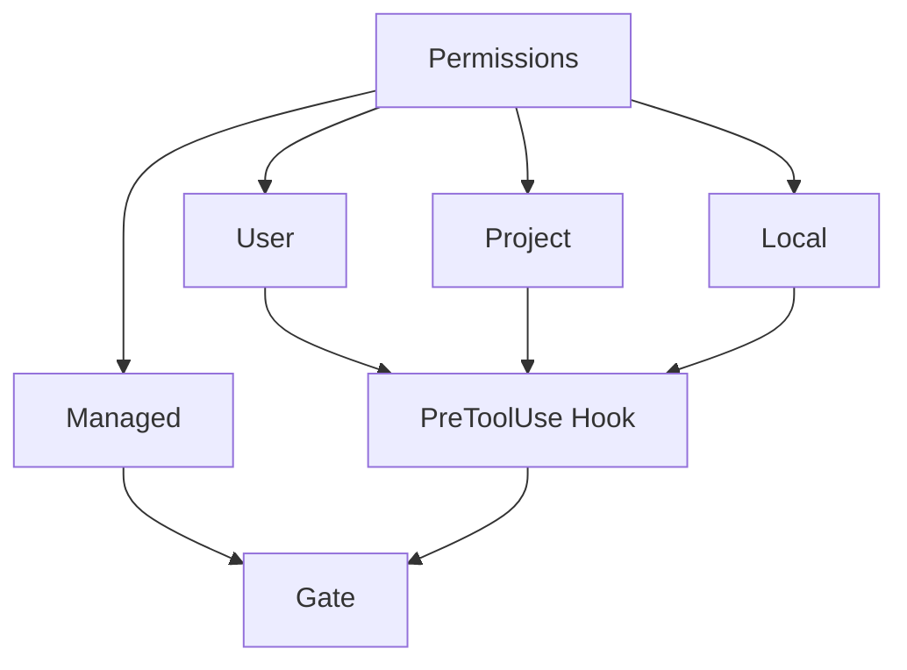

- Permissions come from **user, project, local, and managed** settings.
- **Managed settings win**, and **deny rules override allow rules** at any layer.
- A **PreToolUse hook** runs *before* the permission check and can deny an action first.
- Both permissions and hooks are **pre-execution gates** — a hook can block an action before permissions are even consulted.

### 1.4 The Tool System
Claude Code's tool system is the set of built-in capabilities invoked at each planning step. Each call is a discrete action.

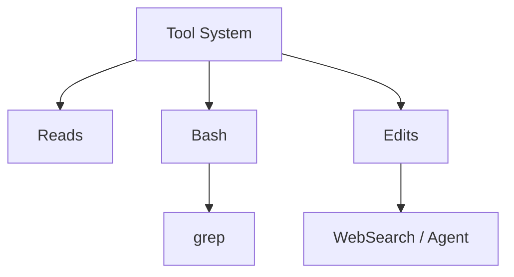

| Concept | Description |
|---|---|
| **Tool System** | Built-in capabilities: Read, Write, Edit, Bash, Glob, Grep, WebSearch, WebFetch, Agent. Each call is discrete. |
| **Edit vs. Write** | Edit makes targeted find-and-replace changes; Write overwrites the entire file. Edit is preferred for code changes. |
| **Agent Tool** | Delegates an isolated subtask to a subagent with its own context window; used when work is too large for the current session. |

### 1.5 Core Built-In Tools in Detail

| Tool | Purpose | Risk / Notes |
|---|---|---|
| **Read** | View a file's contents (text, rendered images, PDFs, notebooks) without modifying anything. The safest tool; the foundation of every workflow touching existing code. For directories use Bash `ls`; to find files use Glob or Grep. |
| **Write** | Overwrite an entire file with new content. Use for new files or full rewrites. **Risk**: on an existing file it destroys everything not in the new content — no partial update. |
| **Edit** | Targeted find-and-replace changes to a file. Finds exact text and replaces it — the default/safer choice for existing files. |
| **Bash** | Runs any shell command: scripts, package installs, file changes, database queries, API calls (e.g., `npm install`, `git push`). **Danger**: a bad command can delete files or cause irreversible damage with no undo. Hooks and permissions are the guardrails. |
| **WebSearch** | Queries the web for information beyond training-cutoff knowledge (current docs, recent API changes, error lookups). Results return as text Claude reads and reasons about. |
| **Agent** | Spawns a subagent with its own separate context window. Useful when a subtask is too large for the current context; enables parallel execution of isolated subtasks. Makes Claude Code itself a multi-agent orchestrator. |

**Write vs. Edit decision table**

| Situation | Use |
|---|---|
| New file, or a full rewrite | **Write** (e.g., `create new_file.py`) |
| Targeted change to an existing file | **Edit** (default for code changes; e.g., `replace old with new`) |

**Tool selection logic** — Claude selects tools based on the current step, not by capability:

| Step needed | Tool |
|---|---|
| Reading existing state before acting | Read |
| Modifying specific lines in a known file | Edit |
| Creating a new file or full rewrite | Write |
| Running a command or system operation | Bash |
| Looking up current information | WebSearch |
| Delegating an isolated subtask | Agent |

---

## 2. Context Window and Session Continuity

### 2.1 What Counts Against the Context Window
Everything in a session competes for space in Claude Code's finite context window.
- Conversation history, tool outputs, and CLAUDE.md files all count.
- Verbose CLAUDE.md files reduce the space left for code and results.
- When the window fills, **earlier content is compacted or dropped**.
- Context is finite — design CLAUDE.md files and workflows to use it efficiently; loading context is a performance decision, not just housekeeping.

### 2.2 Session Continuity and Memory
A new session does **not** automatically carry the full prior conversation forward.

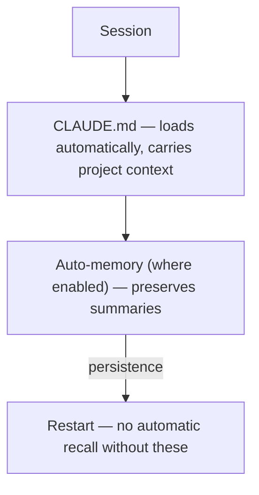

- CLAUDE.md files load automatically at session start and carry project context across sessions.
- Where enabled, auto-memory notes and explicit summaries preserve state.
- Without those mechanisms, a new session has no automatic recall of prior chat.
- **Design workflows to write state explicitly** rather than relying on implicit recall.

### 2.3 Compaction — Reclaiming Window Space
When context fills, older turns are summarized so the session can continue.

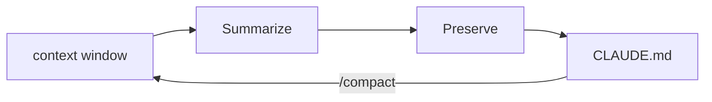

- **Auto-compaction** triggers automatically as the context window approaches its limit.
- The **`/compact`** command runs the same summarization on demand, before the limit is hit.
- A **CLAUDE.md compact instruction** can tell the summarizer what details to always preserve.
- Compaction trades verbatim history for a summary that keeps the session alive.

### 2.4 CLAUDE.md vs. the Memory System
CLAUDE.md is a **user-authored, standing-instruction file** — not an auto-updating memory store.

| | CLAUDE.md | Auto Memory System |
|---|---|---|
| Authorship | Hand-edited by the user | Separate system that persists notes across sessions automatically |
| Loading | Loaded fresh at every session start; counts against the context window | Updates as the session progresses |
| Behavior | Does not rewrite itself as you work | Carries evolving project notes |

**Guidance**: keep CLAUDE.md lean for standing instructions; let the memory system carry evolving project notes.

---

## 3. Project Setup and Onboarding

### 3.1 Onboarding a Codebase

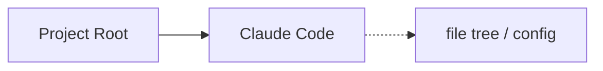

| Concept | Description | Example |
|---|---|---|
| **Claude Code** | Anthropic's official agentic CLI; plans, uses tools, observes in a loop | `claude` in project root |
| **`/init` Command** | A slash command that analyzes the repo and auto-generates a starter CLAUDE.md | `/init` |
| **CLAUDE.md** | A Markdown file of persistent project instructions, loaded at session start | `./CLAUDE.md` |

### 3.2 Initializing Claude Code

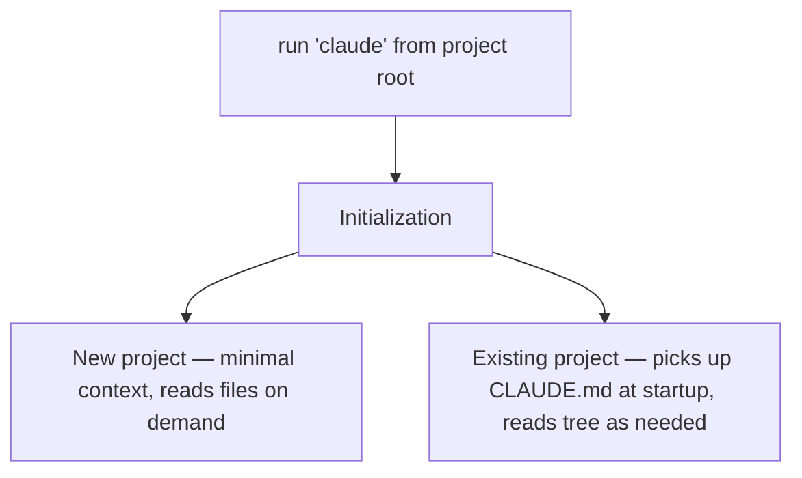

- Run the `claude` command from the project root directory.
- **New project**: starts with minimal context and reads files on demand.
- **Existing project**: picks up CLAUDE.md at startup, then reads the tree as needed.
- The starting directory determines what Claude Code sees by default.

**How Claude Code discovers structure** (no manual file listing required):
- Reads file trees to understand directory layout and module organization.
- Reads README files for project purpose, setup steps, and conventions.
- Reads config files such as `package.json`, `pyproject.toml`, and `.env` examples.
- Discovery is automatic, but **quality depends on what actually exists** in the repo.

### 3.3 The `/init` Command
Running `/init` is the fastest way to give Claude Code persistent context on an unfamiliar codebase.
- Analyzes the repo: file structure, languages, frameworks, entry points.
- Auto-generates a starter CLAUDE.md with key files and detected stack.
- Suggests conventions and rules based on what it finds in the code.
- *You don't build CLAUDE.md from scratch — `/init` does the first draft.*

**What `/init` generates**

| Output | Detected from |
|---|---|
| **Project Name** | Repo name, package config, or README header |
| **Key Files** | Entry points, primary source directories, config files (e.g., `src/`, `config.yaml`) |
| **Languages and Frameworks** | File extensions, imports, dependency manifests (e.g., Python, React) |
| **Suggested Rules** | Initial coding conventions and behavior guidelines inferred from the code (e.g., *run tests before commit*) |

### 3.4 Reviewing and Refining `/init` Output
The `/init` output is a starting point — shipping it unreviewed creates risk.

| | `/init` Generated Output | Reviewed CLAUDE.md |
|---|---|---|
| Description | Scaffolded from repo analysis; broad, generic wording | Edited by the team after `/init`; adds explicit rules, removes irrelevant sections, fixes misdetections |
| Risk | May miss team conventions, security constraints, project rules | Concise, because every line costs context |

Required refinement steps:
- Verify that detected frameworks and languages match the actual stack.
- Add explicit rules the scan couldn't infer (branching policy, test requirements).
- Remove noise — `/init` sometimes flags irrelevant files or boilerplate.
- **Treat refinement as a required step, not an optional improvement.**

### 3.5 Onboarding Checklist Before First Use

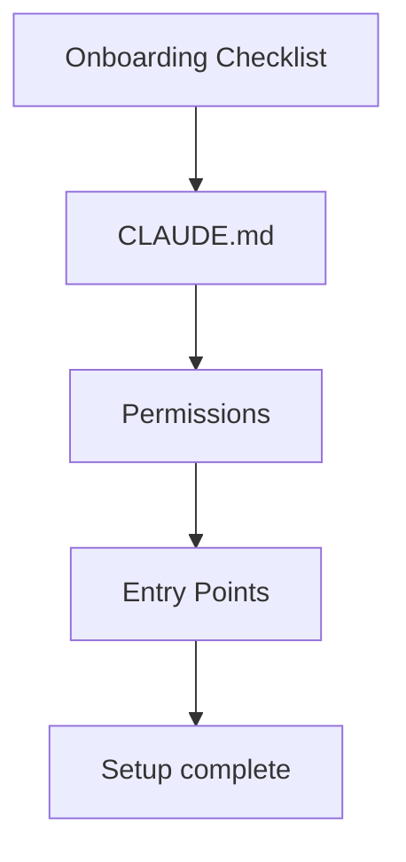

Three checks prevent the most common onboarding failures:
1. **CLAUDE.md exists and is accurate** — not just the raw `/init` draft.
2. **`permissions.deny` rules** in `.claude/settings.json` exclude secrets, binaries, and irrelevant paths.
3. **Entry points, test commands, and build steps** are documented in CLAUDE.md.

**Project Setup key takeaways**: good onboarding gives Claude Code accurate context before the first task; run `claude` from the root; `/init` output is always a draft to review and refine; Claude Code performs best when loaded context matches the real project.

---

## 4. Managing Context Effectively

### 4.1 Ways to Add Context in a Session
Claude Code accepts context through several mechanisms beyond CLAUDE.md:

| Mechanism | Description |
|---|---|
| **File path mentions** | Claude Code reads the file directly in the session |
| **`@` references** | Inline pointers to files, directories, or MCP resources |
| **Pasted URLs** | Claude Code fetches and reads the linked content |
| **Inline instructions** | Plain-text guidance added directly in the prompt |

*Every method costs tokens from the session's finite budget.*

### 4.2 What to Include vs. Exclude

**Include** context that changes what Claude Code would do without it:
- Architecture decisions — why the codebase is structured the way it is.
- Coding conventions — naming, formatting, patterns the team enforces.
- Test requirements — coverage expectations, required patterns.
- Known constraints — rate limits, compatibility floors, security boundaries.

> *If the output would be the same without it, that context isn't worth loading.*

**Exclude** from context:

| Category | Why | Example |
|---|---|---|
| Auto-generated files | Build artifacts add noise without signal | `dist`, `build/` |
| Large binaries | Waste context window space | `photo.png`, `data.zip` |
| Secrets and credentials | Never load into context | `.env`, `secret.key` |
| Irrelevant dependencies | Vendored/unrelated packages dilute useful context | `vendor/`, `.cache/` |

### 4.3 Context Inclusion vs. Efficiency

| | Over-Inclusion | Targeted Inclusion |
|---|---|---|
| Behavior | Every file mentioned adds tokens; unfocused context consumes space needed for code and tool output | Include only files relevant to the current task |
| Result | Earlier context gets compacted; more files do not improve results | A smaller, accurate context window outperforms a large, noisy one |
| Example | Dumping the whole repo | 3 files for this task |

**Token budget thinking**: CLAUDE.md loads at session start (verbose files cut working space immediately); tool call results consume tokens (large file outputs compound the cost); when the window fills, earlier content is compacted or dropped.

### 4.4 File Exclusion — The Real Mechanism

> **Correction / clarification found in source material**: An earlier framing in this curriculum describes a `.claudeignore` file with `.gitignore`-style syntax. A later lesson explicitly retires this as a myth: **there is no `.claudeignore` file, and there never has been.** The real, supported mechanism is **`Read` deny rules inside `permissions.deny` in `.claude/settings.json`**. Both framings are preserved below for completeness, with the corrected mechanism presented as authoritative.

**Real mechanism — `permissions.deny` in `settings.json`**

```json
{
  "permissions": {
    "deny": [
      "Read(.env)",
      "Read(secrets/**)"
    ]
  }
}
```

| Concept | Description |
|---|---|
| **Deny rule** | A `Read` entry in the permissions block of `settings.json` that blocks Claude Code from reading matching paths — the real exclusion mechanism |
| **Settings hierarchy** | Managed, local, project, and user settings layers together; for **permission rules, deny from any layer beats allow from any layer** |
| **Glob pattern** | A path expression with wildcards: one star (`*`) matches a single segment, two stars (`**`) match across directories |

**Path anchors and glob syntax** (gitignore-style syntax, but *not* a gitignore file — it lives inside `settings.json`):

| Symbol | Meaning |
|---|---|
| `path` (bare / dot-slash) | Resolved relative to the working directory (cwd) |
| `/` (leading slash) | Anchors to the settings file's own directory |
| `//` (double slash) | Absolute path |
| `*` | Matches a single path segment |
| `**` | Matches across nested directories (the whole tree) |

**What deny blocks, and what it doesn't:**

| Deny blocks | Deny does *not* block |
|---|---|
| Claude Code's built-in tools: Read, Edit, shell reads like `cat` or `head`; also indirect access via at-mentions and editor selections | Arbitrary subprocesses — a Python script Claude Code runs can still open a denied file, since deny governs *tools*, not the operating system. For OS-level enforcement, pair deny with filesystem-level sandboxing. |

**How precedence resolves** (for ordinary, non-permission settings):

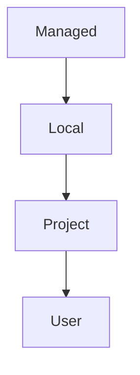
- Non-permission settings follow **managed > local > project > user**.
- Permission rules merge across all layers, and **deny is evaluated before allow**.
- A deny in *any* layer, even user-level, blocks an allow in a higher layer.

**Three myths retired by the source material:**

| Myth | Reality |
|---|---|
| The `.claudeignore` myth | No such file exists, and never has. Use `Read` deny rules instead. |
| The `.gitignore` myth | Claude Code does not honor `.gitignore` at all — git-ignored files are still fully readable. |
| The env-var myth | There is no ignore-environment-variable that hides files; no such flag exists. |

**Protecting secrets and credentials** — common deny patterns:

| Category | Pattern example |
|---|---|
| Environment files | `Read(.env)`, `Read(.env.*)` |
| Secret directories | `Read(secrets/**)` |
| Home credentials | SSH and cloud credential folders |

**Where settings live (highest precedence first):**

| Scope | Description |
|---|---|
| **Managed** | Organization-enforced policy; highest precedence; cannot be overridden locally |
| **Project** | Committed project settings file; shared team rules that travel with the repo |
| **Local** | Gitignored local settings file; personal overrides that stay off the repo |
| **User** | Home settings file; personal defaults across every project |

### 4.5 Key Takeaways — Context and Exclusion
- Context quality and efficiency are ongoing responsibilities, not one-time setup.
- Add context via file mentions, `@` references, URLs, or inline instructions.
- Include architecture, conventions, and constraints; exclude secrets, binaries, and noise.
- Exclusion is implemented through `permissions.deny` Read rules, not a dedicated ignore file.
- Compaction reclaims space automatically near the limit or on demand with `/compact`.
- Every file costs tokens — load only what changes Claude Code's output.

---

## 5. Permission Modes

### 5.1 The Permission Mode Concept
Claude Code pauses to ask before it edits files or runs commands; **permission mode** is a session-wide setting that decides which actions run without asking and which still prompt.

| Concept | Description |
|---|---|
| **Permission Mode** | A session-wide setting deciding which actions run without asking, and which still prompt |
| **Working Directory** | The folder Claude launched in, plus any additional directories added; auto-approval only applies inside it |
| **Protected Path** | Sensitive files like `.git` and `.claude` that are never auto-approved outside bypass mode |

### 5.2 The Three Everyday Modes

| Mode | Behavior | Best for |
|---|---|---|
| **default** | Reads run freely; edits and commands prompt every time | Sensitive or first-time work |
| **acceptEdits** | Auto-approves edits and common file commands in the working directory | Iterating on code |
| **plan** | Reads and explores only; proposes changes without touching source | Before committing to edits |

**What `acceptEdits` covers:**
- Auto-approves common commands like `mkdir`, `touch`, `move`, and `copy`.
- Approval **only applies to paths inside the working directory** — anything outside still prompts.
- Review changes afterward with `git diff` instead of approving each one inline.

### 5.3 Two Hands-Off Modes

| Mode | Behavior |
|---|---|
| **dontAsk** | Auto-denies anything not pre-approved. Only allow-listed tools and read-only commands run. Fully non-interactive — suited for locked-down pipelines. |
| **bypassPermissions** | Skips prompts entirely so tool calls run immediately. Powerful but risky — reserve for isolated containers or VMs where nothing can be damaged. |

### 5.4 Auto Mode (a form of `dontAsk`-adjacent automation)
Auto mode lets Claude work without routine prompts while a **separate classifier** reviews each action.

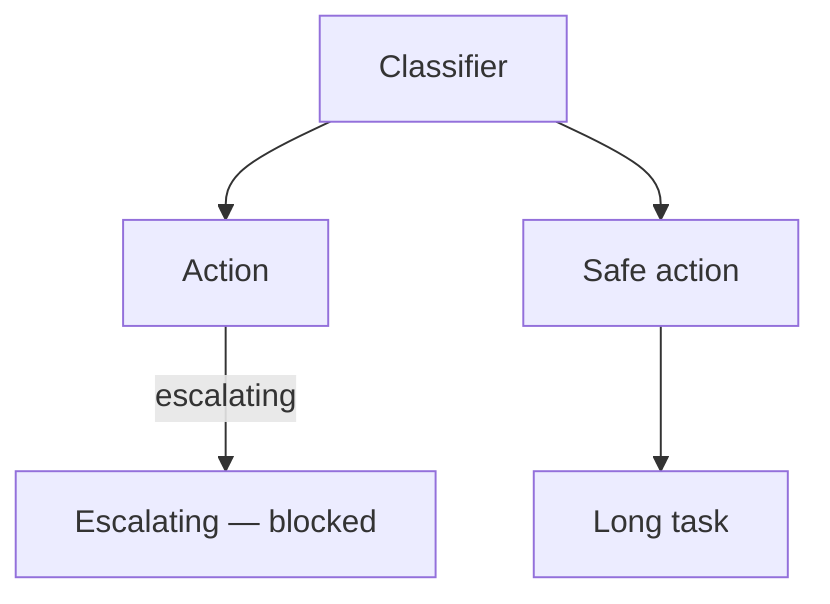

- A separate classifier reviews actions **before they run**.
- It blocks anything that escalates beyond what was asked.
- Explicit "ask" rules still force a prompt.
- Reduces interruptions on long tasks, but **does not replace review on sensitive work**.

### 5.5 How You Switch Modes
You set the mode through controls, **not by asking Claude in chat**.

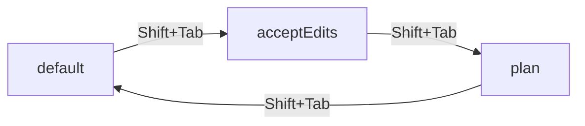

| Method | Description |
|---|---|
| **Shift+Tab** | Cycles mid-session: default → acceptEdits → plan |
| `--permission-mode` flag | Passed at session start to set the starting mode |
| `defaultMode` setting | Set in settings to pick a persistent starting mode |
| Status bar | Shows the current mode so you always know where you are |

### 5.6 Protected Paths Stay Guarded
- **Never auto-approved**: writes to sensitive files like `.git` and Claude's own `.claude` folder are never auto-approved outside bypass mode.
- **Handled per mode**: default, acceptEdits, and plan prompt you; auto routes to the classifier; `dontAsk` denies it outright. Only bypass mode skips this.
- **Why it matters**: keeps repository state and Claude's own configuration safe from accidental edits during a fast session.

### 5.7 Matching Mode to the Job

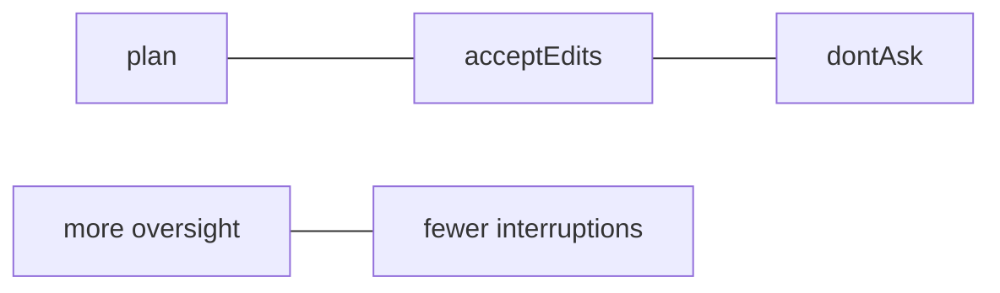

| Mode | When to use |
|---|---|
| **plan** | When you want to explore before changing anything |
| **acceptEdits** | When you're actively reviewing code as it lands |
| **dontAsk** | For locked-down automation where every allowed tool is pre-listed |

Pick more oversight for risky work; fewer interruptions when you trust the direction.

### 5.8 Choosing a Permission Mode — Summary

| Mode | Behavior |
|---|---|
| **Default** | Prompts; acceptEdits auto-edits; plan explores without editing |
| **Auto** | Runs with a safety classifier; dontAsk denies anything not pre-approved |
| **Bypass** | Skips prompts entirely; belongs only in isolated environments |
| **Protected** | Paths stay guarded everywhere except bypass |
| **Switch** | Via Shift+Tab, a CLI flag, or the `defaultMode` setting |

---

## 6. The CLAUDE.md Memory Hierarchy

### 6.1 Four Scopes, Loaded Together
CLAUDE.md files give Claude Code persistent instructions loaded at session start. All applicable scopes load and apply **simultaneously — additive, not exclusive**.

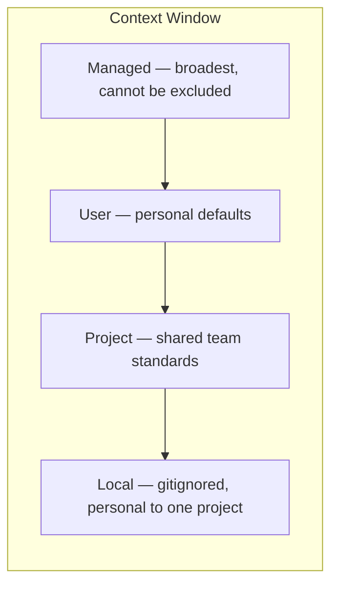

| Scope | Location | Description |
|---|---|---|
| **Managed Policy** | Org-wide, system path | Broadest scope, loaded first; **cannot be excluded** — enforces company-wide standards on every user and project |
| **User Scope** | `~/.claude/CLAUDE.md` | Personal preferences across all of your sessions; second-broadest layer |
| **Project Scope** | `./CLAUDE.md` or `./.claude/CLAUDE.md` | Project instructions for all contributors; committed to source control |
| **Local Scope** | `CLAUDE.local.md` | Gitignored, personal tweaks scoped to one project on your machine |

**Load order**: Managed → User → Project → Local (broadest to most specific). When guidance overlaps, the closer, more specific file carries more weight. **All loaded content counts against the context window** — verbose files at any scope reduce working space.

### 6.2 What Belongs at Each Scope

| Scope | Content |
|---|---|
| **Managed Policy** | Company-wide policies, security requirements, enforced standards every project inherits |
| **User Scope** | Personal style preferences, default response verbosity, individual tool restrictions |
| **Project Scope** | Shared coding conventions, test rules, architecture guidelines, team anti-patterns to avoid |
| **Local Scope** | Personal tweaks scoped to just one project on your machine (gitignored) |

**Personal vs. shared — the anti-pattern to avoid**

| | User-Level Config | Project-Level Config |
|---|---|---|
| Scope | One developer, every project | Team — everyone on the repository |
| Right for | Tone, output style, shortcuts | Code style, test rules, security |
| Wrong for | Anything the team needs consistent | Anything that varies by individual |
| Example | Home-dir CLAUDE.md | `./CLAUDE.md` |

> **Anti-pattern**: placing team standards in user-level config instead of project-level. User-level config is invisible to teammates — it never leaves your machine, so the rest of the team loses consistency **silently, with no error or warning**. Team standards belong in the project-level CLAUDE.md, committed to source control.

Leaving the project-level CLAUDE.md **out of source control** is likewise flagged as a common anti-pattern — every contributor needs it.

### 6.3 Conflict Resolution

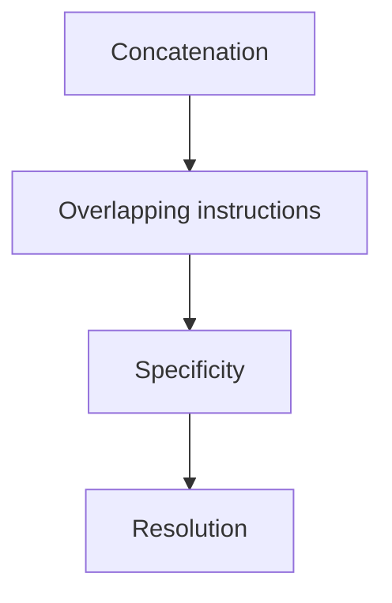

- CLAUDE.md files across all scopes are **concatenated** into context — most guidance simply stacks.
- **Complementary instructions** (different behaviors, no overlap): both apply simultaneously, no resolution needed.
- **Genuine conflicts** (same behavior, opposite instructions at different levels): there is **no reliable precedence** — Claude may pick either one non-deterministically. Avoid writing direct contradictions.

| | Conflict | Complementary |
|---|---|---|
| Definition | Same behavior, opposite instructions at different levels | Different behaviors addressed by each level — both instructions apply |
| Example | User says tabs, project says spaces → unreliable, avoid writing this | User: be concise. Project: always add type hints. → both apply |

**Worked example** — a project-level "no semicolons" rule:
- Developer A has "always use semicolons" in user-level config → **direct conflict, non-deterministic**.
- Developer B has no semicolon rule in user-level config at all → no conflict.
- **Fix**: avoid the conflict and state precedence explicitly in the project file rather than relying on layering to resolve it.

**Seeing which instructions are active**: run `/memory` to see loaded memory files, or `/context` to inspect what's loaded. There is no auto-printed startup list; a custom `InstructionsLoaded`-style hook can log this. Testing overlapping instructions explicitly (and checking behavior in a real session) is useful when onboarding to a new project or debugging inconsistent behavior.

### 6.4 Directory-Scoped (Subdirectory) CLAUDE.md Files
Claude Code **lazy-loads** a directory-scoped CLAUDE.md file the moment it reads a file inside that directory — placement alone sets the scope, with **no registration step**.

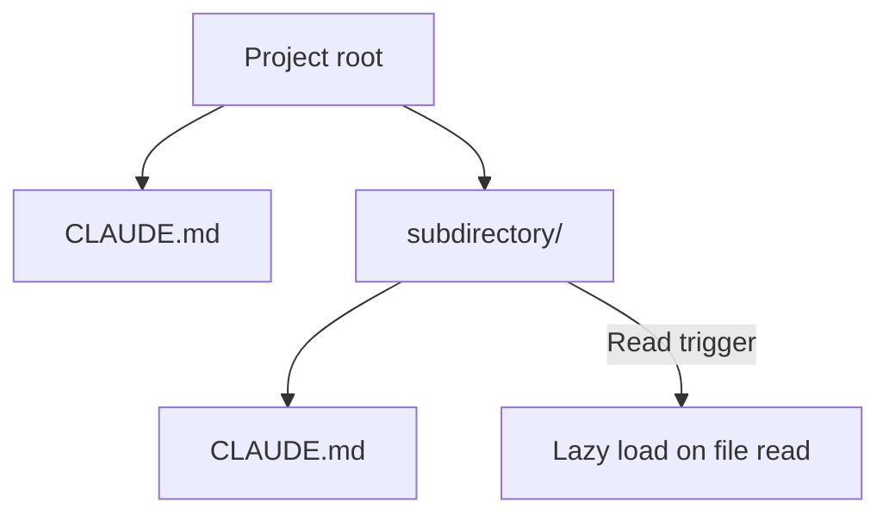

- Drop a CLAUDE.md inside any subfolder — no manifest entry required.
- It loads on demand the moment Claude reads a file in that directory (being in the folder isn't enough; **the read is what triggers the load**).
- Scoped instructions follow file reads, not a central registry.

**Augmentation, not replacement**: subdirectory configs **add** rules on top of the parent config — they don't reset it.
- Parent instructions remain active when working inside a subdirectory.
- Files are concatenated **root-to-leaf**, so the subdirectory file is read last.
- There is **no guaranteed "override winner"** — each level adds; avoid writing direct contradictions across levels.

**Common directory patterns**

| Directory | Typical content |
|---|---|
| `/frontend` | React hook rules, component naming (PascalCase), import order |
| `/backend` | *(see patterns below)* |
| `/tests` | Pytest fixture standards, test naming, coverage thresholds |
| `/infrastructure` | Terraform module structure, naming, **never-delete rules for live resources** |
| `/generated` | *Never modify* — auto-generated; changes are overwritten on the next run |

Root CLAUDE.md applies project-wide baseline style, security rules, and global constraints; a subdirectory CLAUDE.md applies only within that folder, adding framework-specific rules on top.

**Validation**: work inside each subdirectory to confirm folder-specific rules are active; verify parent rules still apply (augmentation shouldn't drop root config); check that explicit contradictions resolve as intended. Scoped config is only reliable once verified to behave correctly in practice.

---

## 7. Instruction Design for CLAUDE.md

### 7.1 What Makes an Instruction Effective
A CLAUDE.md that Claude Code actually follows needs directives that are **specific, actionable, and unambiguous**.

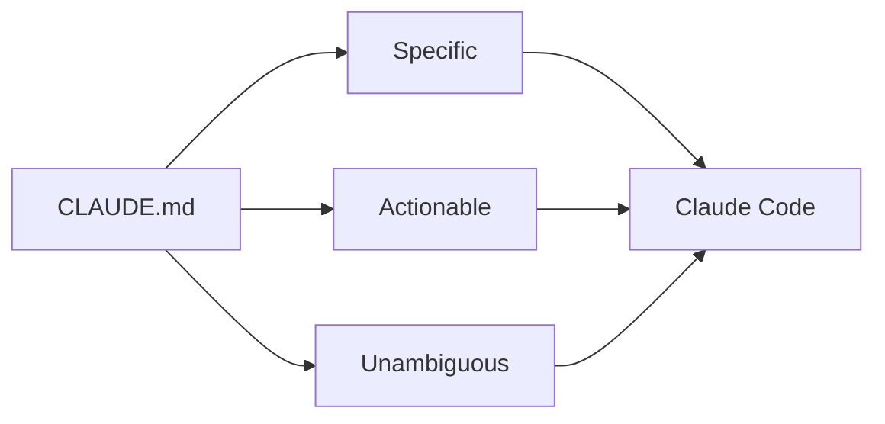

| Trait | Meaning |
|---|---|
| **Specific** | Names the exact language version, file path, or convention |
| **Actionable** | Written so Claude Code can follow it without interpretation |
| **Unambiguous** | One clear meaning, no room for alternative readings |

> Vague instructions get read but not reliably followed — precision is the standard. Example: `use Python 3.11+` (specific, actionable, unambiguous).

### 7.2 Concise Directives vs. Verbose Docs
Claude Code reads both, but **concise wins**:
- A short bullet directive is more reliably followed than a paragraph.
- Verbose documentation takes up context space and dilutes signal.
- Instructions buried in prose are easy to miss under context pressure.

> Write CLAUDE.md like a style-guide checklist, not a design-document narrative.

### 7.3 What to Encode

| Category | Examples |
|---|---|
| **Language Versions** | Exact runtime versions Claude won't guess on its own (e.g., `Python 3.11+, Node 20`) |
| **Style Rules** | Naming conventions, import order, file organization (e.g., `PascalCase components`) |
| **Test Requirements** | Coverage thresholds, test file naming, fixture organization (e.g., `80% coverage minimum`) |
| **Commit Format** | Commit message structure, branch naming, PR description (e.g., `feat: short summary`) |
| **Process & Anti-Patterns** | PR review requirements/approvers/merge strategy; coding anti-patterns to avoid; security rules (no hardcoded credentials, protected files) — "decisions the team already made — encoding them prevents re-deciding" |

### 7.4 What NOT to Encode
CLAUDE.md is for **repo-specific knowledge**, not general programming education:
- Don't explain what Python is or how list comprehensions work.
- Don't document standard library functions Claude already knows.
- Don't restate rules your linter or formatter already enforces.

> Every line of general knowledge wastes context that could hold actual code.

**Encode this vs. skip this**

| Encode in CLAUDE.md | Skip — Claude already knows |
|---|---|
| Runtime version pinning, team naming conventions, PR process, test coverage thresholds, repo-specific anti-patterns, secrets handling (e.g., `pin Node 20 LTS`) | General Python syntax, standard design patterns, what a REST API is, how git works, common test frameworks, language idioms |

### 7.5 Structure — Headers, Bullets, Categories
A well-structured CLAUDE.md is faster to read and more reliably followed than a wall of text.
- Use clear header sections: **Language, Style, Testing, Git, Security**.
- Bullet points outperform paragraphs — one directive per line.
- Group related rules so context pressure hits a whole category at once.

> Structure signals priority and makes verification easier after writing. **Verify Claude Code follows it in a real session** after writing.

---

## 8. Common CLAUDE.md Patterns for Real Teams

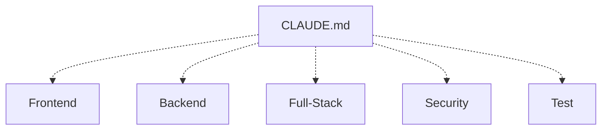

| Pattern | Reusable directives for a team context |
|---|---|
| **CLAUDE.md Pattern** | Reusable directives for a team context (e.g., a frontend rule set) — *say what to do, not background* |
| **Directive vs. Narrative** | Say what to do, not background (e.g., `use PascalCase`) |
| **Tool Duplication (avoid)** | Don't re-state what a linter already enforces (e.g., formatting rules) |

### 8.1 Frontend Pattern
- **Component naming**: PascalCase, co-located with tests and styles.
- **CSS methodology**: encode the choice — modules, Tailwind, or styled-components.
- **State management**: approved library and global-state policy.
- **Accessibility**: required ARIA attributes and keyboard navigation.

*These rules are framework-specific — they belong in frontend config, not the root.*

### 8.2 Backend Pattern
- **API design**: REST conventions, versioning, error response format.
- **Database queries**: ORM vs. raw SQL policy and optimization rules.
- **Error handling**: expected error types, logging, response format.

*Backend directives encode this service's design, not general web development.*

### 8.3 Full-Stack Pattern (cross-cutting rules)
- **Shared Types**: TypeScript interfaces shared across frontend and backend (e.g., shared `User` type).
- **Monorepo Structure**: which packages own which concerns and import rules (e.g., `apps` and `packages`).
- **Service Boundaries**: what each service owns and what crosses boundaries (e.g., no cross-service DB access).
- **Shared Conventions**: naming rules applied across all monorepo packages (e.g., kebab-case files).

### 8.4 Security Pattern — Non-Negotiable Rules
Security directives are the highest-value entries in any CLAUDE.md.
- **No hardcoded credentials**: all secrets via env vars or a secrets manager.
- **`.env` policy**: which files exist, which are committed, which never are.
- **Secrets management**: which vault or service handles secrets here.
- **Auth patterns**: approved libraries, forbidden patterns, session rules.

> Security rules should be explicit and prominent.

### 8.5 Test Pattern
- **Test file naming**: location and the `.test` vs. `.spec` suffix convention.
- **Coverage thresholds**: minimum percentages enforced in CI.
- **Fixture organization**: where shared fixtures live and how they import.
- **Mock policies**: which dependencies are mocked vs. tested for real.

### 8.6 Two Anti-Patterns to Avoid

| Anti-Pattern | Problem |
|---|---|
| **Narrative documentation** | Long paragraphs with rules buried in prose — verbose docs posing as config. Easy to miss, hard to verify. Prefer the **directive pattern**: bullet points, one rule per line, grouped by section. |
| **Duplicating linter rules** | Encoding rules existing tools already enforce creates two sources of truth. If Black handles Python formatting, don't encode formatting rules; if ESLint catches an import pattern, don't also write it as a directive; if a type checker enforces annotations, the CLAUDE.md rule is redundant. *Let tools enforce what tools can; CLAUDE.md fills the gaps they can't cover.* |

---

## 9. Custom Slash Commands

### 9.1 What Slash Commands Are
Slash commands are shortcuts: they map a `/keyword` to a reusable prompt template stored in a Markdown file under `.claude/commands/`.

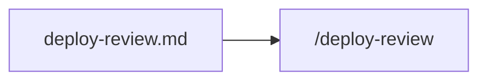

| Concept | Description |
|---|---|
| **Slash Command** | A user-defined shortcut mapping a `/keyword` to a reusable prompt in a Markdown file under `.claude/commands/` |
| **Merged Into Skills** | Custom commands have merged into skills conceptually. Commands still work, but `.claude/skills/<name>/SKILL.md` is now the recommended form. |
| **`$ARGUMENTS`** | A placeholder in a command file replaced with whatever text follows the command keyword when invoked |

- `/init` and `/help` are **built-in** commands shipped with Claude Code.
- Custom commands (e.g., `/deploy-review`, `/run-tests`) are created by the user.
- The command invocation runs the Markdown file's content as a prompt.
- Custom commands **extend** Claude Code — they don't change how the underlying model works.

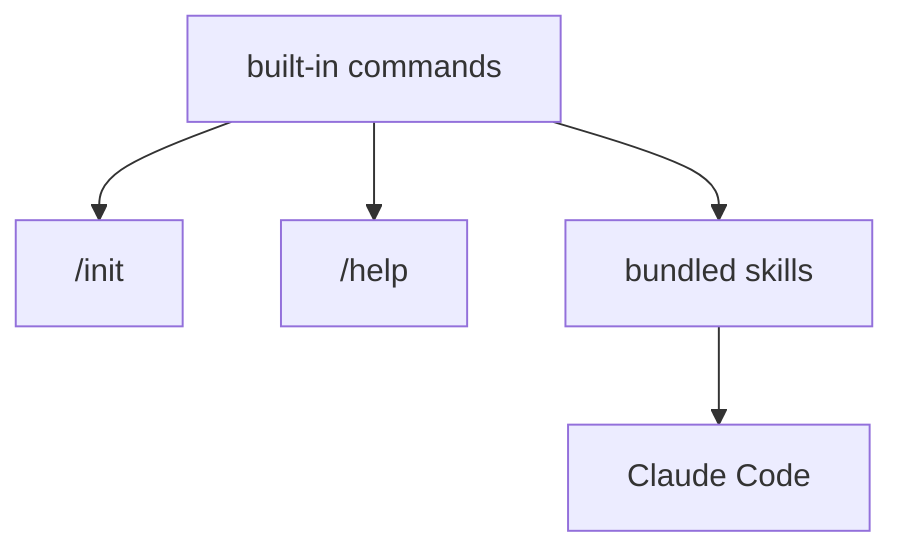

- Others like `/code-review` and `/loop` ship bundled too.
- A custom command named after a built-in gets **shadowed** — check the `/help` list before naming a command; unused names map straight to your filename.

### 9.2 Filename Becomes the Command
There is no separate registration step — the filename *is* the command.

| File | Command |
|---|---|
| `deploy-review.md` | `/deploy-review` |
| `run-tests.md` | `/run-tests` |
| `explain-file.md` | `/explain-file` |

> Keep names lowercase and hyphen-separated so the keyword signals what it does.

### 9.3 Project-Level vs. User-Level Commands

| Location | Scope |
|---|---|
| `.claude/commands/` (project) | Lives in the repo, version-controlled, shared with everyone who clones it — best for team workflows |
| `~/.claude/commands/` (user) | Home directory; personal to you in every project — best for private shortcuts |

**Scope in practice**: project commands are **shared by default** (committed, no setup to share); user commands are **personal only** (never leave your machine unless copied); the file path sets scope — project is shared, user is personal.

### 9.4 What Goes Inside a Command File
The entire Markdown content becomes the instruction template Claude executes:
- Include a **role statement**: "You are reviewing a pull request."
- State the **task** and the expected **output format**.
- Add **constraints** like language, tone, or scope.

> A good command file reads like a well-crafted system prompt.

### 9.5 Using `$ARGUMENTS` for Dynamic Input
Adding `$ARGUMENTS` makes a static command file flexible for variable input.

```md
# review-pr.md
Review pull request $ARGUMENTS in detail.
```

- `/review-pr 4521` passes `"4521"` into `$ARGUMENTS`.
- The placeholder takes whatever text follows the keyword.
- `$ARGUMENTS` can be referenced multiple times in one template.
- Use **free-form** `$ARGUMENTS` for simple input; **structured templates** when the input shape matters.

### 9.6 Design Principles for Effective Commands

| Principle | Description |
|---|---|
| **Narrow-Scope Command** | Does exactly one defined task (e.g., `/review-pr`) |
| **Verb-Noun Convention** | Verb is the action, noun is the target (e.g., `/run-tests`) |
| **Managed Settings** | Pushes commands org-wide (e.g., organization-wide rollout) |

**Core design principle — do one thing well**: `/review-pr` reviews a pull request, nothing else. A broad anti-pattern like `/do-everything` (reviews, tests, and deploys) tangles the template and gives Claude conflicting guidance. Small commands compose better than large ones.

**Writing effective command prompts** — four elements:

| Element | Purpose |
|---|---|
| **Role** | The perspective Claude operates from |
| **Task** | Describe exactly what to do |
| **Output format** | How the result should be structured |
| **Constraints** | Scope, tone, language, what to exclude |

*Missing any element causes output to drift across runs, defeating a reusable command.*

**Free-form vs. structured templates**

| | Free-Form `$ARGUMENTS` | Structured Template |
|---|---|---|
| Best for | One piece of variable text — low friction (e.g., `/explain-file app.py`) | Multiple input fields — fewer errors (e.g., "Provide: PR number, role, and focus.") |

**Naming convention — verb-noun**

| Good Pattern | Bad Pattern |
|---|---|
| `/review-pr`, `/run-tests`, `/explain-file` — action is immediately clear | Noun-only or vague: `/pr`, `/code`, `/stuff` — you must open the file to know what it does |

*A consistent convention is self-documenting; teammates guess keywords before reading docs.*

### 9.7 Distribution

| Method | Mechanism |
|---|---|
| **Team distribution (version control)** | Add command files to `.claude/commands/` and commit. Everyone who clones the repo has the commands immediately; updates propagate through normal pull and merge — no extra tooling. |
| **Enterprise distribution (managed settings)** | Admins configure commands in organization-level managed settings; pushed automatically to every user in the org; users can't accidentally delete or override org-level commands. Enforces consistency for compliance, security, and approved automation. |

**Two anti-patterns to avoid**:
- **Overly broad commands**: one template that reviews, refactors, tests, *and* ships.
- **CLAUDE.md duplication**: copying standing instructions into a command file (diverges from CLAUDE.md over time).

> Broad commands are unpredictable; duplication diverges from CLAUDE.md over time.

**Key takeaways — Slash Commands**: mapping a keyword to a reusable Markdown template; `.claude/commands/` is project-scoped and shared via version control; `~/.claude/commands/` is personal and not shared; the filename *is* the keyword — no registration required; `$ARGUMENTS` handles dynamic input; creating a command is as simple as dropping a Markdown file in the right directory.

---

## 10. The Skills System

### 10.1 What Skills Are
Skills are reusable instruction packages defined in `SKILL.md` files, loaded automatically when their description matches the user's request.

```mermaid
flowchart LR
    InstructionPackages["Instruction Packages"] --> Skills2["Skills"]
    InstructionPackages --> Description2["Description"]
    Skills2 --> SKILLmd["SKILL.md"]
    SKILLmd --> DecisionFramework["Decision Framework"]
    Description2 --> DecisionFramework
```

### 10.2 Three Instruction Mechanisms Compared

| Mechanism | Description |
|---|---|
| **Skill** | A reusable instruction package — a `SKILL.md` plus optional files — Claude loads when its description matches the request, *or* you invoke it directly. |
| **Slash Command** | A shortcut in `.claude/commands/`. Now a subset of skills. Manual-only invocation, vs. a skill's description-based auto-loading. |
| **Subagent** | A delegated autonomous worker spun up to complete a task independently — an active worker, not a passive instruction template. |

### 10.3 Skills Are the Middle Layer
Skills sit between always-on config and fully delegated workers in the instruction stack.

```mermaid
flowchart TD
    AlwaysOn["Always-on Config (CLAUDE.md)"] --> SkillsLayer["Skills"]
    SkillsLayer --> Instruction3["Instruction"]
    Instruction3 --> Delegation["Delegation (Subagents)"]
```

| Layer | Activation pattern |
|---|---|
| **CLAUDE.md rules** | Always active, apply everywhere, always in context |
| **Skills** | Loaded when their description matches the request; defined in SKILL.md |
| **Manual-only commands** | A skill you invoke explicitly with a `/name` |
| **Subagents** | Spawned for a task; active autonomous workers |

*If a procedure should load only when it fits the request, package it as a skill.*

### 10.4 Skills vs. Slash Commands
Custom commands are now a subset of skills — both are invoked with a `/name`. **The difference is a loading pattern, not two separate mechanisms.**

```mermaid
flowchart LR
    DescriptionMatch["Description matches"] --> Skills3["Skills"]
    Skills3 --> Command2["/command"]
    Command2 --> ManualInvocation["Manual invocation"]
```

- Manual-only commands set `disable-model-invocation` — you type them explicitly.
- Skills also load when their description matches the request (auto-loading).
- Reach for **manual-only** when you want a shortcut fired only on your explicit request.

### 10.5 When to Build a Skill

| Signal | Description |
|---|---|
| **Recurring Workflows** | Multi-step patterns repeated across many sessions or team members |
| **Team-Wide Patterns** | Conventions that should fire consistently for every contributor |
| **Automatic Loading** | Procedures that load automatically when relevant, not by typed command |
| **Reusable Templates** | Instructions that need to work the same way every time they run |

**The Build Decision Framework** — three factors:

| Factor | Question |
|---|---|
| **Frequency** | Does this workflow come up often enough to formalize it? |
| **Complexity** | Is it multi-step enough that a reusable template adds value? |
| **Reusability** | Will it run for more than one user, session, or context? |

*High on all three → build a skill. Low → use a simpler mechanism.*

### 10.6 When NOT to Build a Skill
- **One-time tasks**: skills exist for reuse, not single tasks with no future value.
- **Simple lookups**: a slash command or CLAUDE.md rule has less overhead.
- **Always-on rules**: if it applies unconditionally, use CLAUDE.md instead.

### 10.7 Skills vs. Subagents

| | Skill | Subagent |
|---|---|---|
| Definition | An instruction package stored in `SKILL.md`. Loaded when its description matches. **Claude Code runs the instructions itself** — the skill is the recipe, not a separate worker. | An autonomous worker delegated to complete a task independently. Has its own context, tools, and scope. Reports back when done — an active process, not just instructions. |

### 10.8 Reading the Instruction Stack

```mermaid
flowchart TD
    Stack["Instruction Stack"] --> CLAUDEmd5["CLAUDE.md — always active, everywhere, always in context"]
    Stack --> SkillsLayer2["Skills — loaded on description match, defined in SKILL.md"]
    Stack --> Placement["Manual-only commands — invoked explicitly with /name"]
    Stack --> Subagents2["Subagents — spawned for a task, active workers"]
```

*Choosing the right layer prevents over-engineering.*

### 10.9 Authoring Agent Skills
A skill is a **folder** holding a `SKILL.md` file, discovered automatically and invoked by its directory name.

```mermaid
flowchart TD
    Root2[".claude/skills/"] --> MySkill["my-skill/"]
    MySkill --> SKILLmd2["SKILL.md"]
```

**Three building blocks:**

| Block | Description |
|---|---|
| **Skill directory** | A named folder holding a `SKILL.md` file. The folder name is the skill's name and invocation handle. Auto-discovered, no registration. |
| **SKILL.md body** | The Markdown below the frontmatter — the actual instructions Claude follows. **Always loads, even with no frontmatter at all.** |
| **Frontmatter** | An optional YAML block at the top. Every field is optional. Only `description` is really worth adding, since it drives matching. |

**Skills are directory-based**: layout is `.claude/skills/<named-folder>/SKILL.md`; the directory name becomes the skill's name and invocation handle; Claude auto-discovers every skill folder present with no registry step; you invoke a skill by its folder name — that name is the whole addressing scheme (e.g., `.claude/skills/langchain_agent/`).

**The body always loads**: with **zero frontmatter**, the Markdown body still loads and the skill still runs; invoking by folder name works with no fields declared; there is **no silent failure** from a missing frontmatter block; frontmatter tunes behavior, the body is the substance, and it loads either way.

### 10.10 Frontmatter Fields — Real vs. Fabricated

**Real optional fields**

| Field | Purpose |
|---|---|
| `name` and `description` | Sets the display label in listings and, crucially, tells Claude when the skill fits |
| `when-to-use` | A plain-language cue describing the situations the skill should handle |
| `allowed` / `disallowed` tools | `allowed` pre-approves tools so they skip the prompt; `disallowed` removes tools from the pool |
| `model`, `effort`, `context` | Pick a model, set reasoning effort, and set context to fork for a subagent |
| `agent` and `hooks` | Bind the skill to a specific agent, or wire in lifecycle-hook behavior when it runs |
| `paths` | Restrict the skill to certain file paths so it only applies in the right places on disk |
| `argument-hint` | Signals the arguments the skill expects when a user chooses to invoke it directly |

**Fabricated fields to drop — these do not exist:**

| Fake field | Reality |
|---|---|
| `trigger` | No such field; matching runs off the `description` |
| `version` | No such field |
| `author-tags` | No such field |

> A missing frontmatter block does not cause a silent failure. Reach for the real fields; invented ones just sit inert.

### 10.11 Description Drives Matching
Of every field, **description carries the weight** — it is the one worth writing carefully.

```mermaid
flowchart TD
    Request["Request"] --> SkillCheck["Skill"]
    SkillCheck --> SpecificDesc["Specific description → fires"]
    SkillCheck --> VagueDesc["Vague description → passed over"]
```

- Claude reads the description to decide whether a skill fits the request.
- A **vague** description means the skill is passed over when it should fire.
- A **sharp, specific** description makes auto-invocation reliable.
- Everything else tunes behavior; the description is what gets the skill picked at all.

### 10.12 How Invocation Works

| Mode | Description |
|---|---|
| **Auto-invocation** (default path) | Claude reads each skill's description, matches it against the request, and runs the fitting skill on its own. |
| **Direct invocation** | You call the skill by its folder name yourself — handy when you know exactly which skill you want to run. |

**Key takeaways — Skills**: description-gated instruction packages sitting between CLAUDE.md and subagents; skills load on description match, manual-only commands need explicit invocation; subagents are autonomous workers, skills are instruction packages; build when frequency, complexity, and reusability score high; skip skills for one-time tasks or always-on rules; match each workflow to how it should load.

---

## 11. Subagents

### 11.1 Creating and Configuring Custom Subagents
Claude Code can spawn separate agent instances to handle delegated work.

```mermaid
flowchart LR
    Parent["Parent Agent"] --> Sub1["Subagent"]
    Parent --> Sub2["Subagent"]
```

**Three core concepts**

| Concept | Description |
|---|---|
| **Subagent** | A separate agent instance with its own isolated context window, spawned within the same Claude Code session via the Agent tool for a delegated subtask |
| **Context Isolation** | Each subagent has its own context window. No information passes from the parent automatically — everything needed must be explicitly provided. |
| **Orchestrator** | The parent agent that decomposes goals, spawns subagents, and synthesizes their results. Does not share context automatically. |

**Subagents vs. API-context agents** — Claude Code subagents are distinct from multi-agent patterns built directly against the API:
- Subagents are **isolated agent instances inside one Claude Code session** — not API completions you orchestrate yourself.
- Created via the **Agent tool within Claude Code**, not direct API calls.
- Each runs with its own isolated context window and independent tool access and permissions.

### 11.2 How to Create a Subagent
Two creation paths exist:

| Path | Description |
|---|---|
| **Markdown definition files** | `.claude/agents/` (project) or `~/.claude/agents/` (user) |
| **Agent tool in code** | Programmatic spawning from a parent agent's workflow, for dynamic delegation during an agentic workflow |

Ask Claude to write the definition file, or edit it directly to set tool access and scope.

### 11.3 What Gets Configured Per Subagent

| Setting | Description |
|---|---|
| **Tool Access** | Which tools the subagent can invoke — Bash, file read/write, web fetch, etc. |
| **Isolation** | A worktree gives the subagent its own repo copy; permission rules scope filesystem reach |
| **Permissions** | Subagents can have narrower or different permissions than the parent agent |
| **Task Description** | The explicit instructions defining what the subagent is supposed to do |

### 11.4 Context Isolation in Practice
A subagent starts fresh — the parent's conversation and prior work don't carry over.

```mermaid
flowchart LR
    Isolation["Context Isolation"] --> SubagentNode["Subagent"]
    SubagentNode -->|"Explicit Handoff"| ReturnResults["Return Results"]
```

- **No automatic inheritance** from the parent's conversation or loaded files.
- The parent must explicitly pass every piece of context the subagent needs.
- Subagent results are returned to the parent and then synthesized there.
- Isolation is a feature: it prevents context bleed and keeps the subagent's focus narrow.

### 11.5 Restricting Permissions Below the Parent
Subagents inherit the parent's tool and permission context by default, but you can scope them more narrowly.

```mermaid
flowchart TD
    RestrictedPermissions["restricted permissions"] --> ReadOnly["read-only"]
    ReadOnly --> DirectoryScoped["directory-scoped"]
    DirectoryScoped --> LeastPrivilege["least privilege"]
    LeastPrivilege -->|"blast radius"| BlastRadius["reduced blast radius"]
```

- A **read-only** subagent can inspect files without being allowed to write.
- A **directory-scoped** subagent can only operate within a designated path.
- Restricting tool access reduces the blast radius if the subagent acts unexpectedly.
- Minimal-permission subagents follow the **principle of least privilege** by design.

### 11.6 When to Spawn vs. When to Stay Inline

| | Spawn a Subagent | Stay Inline |
|---|---|---|
| Criteria | Tasks are independent and parallel, need different tools, require scope isolation, or are substantial enough for a separate session | Task needs full parent context, is sequential, delegation overhead exceeds the value, or is simple enough for the current session |
| Example | Parallel file audits | One quick edit |

### 11.7 The Handoff — What to Pass Explicitly
A subagent only knows what you tell it. The handoff is a design decision.

| Element | Description |
|---|---|
| **Task description** | A precise definition of what to do and what "done" looks like |
| **Necessary context** | Only the information the subagent needs — no more |
| **Output format** | The exact structure of what the subagent should return |

*An underspecified handoff produces ambiguous results — be explicit about all three.*

### 11.8 Built-In Subagents and Delegation
Claude Code ships with ready-made subagents so you don't design every one from scratch.

```mermaid
flowchart TD
    Delegation2["Delegation"] --> Explore
    Explore --> Plan2["Plan"]
    Explore --> GeneralPurpose["general-purpose"]
    Plan2 --> ModelRouting["Model routing"]
    GeneralPurpose --> ModelRouting
```

| Built-in subagent | Behavior |
|---|---|
| **Explore** | Investigates the codebase and reports back without making edits |
| **Plan** | Does read-only research in plan mode |
| **general-purpose** | Handles open-ended work |

- **Delegation is description-driven** — a clear description routes the task to the right one.
- Each subagent can also be routed to its own model, matching capability to task cost.

### 11.9 Designing Subagents for Delegation — Three Design Questions
Every subagent should be designed by answering three questions before spawning:

| Question | Description |
|---|---|
| **What task** | Precisely what should the subagent do, and what does "done" mean? |
| **What context** | Exactly what information does the subagent need to complete it? |
| **What output format** | How should results be structured for the parent to use? |

*Skipping any of the three produces a subagent with unpredictable results.*

**Context window allocation**: each subagent has its own finite context window — don't over-stuff it.
- Pass only what the subagent needs — excess context crowds out relevant content.
- Relevance over completeness: more context isn't better if it isn't useful.
- The parent holds the full context; the subagent needs a focused slice of it.

### 11.10 Structured Output Principles

| Principle | Description |
|---|---|
| **Use Schema** | Define the exact output structure upfront — JSON, YAML, or named fields |
| **No Summaries** | Return machine-parseable results, not narrative descriptions |
| **Include Status** | Output should include a success or failure indicator the parent can check |
| **Be Explicit** | The output format should be specified in the subagent's task description |

### 11.11 Error Reporting Design
Subagents must surface failures clearly — silent empty results break the workflow.
- A subagent that fails should return an **explicit error indicator**, not an empty result.
- Include enough context for the parent to understand what failed and why.
- **Silent failures are the most dangerous subagent behavior pattern.**

> Design the error path as deliberately as the success path — the parent needs both.

### 11.12 When Delegation Helps vs. Hurts

| Delegation Helps | Delegation Hurts |
|---|---|
| Work is truly independent and parallel, needs different tools, isolation prevents contamination, or the task is substantial (e.g., parallel research) | Task is simple inline, needs the parent's full context, spawning overhead exceeds work saved, or output depends on parent state (e.g., one-line fix) |

### 11.13 Two Anti-Patterns

| Anti-Pattern | Problem |
|---|---|
| **Spawning too many subagents** | Each spawn adds latency, cost, and coordination complexity. Spawning for trivial tasks means overhead exceeds the actual work done; the orchestrator spends more time managing subagents than they save. Reserve delegation for work that genuinely benefits from isolation or parallelism. |
| **Undefined output format** | Natural-language summaries can't be reliably parsed by the parent agent. Undefined format leads to inconsistent results across runs. The parent has to interpret rather than process — introducing errors and ambiguity. **Define the output format in the task description before the subagent ever runs.** |

**Key takeaways — Subagent Design**: answer the three design questions (task, context, output format) before spawning; pass only what the subagent needs; require structured, parseable output with explicit success/failure signals; delegate for parallel independent work, stay inline when overhead exceeds value. *Silent failures and undefined output formats are the two most common mistakes.*

---

## 12. Plan Mode

### 12.1 Plan Mode Is a Permission Mode
Plan mode separates planning from doing — Claude proposes a plan you review first. It is **one of the session's permission modes, not a separate tool**.

```mermaid
flowchart TD
    ShiftTab["Shift+Tab"] --> PermissionModePlan["--permission-mode plan"]
    PermissionModePlan --> PlanMode2["plan"]
    PlanMode2 --> Approve
    PlanMode2 --> Edit2
    PlanMode2 --> Reject
```

| Component | Description |
|---|---|
| Propose Plan → Review & Approve → Execute | The basic flow |
| **Shift+Tab** | Cycles the modes until landing on plan |
| `--permission-mode plan` | Starts a session in plan mode |
| A ready plan lets you | **Approve, edit, or reject** it |
| Approving | Flips the session out of plan mode into making changes |

### 12.2 Two Ways to Enter Plan Mode

| Method | Description |
|---|---|
| **Shift+Tab (mode toggle)** | Cycles the permission mode: default → accept-edits → plan. Landing on plan keeps the *whole session* in plan mode until cycled back out. |
| **`/plan` prefix (one prompt)** | Prefix a single request with `/plan` to plan just that prompt. The session returns to its normal mode afterward. Best for one plan without flipping the whole session. |

**Three core plan mode concepts**

| Concept | Description |
|---|---|
| **Plan Mode** | Claude proposes a plan, then pauses |
| **Approval Gate** | Approve, revise, or reject first (e.g., no writes until approved) |
| **Re-planning** | Amend a plan mid-execution (e.g., revise after new info) |

### 12.3 What Plan Mode Actually Does
Plan mode is a **read-only thinking phase** — Claude reasons without touching files.
- Claude reads the relevant files and context.
- Produces an ordered list of steps with the files to be changed.
- Calls out risks and assumptions explicitly.

> The plan is a proposal, not a commitment. You stay in control.

**Explicit vs. implicit plan mode**

| | Explicit `/plan` Command | Implicit Invocation |
|---|---|---|
| Description | You type `/plan` before your request. Claude enters plan mode intentionally and waits — the most reliable trigger for complex work. | Claude detects ambiguity or high-risk scope and proposes a plan on its own. Helpful, but less predictable than typing the command. |

### 12.4 The Shape of a Good Plan
A well-formed plan has three components you can verify before execution:
- **Ordered steps**: a numbered sequence of discrete actions.
- **Files touched**: every file that will be read or written.
- **Risks called out**: assumptions that could break if wrong.

> If any of those three are missing, ask Claude to expand before approving.

### 12.5 When Plan Mode Pays Off vs. When It's Overkill

| Pays Off | Overkill |
|---|---|
| **Cross-file refactors**: renaming a type used in dozens of files — a plan shows every touch point | Single-file changes with a clear, mechanical fix |
| **Schema changes**: DB or API contract changes rippling through models, validators, tests | Tiny edits: renaming one variable or fixing a typo |
| **Ambiguous requests**: externalizes Claude's interpretation for you to correct first | Exploratory work where reversibility is trivially easy |

> Use plan mode for work that is hard to reverse or spans multiple modules.

### 12.6 Scope and Context in Planning

| Concept | Description |
|---|---|
| **Iterative Refinement** | Producing a draft, reviewing it, and revising until quality criteria are met — plans improve through iteration |
| **Plan-Mode Pairing** | Combining plan mode with subagents for investigation, or hooks for validation, to improve reliability on complex changes |

### 12.7 Reading a Plan Before You Approve
Approving a plan without reading it defeats the purpose. Check:
- Does the scope match your intent, or is Claude doing extra work?
- Are the assumed file paths correct for your project layout?
- Does the plan flag risks your domain knowledge can already resolve?

> Catching a wrong assumption here costs seconds; catching it after execution costs more.

### 12.8 Iterating on a Plan: Approve, Edit, Redo

```mermaid
flowchart LR
    Propose --> Review
    Review --> ApproveOrReplan["Approve or Re-Plan"]
    ApproveOrReplan -.-> Propose
```

**The approval gate in detail** — nothing is written until you explicitly approve. This is the primary control point.
- Accept the plan as-is to start execution immediately.
- Edit the plan inline to trim scope or reorder steps.
- Reject the plan entirely and restate your intent.

> The gate only works if you use it — skipping review hands control back to Claude.

**Editing a plan before approval** (editing beats re-planning from scratch): trim scope (remove steps beyond your intent); reorder steps to match known dependencies; add a step Claude omitted based on your domain knowledge. After editing, approve the revised plan — Claude executes *your* version, not the original.

**Re-planning after partial execution**

| When to Re-Plan | When to Proceed |
|---|---|
| Reality diverges mid-execution — a missing file or a wrong schema assumption (e.g., missing config file) | The divergence is minor and remaining steps are still valid — small surprises don't always require a full re-plan (e.g., minor rename only) |

### 12.9 Plan-Mode Pairing Patterns
Plan mode pairs with other mechanisms to catch different failure classes:
- **Subagent Investigation**: a subagent gathers context, then the main agent builds the plan.
- **Hook Validation**: pre-execution hooks check files and run linters on plan steps.
- **Human-in-the-Loop**: a developer approves after each major phase to catch drift.
- **Combined Patterns**: subagent finds, hook validates, human approves — layered safety.

*Layering these three catches different classes of failure.*

### 12.10 The Most Common Plan-Mode Failure
**Claude abandoning the plan and improvising mid-execution.**
- An unexpected file state prompts Claude to adapt silently.
- Claude adds steps not in the plan without surfacing them.
- You end up reviewing code that doesn't match what you approved.

> Counter this by asking Claude to stop and surface any divergence rather than working around it.

### 12.11 Workflow Tips for Reliable Plans
- Keep plans short: **five to eight steps** is the sweet spot for reviewability.
- Name files explicitly rather than using vague references.
- Always ask for risks, even when you think you know the codebase.

> Short, explicit plans with named files are the most reliable.

**Plan Mode vs. Direct Execution**

| | Plan Mode First | Direct Execution |
|---|---|---|
| Description | Higher upfront overhead, but the approval gate catches wrong assumptions before code is written (e.g., cross-file refactor) | Lower upfront overhead — Claude writes code immediately. Best for small, reversible, single-file changes where a mistake is cheap (e.g., fix one typo) |

**Key takeaways — Iteration Loop**: the loop is propose → review → edit or approve → execute; the approval gate is your primary control over Claude; edit plans inline rather than accepting unwanted scope; re-plan when assumptions break mid-execution; watch for silent improvisation — surface any divergence.

---

## 13. Hooks

### 13.1 Hook Types
Hooks are **user-defined scripts** that fire automatically at specific lifecycle events during a Claude Code session — executing **outside Claude's reasoning context, at the shell level**.

```mermaid
flowchart TD
    LifecycleEvent["Lifecycle Event"] --> ClaudeCode4["Claude Code"]
    ClaudeCode4 --> Hook["Hook (Shell Script)"]
```

| Concept | Description |
|---|---|
| **Hook** | A user-defined script registered in settings that runs automatically at a lifecycle event, outside Claude's context, at the shell level |
| **PreToolUse Hook** | Fires *before* a tool call runs. Can inspect, log, or block it. **Exit 0 or 1 allows the call; only exit 2 blocks it.** |
| **PostToolUse Hook** | Fires *after* a tool call completes. Can inspect results or trigger side effects, but **cannot undo the action**. |

**What makes hooks different**: they fire *deterministically* at lifecycle events regardless of Claude's decisions; they're registered in **settings**, not in CLAUDE.md or prompt instructions; Claude **cannot be prompted to disable or override** a registered hook. This shell-level execution is what makes hooks reliable for safety enforcement.

### 13.2 PreToolUse vs. PostToolUse

| | PreToolUse | PostToolUse |
|---|---|---|
| Timing | Fires *before* the tool runs | Fires *after* the tool already ran |
| Capability | Can inspect the pending call and block it with a nonzero exit; prevents an action (logging, linting, enforcing policy) | Cannot block now — reacts: logging outcomes, triggering automation, validating what was written |
| Example | Block writes to `.env` | Run tests after edit |

### 13.3 The Stop Hook and Notification Hook

**Stop Hook** — fires when Claude reaches the end of its execution loop **for a turn** (fires at agent task completion, not session exit — one session can trigger it multiple times).
- Useful for cleanup tasks after a multi-step agent run.
- Can run final validation, summary logging, or notification dispatch.

**Notification Hook** — fires when Claude emits a notification event during a session.
- Purpose is **routing alerts to external systems**, not blocking actions.
- Common targets: Slack, PagerDuty, email, webhook endpoints.
- Does not interrupt or modify Claude's execution flow.
- *To block an action, use PreToolUse — Notification hooks only alert.*

### 13.4 Four Hook Events at a Glance

| Event | Behavior |
|---|---|
| **PreToolUse** | Fires before any tool call. Can block with non-zero exit. Best for enforcement and pre-flight checks. |
| **PostToolUse** | Fires after a tool call finishes. Cannot block retroactively. Best for logging and side effects. |
| **Stop** | Fires at end of agent turn. Used for cleanup, summary, and final validation tasks. |
| **Notification** | Fires when Claude emits an alert. Routes status to Slack, PagerDuty, or any system. |

### 13.5 Exit Codes and Scope

| Exit Code | Meaning |
|---|---|
| **0** | The continue signal — Claude Code proceeds with the lifecycle event as planned |
| **2** | The block signal — stops the action and feeds `stderr` to Claude |
| **Other non-zero (e.g., 1)** | Non-blocking errors that are logged while the tool proceeds anyway |

| Concept | Description |
|---|---|
| **Hook Scope** | Hooks apply to all matching tool calls in the session unless scoped by tool name or pattern |

> Only exit code 2 blocks the call. Document your exit-code meanings in the script so maintainers understand intent.

**Choosing the right hook type**: need to *prevent* an action → use **PreToolUse** (the only hook that can block); need to *react* to an action → use **PostToolUse**; need end-of-turn logic → use **Stop**. *Mixing up hook types is the most common mistake — prevention requires PreToolUse.*

### 13.6 Implementation Vocabulary

| Term | Description |
|---|---|
| **Hook Registration** | Declaring a hook in the settings file by naming the lifecycle event and the command or script to run |
| **Exit Code Convention** | Exit 0 continues, exit 2 blocks and feeds `stderr` to Claude; any other non-zero code is a non-blocking error that is logged while the action proceeds |
| **Hook Timeout** | The time Claude Code waits for a hook to finish. A slow hook can stall the session until it times out. |

### 13.7 Registering Hooks in Settings
Hooks are registered in the Claude Code **settings file**, not in CLAUDE.md or a prompt.

```mermaid
flowchart LR
    LifecycleEvent2["Lifecycle Event"] --> HookSettings["Hook Settings"]
    HookSettings --> Command3["Command (inline or script/path)"]
```
- Each entry specifies the lifecycle event and the command to run.
- Commands can be inline shell one-liners or paths to external script files.
- Multiple hooks for one event run in parallel — **don't rely on order**.
- Keeping complex logic in script files makes hooks easier to test and version-control.

**Inline command vs. script file**

| | Inline Command | External Script File |
|---|---|---|
| Description | A single shell one-liner registered directly in settings. Fast to set up, good for simple checks like logging. Hard to test in isolation and to maintain as it grows. | A standalone shell script at a file path. Can be tested independently, version-controlled, and reused. Preferred for any logic beyond a one-liner. |
| Example | `echo a log line` | `hooks/check.sh` |

### 13.8 Writing a PreToolUse Shell Script
A PreToolUse hook reads the call and exits with the right code.

```mermaid
flowchart TD
    Stdin["stdin"] --> Context2["Context (JSON: tool name, input, session)"]
    Context2 --> Script["PreToolUse Shell Script"]
    Script --> Policy2["Policy"]
    Script --> ExitCode2["exit code"]
```
- Context arrives as **JSON on stdin** — tool name, input, session.
- Env vars are for **path resolution**, not tool data.
- Inspect the name or path and apply policy.
- **Exit 0 allows; exit 2 blocks.**
- A stray exit 2 silently blocks every call — **test each path**.

### 13.9 Three Common Hook Gotchas

| Gotcha | Problem |
|---|---|
| **Accidental Exit 2** | A hook meant to warn returns exit 2. Every matching tool call is blocked silently. Exit 1 would not block. |
| **Slow Hook Blocking** | A hook calling a slow external service delays every tool call until it completes or times out. |
| **Wrong Event Type** | A PostToolUse hook registered to *prevent* an action — by the time it fires, the tool has already run. |

### 13.10 Exit Code 1 vs. Exit Code 2
Only **one** non-zero exit code actually blocks the call.

```mermaid
flowchart TD
    ExitCode3["Exit Code"] --> Block2["Block (only code 2)"]
    ExitCode3 --> ErrorNode["Error (any other non-zero — non-blocking)"]
```
- **Exit code 2** is the block signal — policy violation, stops the action.
- **Exit code 1** and other non-zero codes are **non-blocking errors** — logged, tool still runs.
- Claude Code feeds the `stderr` of an exit-2 hook back to Claude.
- Document exit code meanings in the script for future maintainers.

### 13.11 Three Safety Patterns

| Pattern | Description | Example |
|---|---|---|
| **Allowlist Pattern** | Allow only approved values; block the rest | `allow Read, Edit` |
| **Blocklist Pattern** | Block known-dangerous values only | `block rm -rf` |
| **Dry-Run Pattern** | Log what *would* be blocked, don't actually block | `log, then enforce` |

### 13.12 Testing Hooks Before Deployment
A hook that silently blocks tool calls is harder to debug than one that fails loudly.
- Test exit code paths in isolation: run the script manually with sample inputs.
- Use dry-run mode to log what the hook *would* block before enabling enforcement.
- Add error messages to `stderr` so blocked calls are diagnosable.

> Never deploy a PreToolUse hook into a live session without verifying exit code behavior.

**Key takeaways — Hook Implementation**: hooks are registered in settings and run as shell-level scripts; **exit 0 means continue, exit 2 means block**; a non-zero code other than 2 is non-blocking and won't stop the call; slow hooks stall the session — keep them fast; PostToolUse cannot prevent an action already executed; test every exit code path before deploying.

### 13.13 Real-World Hook Applications
Hooks are most valuable applied to recurring, concrete automation and safety needs: **Auto-Format**, **Safety Net**, **Audit Log**.

| Pattern | Description | Example |
|---|---|---|
| **Auto-Format Hook** | Runs a formatter after any file write | `prettier` on save |
| **Safety Net Hook** | Blocks destructive Bash commands before they run | `block rm -rf` |
| **Audit Log Hook** | Records every tool call to a log file | Log each tool call |

**Auto-formatting on file write**:
- **Trigger**: PostToolUse on Write or Edit tool calls.
- **Action**: run black, prettier, or any formatter via Bash.
- **Result**: every saved file is style-compliant with no extra steps.
- *PostToolUse fires after the write completes, so the formatter edits the already-saved file.*

**Blocking destructive Bash commands** (PreToolUse — the right tool to prevent data loss):
- **Trigger**: PreToolUse on the Bash tool.
- **Check**: inspect the command string for `rm -rf`, `DROP TABLE`, or similar patterns.
- **Block**: return a non-zero exit code to halt execution immediately.
- *PostToolUse cannot undo a destructive command — only PreToolUse prevents it.*

**Audit logging approaches**:
- **Append-Only Log**: each PostToolUse hook appends the tool name, arguments, and a timestamp to a flat file.
- **Structured JSON Log**: write each record as a JSON object for machine-readable queries.
- **Remote Logging**: POST log entries to an external endpoint for centralized audit storage.
- **Session Summary**: a Stop hook writes a final summary entry when the agent finishes.

**PreToolUse vs. PostToolUse for logging**

| | PreToolUse Logging | PostToolUse Logging |
|---|---|---|
| Captures | The intent before execution — what was attempted, including blocked actions. Useful for detecting policy violations even when commands are stopped. | Results after execution — what succeeded, including output and side effects. Useful for audit trails of completed actions. |

**Notifications for long-running tasks**:
- **Trigger**: the Stop hook fires at the end of the agent execution loop.
- **Action**: call a notification service, Slack webhook, or system alert.
- **Payload**: include task name, duration, and success/failure status.
- *Stop hooks run once per session end, making them ideal for completion signals.*

**Automatic test runs after code edits**:
- **Trigger**: PostToolUse on Write or Edit calls for test-relevant files.
- **Filter**: check the file path to run only the relevant test suite.
- **Action**: execute pytest, jest, or the project's test runner via Bash.
- *Scoping the hook to relevant paths avoids running the full suite on every edit.*

**Cost tracking hook pattern**:

| Element | Description |
|---|---|
| **What to Capture** | Log input tokens, output tokens, the model name, and a timestamp from each tool response |
| **Where to Store It** | Append to a session cost file, or push to a lightweight local database for querying |
| **When It Fires** | PostToolUse on any tool that invokes the model, typically the agent loop's responses |
| **Why It Matters** | Running cost data surfaces expensive prompts before they exceed budget thresholds |

**Key takeaways — Hook Patterns**: six patterns cover the most common automation and safety needs — auto-format (PostToolUse formatter on Edit), safety net (PreToolUse blocks destructive Bash), audit log (PostToolUse records every call), notifications (Stop hook alerts on completion), test runs (PostToolUse on Edit runs tests), cost tracking (Stop hook logs token usage). *Match the hook type to the required lifecycle moment.*

---

## 14. The Claude Agent SDK

### 14.1 What the SDK Is
The Claude Agent SDK (formerly the Claude Code SDK) is the **programmatic interface for integrating Claude Code into custom applications**. npm package: `@anthropic-ai/claude-agent-sdk`.

```mermaid
flowchart LR
    ProgrammaticControl["Programmatic Session Control API"] --> SDK["Claude Agent SDK"]
    SDK --> Code2["Code"]
    SDK --> Session2["Claude Code Session"]
```

| Concept | Description |
|---|---|
| **Claude Agent SDK** | Programmatic interface for integrating Claude Code into custom applications (formerly Claude Code SDK); npm package `@anthropic-ai/claude-agent-sdk` |
| **Programmatic Session** | A Claude Code session managed via the SDK. The host application controls session lifecycle, prompt injection, and output handling without terminal interaction. |
| **Session Streaming** | The SDK's capability to receive tool call events and output incrementally, enabling real-time monitoring of agent tasks without waiting for a full response. |

### 14.2 SDK vs. CLI — Same Power, New Surface
The SDK and CLI share the same Claude Code capabilities; the difference is the **control surface**.
- **CLI**: interactive terminal commands for developer workflows and one-off tasks.
- **SDK**: method calls from code for automation, pipelines, and custom tooling.
- SDK sessions start and stop under full programmatic control.

> Choose the CLI when a human is driving. Choose the SDK when your code is driving.

### 14.3 SDK vs. Direct API Calls

| | Claude Agent SDK | Claude API (Direct) |
|---|---|---|
| Controls | Full agentic sessions: multi-step tool use, file edits, shell commands, and streaming output. The SDK manages the session loop; your code provides prompts and handles events. | Individual model calls: send a prompt, get a completion. No session state, no tool orchestration unless you build it yourself. Best for single-turn tasks or custom agent frameworks you manage. |

### 14.4 Creating Sessions Programmatically
The SDK exposes methods to create, configure, and run sessions from any Python or Node.js script.
- Instantiate a session object with your desired model and tool permissions.
- Pass prompts directly as strings — no terminal interaction required.
- Set working directory, environment variables, and context at session creation.

> Programmatic session creation is the foundation for embedding Claude Code in any workflow.

### 14.5 Injecting Context and Instructions

| Method | Description |
|---|---|
| **System Prompt** | Pass a system prompt at session creation to set role, tone, and behavioral constraints up front |
| **Context Files** | Inject file contents or directory listings so the session starts with useful codebase knowledge loaded |
| **Tool Permissions** | Explicitly allow or restrict tool types — read, write, shell — to enforce safety boundaries per session |
| **Dynamic Instructions** | Append follow-up prompts mid-session to steer the run without restarting it |

### 14.6 Streaming Output and Tool Events
SDK sessions stream events as they happen, giving the application visibility into every step.
- Tool call events fire each time the agent invokes read, write, or shell operations.
- Output chunks arrive incrementally, enabling live progress displays or logs.
- Error events surface failures immediately so code can react or retry.

> Streaming is essential when sessions run long or downstream systems need real-time feedback.

### 14.7 Embedding Claude Code in Custom Tooling
The SDK's primary use case is integrating Claude Code into automated systems a team operates:
- **Code review bots**: trigger sessions on pull requests, stream results to GitHub comments.
- **Documentation generators**: pass source files and receive updated docs automatically.
- **CI/CD pipelines**: run sessions as pipeline steps with structured exit codes.

> Any workflow that benefits from agentic code understanding is a candidate for SDK integration.

### 14.8 When to Choose SDK vs. API

| Use SDK for | Use API for |
|---|---|
| **Agentic Tasks**: multi-step workflows, file edits, shell commands, or work needing the full Claude Code agent loop | **Model Calls**: single-turn completions, embeddings, or custom agent frameworks you build and orchestrate yourself |
| **Observability**: when you need streaming tool events, real-time monitoring, or structured output from a running session | **Simplicity**: lightweight tasks with no tool use, where a plain prompt-and-response cycle is all you need |

**Key takeaways — SDK**: the Claude Agent SDK gives code full control of agentic sessions; SDK vs. CLI is the same power with code replacing the terminal; SDK vs. API — SDK runs agentic loops, API makes single calls; inject prompts, context files, and permissions at creation; stream tool events and output in real time; choose the SDK when code drives a multi-step workflow.

---

## 15. CI/CD Integration

### 15.1 The `-p` Flag (Print Mode)
Claude Code runs non-interactively in automated pipelines using the `-p` (or `--print`) flag.

```mermaid
flowchart LR
    PipelineStep["Pipeline Step"] --> ClaudeP["claude -p"]
    ClaudeP --> Stdout["stdout + exit code"]
```

| Concept | Description |
|---|---|
| **The `-p` Flag (Print Mode)** | Runs Claude Code non-interactively, then exits (e.g., `claude -p run tests`) |
| **Non-Interactive Mode** | Finishes the task and stops, never prompting (e.g., works in GitHub Actions) |
| **Pipeline Job Hang** | Without `-p`, Claude Code waits for input and blocks — the job stalls until timeout |

### 15.2 Why `-p` Is Required in CI/CD
In automated pipelines, no human is present to answer prompts.

```mermaid
flowchart LR
    CICDPipeline["CI/CD Pipeline"] -->|"-p flag"| ClaudeCode5["Claude Code"]
    ClaudeCode5 --> Automation2["Automation"]
```
- Without `-p`, Claude Code enters interactive mode and waits.
- CI/CD runners have no terminal, so the job blocks indefinitely.
- The `-p` flag runs the agentic loop non-interactively and **exits when done**.
- It returns a **status code** the pipeline can act on.
- The `-p` flag bridges Claude Code and automation.

### 15.3 The `-p` Flag and Its Companions
Pass `-p` (or `--print`), then add the flags a pipeline needs:

```mermaid
flowchart LR
    p["-p"] --> print["print"]
    print --> outputFormatJson["--output-format json"]
    outputFormatJson --> resume["--resume"]
    resume --> continue2["--continue"]
    continue2 --> headlessFlags["headless flags"]
```

| Flag | Purpose |
|---|---|
| `--output-format json` | Returns parseable output; `stream-json` emits events live |
| `--allowedTools` | Scopes which tools the run may invoke |
| `--resume` / `--continue` | Pick up a prior session |
| **Exit code 0** | Success; non-zero signals an error |

*Together these flags make a headless run predictable.*

### 15.4 Interactive vs. Non-Interactive Mode

| | Interactive Mode (default) | Non-Interactive Mode (`-p`) |
|---|---|---|
| Description | Claude Code opens a REPL session, prompts for input, and waits for user responses. Suited for developer workstations where a human is present throughout. | Claude Code accepts a single prompt, completes the task, writes output to stdout, and exits. Required for CI/CD, cron jobs, and any context with no human present. |
| Example | Developer at a terminal | A CI pipeline step |

### 15.5 Structuring Tasks for Automation

| Practice | Description |
|---|---|
| **Atomic Tasks** | Each run does one thing, like linting a file |
| **Clear Prompts** | Write complete, standalone prompts |
| **Structured Output** | Request JSON so downstream steps can parse the result |
| **Idempotency** | Make tasks safe to re-run on retry |

### 15.6 GitHub Actions Integration
The documented, **supported** path is the `claude-code-action` workflow — **not** a raw `-p` step.

```mermaid
flowchart TD
    InstallApp["/install-github-app"] --> ClaudeCodeAction["claude-code-action"]
    ClaudeCodeAction --> AtClaude["@claude mention"]
    ClaudeCodeAction --> Secret["secret (ANTHROPIC_API_KEY)"]
    AtClaude --> Prompt2["prompt"]
```
- Run `/install-github-app` to set up the action and app.
- Trigger it with an `@claude` mention or a prompt input.
- Store `ANTHROPIC_API_KEY` as a **GitHub Actions secret**.
- A raw `claude -p` step is general **Agent SDK CI**, not this specific integration.
- The official action is the **supported** GitHub Actions path.

### 15.7 Permissions in Automated Contexts
Automated pipelines should run with the **minimum permissions the task requires**.
- Scope allowed tools to only what the specific task needs.
- Don't grant write access to directories the task only reads.
- Restrict network tools if the task is purely file-based.
- Store API keys as secrets, never as plaintext in workflow files.

> Minimum permissions limit the blast radius if a step behaves unexpectedly.

### 15.8 Output Parsing and Error Handling

| Practice | Description |
|---|---|
| **Capture stdout** | Assign output to a shell variable or file |
| **Check Exit Codes** | A nonzero exit means an error — fail fast |
| **Validate Output** | If you asked for JSON, validate its shape |
| **Set Timeouts** | Add a timeout to prevent runaway jobs |

**Key takeaways — CI/CD Integration**: the `-p` flag enables non-interactive, single-turn automation for pipelines; without `-p`, Claude Code waits for interactive input and the job hangs; with `-p`, Claude Code executes the task, writes to stdout, and exits; scope tool permissions to the minimum the task requires; parse stdout and handle non-zero exit codes in pipeline scripts.

> **The `-p` flag is the answer whenever a scenario describes CI/CD automation.**

---

## Appendix — Cross-Cutting Concept Map

```mermaid
flowchart TD
    ClaudeCodeCore["Claude Code — Agentic Loop"] --> Context3["Context: CLAUDE.md, window, compaction"]
    ClaudeCodeCore --> Permissions3["Permissions: modes, deny rules, hooks"]
    ClaudeCodeCore --> Instructions["Instructions: CLAUDE.md, commands, skills"]
    ClaudeCodeCore --> Delegation3["Delegation: subagents, plan mode"]
    ClaudeCodeCore --> Automation3["Automation: hooks, SDK, CI/CD"]

    Instructions --> CLAUDEmdFile["CLAUDE.md — always-on"]
    Instructions --> Commands["Slash Commands — manual /name"]
    Instructions --> SkillsNode["Skills — description-gated"]
    Delegation3 --> Subagents3["Subagents — isolated workers"]
    Delegation3 --> PlanModeNode["Plan Mode — read-only proposal"]
    Automation3 --> Hooks2["Hooks — shell-level, deterministic"]
    Automation3 --> SDKNode["Agent SDK — programmatic sessions"]
    Automation3 --> CICDNode["CI/CD — -p flag, GitHub Actions"]
```

### Summary Table — Mechanism Selection

| Need | Mechanism |
|---|---|
| Standing rule that applies to every session | **CLAUDE.md** (choose the right scope: managed/user/project/local) |
| One-off reusable shortcut, invoked by name | **Slash Command** |
| Reusable procedure that should load only when relevant | **Skill** |
| Isolated worker for a parallel or scoped subtask | **Subagent** |
| Review a plan before code is touched | **Plan Mode** |
| Deterministic enforcement or automation at a lifecycle point | **Hook** |
| Embed Claude Code in custom application code | **Claude Agent SDK** |
| Run Claude Code in an automated pipeline | **`-p` flag** (or the GitHub Actions integration) |
| Exclude sensitive files from context | **`permissions.deny` Read rules** in `settings.json` (not a `.claudeignore` file) |
