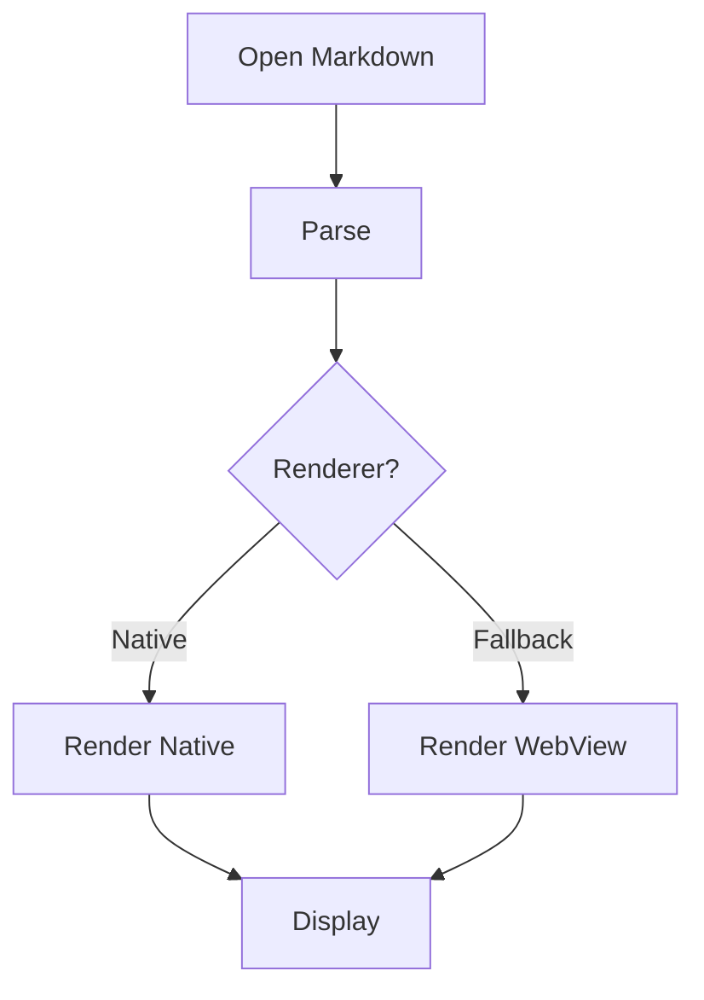
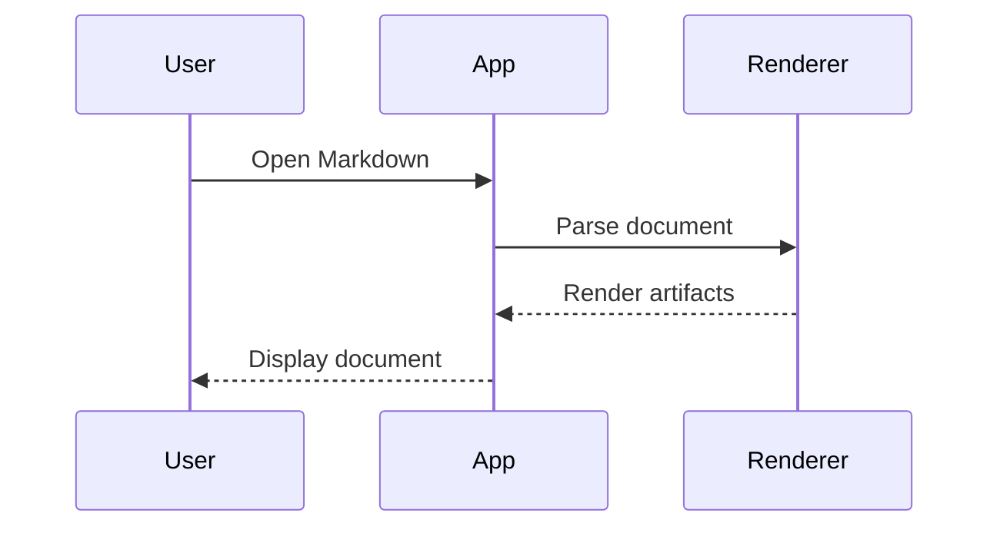
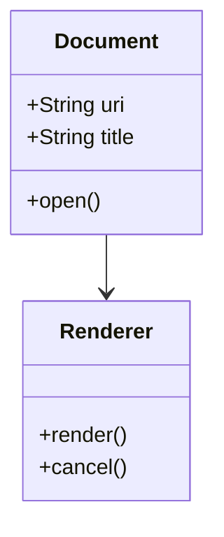
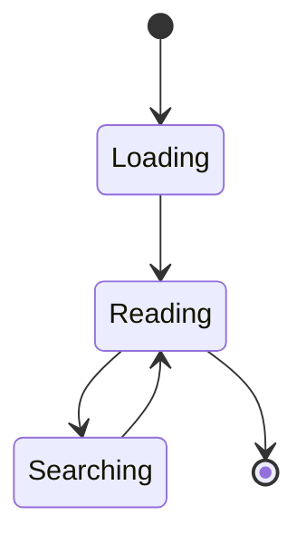
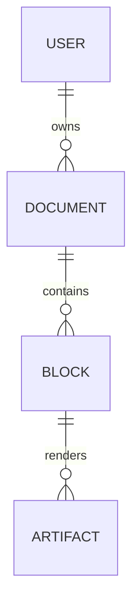
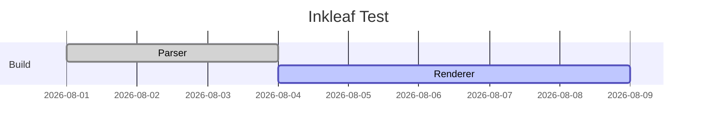
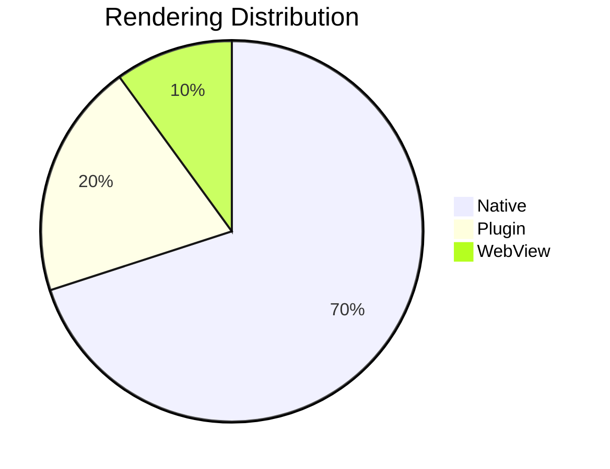
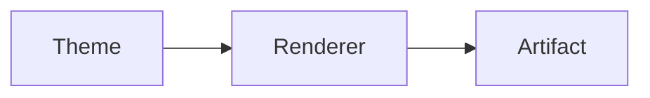
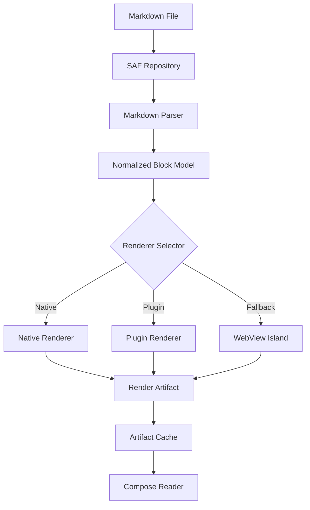

# Inkleaf Markdown Rendering Test Suite

> **Purpose:** A comprehensive Markdown fixture for visually and functionally testing the Inkleaf renderer.
>
> **How to use:** Open this file in Inkleaf and compare every section against the expected Markdown semantics. If a section renders incorrectly, record the section ID, input syntax, observed result, expected result, and renderer/plugin involved.

---

## 0. Test Metadata

| Field | Value |
|---|---|
| Fixture | Inkleaf Markdown Rendering Test Suite |
| Primary target | CommonMark + GFM |
| Secondary target | GitHub-style extensions / common Markdown extensions |
| Product-specific targets | Mermaid, KaTeX/LaTeX, SVG, callouts |
| Expected behavior | Unsupported syntax should degrade gracefully rather than corrupt the document |
| Main purpose | Rendering regression / compatibility testing |

### Test Result Legend

- **PASS** — renders correctly and behaves correctly.
- **FAIL** — syntax is recognized but visual/behavioral output is wrong.
- **UNSUPPORTED** — syntax is intentionally not implemented.
- **PARTIAL** — some cases work, edge cases fail.
- **SECURITY-FALLBACK** — unsafe content is correctly blocked or converted to safe text.

---

# 1. Document Structure & Headings

## 1.1 ATX Headings

# Heading 1

## Heading 2

### Heading 3

#### Heading 4

##### Heading 5

###### Heading 6

## 1.2 ATX Headings Without Space

#Heading without a space

This should normally remain ordinary text under CommonMark rather than becoming an H1.

## 1.3 ATX Headings With Closing Hashes

# Heading 1 #

## Heading 2 ##

### Heading 3 ###

#### Heading 4 ####

## 1.4 Heading With Formatting

# **Bold heading**

## *Italic heading*

### `Code` inside heading

#### [Linked heading](https://example.com)

## 1.5 Setext Headings

Setext Heading 1
================

Setext Heading 2
----------------

## 1.6 Heading Edge Cases

### Heading with punctuation!

### Heading with `inline code`

### Heading with **bold**, *italic*, and ~~strike~~

### Heading with emoji 🚀 📚 🧪

---

# 2. Paragraphs & Line Breaks

## 2.1 Normal Paragraph

This is a normal paragraph containing several words and punctuation.

This is a second paragraph separated by a blank line.

## 2.2 Soft Line Break

This line
continues on the next source line.

The renderer should treat this according to its soft-break policy without accidentally creating a new paragraph.

## 2.3 Hard Line Break With Two Spaces

First line ends here.  
Second line starts after a Markdown hard break.

## 2.4 Hard Line Break With Backslash

First line ends here.\
Second line starts after a Markdown hard break.

## 2.5 Multiple Blank Lines

Paragraph A.


Paragraph B.

## 2.6 Long Paragraph

Lorem ipsum dolor sit amet, consectetur adipiscing elit. Vestibulum consequat, ipsum sed faucibus luctus, nibh lectus tincidunt erat, at consectetur nisl arcu non libero. This paragraph is intentionally long enough to test wrapping, line spacing, content width, font scaling, and scrolling behavior.

---

# 3. Emphasis & Inline Formatting

## 3.1 Italic

*italic text*

_italic text_

## 3.2 Bold

**bold text**

__bold text__

## 3.3 Bold + Italic

***bold italic***

___bold italic___

**_bold italic_**

_**bold italic**_

## 3.4 Nested Emphasis

**bold with *italic* inside**

*italic with **bold** inside*

***bold italic with `code` inside***

## 3.5 Strikethrough — GFM

~~strikethrough text~~

This is ~~deleted~~ and this is **important**.

## 3.6 Inline Code

Use `inline code` inside a paragraph.

Use ``code containing a `backtick` ``.

Use ```code containing multiple backticks```.

## 3.7 Mixed Inline Formatting

**Bold**, *italic*, ~~strike~~, `code`, and [link](https://example.com).

---

# 4. Escaping & Literal Characters

## 4.1 Backslash Escapes

\*not italic\*

\_not italic\_

\# not a heading

\[not a link\]

\`not code\`

\\backslash

## 4.2 Escaping Markdown Punctuation

\! \# \$ \% \& \( \) \* \+ \- \. \: \; \< \= \> \? \@ \[ \] \^ \_ \{ \} \| \~

## 4.3 Literal Asterisks

This contains *one asterisk*.

This contains literal \* asterisk characters.

## 4.4 Literal Underscores

variable_name

my_file_name

\_literal underscore\_

---

# 5. Unordered / Bullet Lists

## 5.1 Hyphen Bullets

- Item one
- Item two
- Item three

## 5.2 Asterisk Bullets

* Item one
* Item two
* Item three

## 5.3 Plus Bullets

+ Item one
+ Item two
+ Item three

## 5.4 Mixed Bullet Markers

- First
- Second
  - Nested A
  - Nested B
- Third

## 5.5 Nested Bullet Lists

- Level 1
  - Level 2
    - Level 3
      - Level 4
        - Level 5

## 5.6 Bullet List With Rich Inline Content

- **Bold item**
- *Italic item*
- `Code item`
- ~~Strike item~~
- [Link item](https://example.com)
- 

## 5.7 Bullet List With Paragraphs

- Item one

  Continuation paragraph inside item one.

- Item two

  Continuation paragraph inside item two.

## 5.8 Bullet List With Multiple Block Types

- Item containing a paragraph.

  > Quote inside list item.

  ```text
  Code inside list item
  ```

- Second item.

## 5.9 Empty Bullet Item

- First
-
- Third

## 5.10 Bullet Immediately After Paragraph

This paragraph is immediately followed by a list.
- First list item
- Second list item

## 5.11 Different Bullet Delimiters

- Hyphen item
- Hyphen item

+ Plus item
+ Plus item

* Asterisk item
* Asterisk item

> CommonMark defines `-`, `+`, and `*` as valid bullet markers.

---

# 6. Ordered Lists

## 6.1 Basic Ordered List

1. First
2. Second
3. Third

## 6.2 Ordered List Starting At Another Number

5. Five
6. Six
7. Seven

## 6.3 Ordered List With Zero

0. Zero
1. One

## 6.4 Ordered List Using Parentheses

1) First
2) Second
3) Third

## 6.5 Ordered List With Formatting

1. **Bold**
2. *Italic*
3. `Code`
4. [Link](https://example.com)
5. ~~Strike~~

## 6.6 Nested Ordered Lists

1. Level 1
   1. Level 2
      1. Level 3
         1. Level 4

## 6.7 Mixed Ordered + Unordered

1. First
   - Nested bullet A
   - Nested bullet B
2. Second
   1. Nested ordered A
   2. Nested ordered B

## 6.8 Ordered List With Paragraphs

1. First item

   Continuation paragraph.

2. Second item

   Another paragraph.

## 6.9 Ordered List With Code

1. Install the dependency.

   ```bash
   npm install example-package
   ```

2. Run the application.

## 6.10 Ordered List Edge Case

3. Three
4. Four
1. This source number may be ignored for subsequent items depending on Markdown semantics.

---

# 7. Task Lists — GFM

## 7.1 Basic Task List

- [ ] Unchecked task
- [x] Checked task
- [X] Checked task using uppercase X

## 7.2 Task List With Formatting

- [ ] **Bold task**
- [x] *Italic task*
- [ ] `Code task`
- [x] [Linked task](https://example.com)

## 7.3 Nested Task Lists

- [x] Parent task
  - [ ] Child task
  - [x] Completed child task
    - [ ] Grandchild task

## 7.4 Task List With Paragraph

- [ ] Main task

  Additional explanation for the task.

- [x] Completed task

---

# 8. Block Quotes

## 8.1 Simple Quote

> This is a block quote.

## 8.2 Multi-Line Quote

> First line.
> Second line.
> Third line.

## 8.3 Quote With Paragraphs

> First paragraph inside quote.
>
> Second paragraph inside quote.

## 8.4 Nested Quote

> Outer quote
>
> > Nested quote
>
> Back to outer quote.

## 8.5 Quote With Formatting

> **Bold**
>
> *Italic*
>
> `Code`
>
> [Link](https://example.com)

## 8.6 Quote With List

> - Item one
> - Item two
>   - Nested item

## 8.7 Quote With Code

> ```text
> Code inside block quote
> line two
> ```

## 8.8 Quote With Heading

> ## Heading inside quote
>
> Text under the heading.

---

# 9. Horizontal Rules / Thematic Breaks

## 9.1 Asterisks

***

## 9.2 Hyphens

---

## 9.3 Underscores

___

## 9.4 Spaced Asterisks

* * *

## 9.5 Spaced Hyphens

- - -

## 9.6 Spaced Underscores

_ _ _

---

# 10. Links

## 10.1 Inline Link

[Example](https://example.com)

## 10.2 Link With Title

[Example with title](https://example.com "Example website")

## 10.3 Link With Formatting

[**Bold link**](https://example.com)

[*Italic link*](https://example.com)

[`Code link`](https://example.com)

## 10.4 Autolink — URL

<https://example.com>

## 10.5 Autolink — Email

<user@example.com>

## 10.6 Bare URL

https://example.com

## 10.7 Bare Email

user@example.com

## 10.8 Link With Query Parameters

[Search](https://example.com/search?q=markdown&sort=desc)

## 10.9 Link With Parentheses

[Wikipedia](https://en.wikipedia.org/wiki/Markdown_(markup_language))

## 10.10 Link Reference — Full

[CommonMark][cm]

[cm]: https://spec.commonmark.org/

## 10.11 Link Reference — Collapsed

[CommonMark][]

[CommonMark]: https://spec.commonmark.org/

## 10.12 Link Reference — Shortcut

[CommonMark]

[CommonMark]: https://spec.commonmark.org/

## 10.13 Link With Anchor

[Jump to Rendering](#15-code-blocks)

---

# 11. Images

## 11.1 Basic Image


## 11.2 Image With Title


## 11.3 Image With Alt Text


## 11.4 Image Reference

![Reference image][img-ref]

[img-ref]: https://placehold.co/640x360/png "Reference image"

## 11.5 Broken Image


Expected behavior: visible broken-resource state; renderer must not crash or blank the document.

## 11.6 Image Inside Link

[](https://example.com)

## 11.7 Image With Formatting in Alt Text


---

# 12. Code Blocks

## 12.1 Indented Code Block

    This is an indented code block.
    It should preserve whitespace.
    Line three.

## 12.2 Fenced Code Block

```
Plain fenced code
Line two
Line three
```

## 12.3 Fenced Code With Tildes

~~~
Tilde fenced code
Line two
~~~

## 12.4 JavaScript

```javascript
function hello(name) {
  return `Hello, ${name}!`;
}

console.log(hello("Inkleaf"));
```

## 12.5 Kotlin

```kotlin
data class User(
    val id: Long,
    val name: String
)

fun main() {
    println(User(1, "Inkleaf"))
}
```

## 12.6 Java

```java
public class Main {
    public static void main(String[] args) {
        System.out.println("Hello Markdown");
    }
}
```

## 12.7 Python

```python
def fibonacci(n):
    a, b = 0, 1
    for _ in range(n):
        a, b = b, a + b
    return a
```

## 12.8 JSON

```json
{
  "name": "Inkleaf",
  "version": "1.0",
  "offline": true,
  "features": ["markdown", "mermaid", "katex", "svg"]
}
```

## 12.9 XML

```xml
<document>
  <title>Inkleaf</title>
  <offline>true</offline>
</document>
```

## 12.10 SQL

```sql
SELECT id, name
FROM users
WHERE active = true
ORDER BY name;
```

## 12.11 Shell

```bash
#!/usr/bin/env bash

echo "Testing Inkleaf"
mkdir -p build
./gradlew test
```

## 12.12 Unknown Language

```not-a-real-language
This should still render as readable code.
Unknown language should not break the document.
```

## 12.13 Very Long Code Line

```text
This is intentionally a very long code line designed to test whether the renderer wraps code, horizontally scrolls code, clips code, or causes the entire document layout to overflow unexpectedly. 1234567890 abcdefghijklmnopqrstuvwxyz
```

---

# 13. Inline Code Edge Cases

`simple`

`a b c`

``code with ` inside``

```code with `` inside```

`$variable`

`*not italic*`

`[not a link](url)`

---

# 14. Tables — GFM

## 14.1 Basic Table

| Name | Role | Status |
|---|---|---|
| Alice | Developer | Active |
| Bob | Designer | Active |
| Charlie | QA | Pending |

## 14.2 Left / Center / Right Alignment

| Left | Center | Right |
|:---|:---:|---:|
| A | B | C |
| Left aligned | Center aligned | Right aligned |

## 14.3 Wide Table

| ID | Name | Description | Owner | Status | Created | Updated |
|---|---|---|---|---|---|---|
| 001 | Renderer | Native Markdown renderer | Core | Active | 2026-08-01 | 2026-08-14 |
| 002 | Mermaid | Diagram plugin | Plugin | Active | 2026-08-02 | 2026-08-14 |
| 003 | KaTeX | Math plugin | Plugin | Active | 2026-08-03 | 2026-08-14 |
| 004 | SVG | Vector renderer | Plugin | Active | 2026-08-04 | 2026-08-14 |

Expected behavior: table remains readable; wide content should horizontally scroll rather than clip the document.

## 14.4 Table With Inline Markdown

| Feature | Example |
|---|---|
| **Bold** | **important** |
| *Italic* | *note* |
| `Code` | `const x = 1` |
| Link | [Open](https://example.com) |
| Strike | ~~removed~~ |

## 14.5 Table With Pipes Inside Code

| Expression | Result |
|---|---|
| `a \| b` | Pipe inside code |
| `foo \| bar` | Another pipe |

## 14.6 Empty Cells

| A | B | C |
|---|---|---|
| value | | value |
| | value | |

## 14.7 Uneven Rows

| A | B | C |
|---|---|---|
| 1 | 2 |
| 3 | 4 | 5 | 6 |

Expected behavior should follow the chosen GFM implementation.

## 14.8 Table Without Outer Pipes

A | B | C
--- | --- | ---
1 | 2 | 3
4 | 5 | 6

## 14.9 Table With Multiline-Looking Text

| Name | Description |
|---|---|
| Alpha | First item with a long description that should wrap inside the cell without destroying table alignment. |
| Beta | Second item. |

---

# 15. Code Blocks Inside Lists and Quotes

## 15.1 Code Inside Bullet

- First item

  ```javascript
  const value = 42;
  console.log(value);
  ```

- Second item

## 15.2 Code Inside Ordered List

1. First step

   ```bash
   echo "step 1"
   ```

2. Second step

## 15.3 Code Inside Quote

> Example:
>
> ```text
> quoted code
> ```

---

# 16. HTML Blocks & Inline HTML

> **Compatibility note:** Raw HTML is part of CommonMark, but an Android reader may intentionally support only a safe subset. Test whether your implementation renders, escapes, or safely degrades each case.

## 16.1 Inline HTML

This contains <mark>highlighted HTML</mark>.

This contains <kbd>Ctrl</kbd> + <kbd>C</kbd>.

This contains <sub>subscript</sub> and <sup>superscript</sup>.

## 16.2 HTML Line Break

Line one<br>
Line two

## 16.3 HTML Horizontal Rule

<hr>

## 16.4 HTML Paragraph

<p>This is an HTML paragraph.</p>

## 16.5 HTML Div

<div>
This is inside a div.
</div>

## 16.6 HTML Details / Summary

<details>
<summary>Click to expand</summary>

Hidden content.

</details>

## 16.7 HTML Table

<table>
<tr>
<th>Name</th>
<th>Value</th>
</tr>
<tr>
<td>Alpha</td>
<td>100</td>
</tr>
</table>

## 16.8 Unsafe HTML — Script

<script>
alert("This must NOT execute.");
</script>

Expected behavior: script must never execute. Safe fallback/escaping is required.

## 16.9 Unsafe Event Handler

<div onclick="alert('unsafe')">Unsafe event handler</div>

Expected behavior: event handler must not execute.

---

# 17. Entities & Unicode

## 17.1 HTML Entities

&amp; &lt; &gt; &quot; &apos;

## 17.2 Numeric Entities

&#169; &#174; &#8482; &#9731;

## 17.3 Unicode

English — हिन्दी — বাংলা — தமிழ் — తెలుగు — मराठी — ગુજરાતી — ಕನ್ನಡ

中文 — 日本語 — 한국어 — العربية — עברית — Ελληνικά — Русский

## 17.4 Emoji

😀 😃 😄 😁 😆 😅 😂 🙂 🙃 😉 🚀 🧪 📚 ❤️ 🔥 ✅ ❌ ⚠️

## 17.5 Combining Characters

é é

Å Å

---

# 18. Footnotes

> **Extension:** Footnotes are not part of the original CommonMark core. Test them if your Markdown stack supports them.

## 18.1 Basic Footnote

Here is a sentence with a footnote.[^1]

[^1]: This is the footnote text.

## 18.2 Multiple Footnotes

Markdown was designed to be readable.[^design]

A second note appears here.[^second]

[^design]: A footnote about Markdown design.
[^second]: A second footnote.

## 18.3 Footnote With Formatting

This has a formatted footnote.[^formatted]

[^formatted]: **Bold**, *italic*, and `code` inside a footnote.

## 18.4 Footnote With Multiple Paragraphs

Here is a longer note.[^long]

[^long]: First paragraph of the note.

    Second paragraph of the same note.

---

# 19. Definition / Reference Links

[Markdown][markdown-ref]

[markdown-ref]: https://spec.commonmark.org/

## Reference Image

![Reference image][reference-image]

[reference-image]: https://placehold.co/400x200/png

---

# 20. Automatic Link Detection

https://example.com

http://example.com

www.example.com

mailto:user@example.com

user@example.com

Expected behavior depends on whether bare URL/email autolinking is enabled by the implementation.

---

# 21. Escaped & Ambiguous Syntax

## 21.1 Asterisk Ambiguity

a*b*c

a**b**c

a***b***c

## 21.2 Underscore Ambiguity

foo_bar_baz

foo__bar__baz

foo___bar___baz

## 21.3 List-Like Text That Is Not a List

This is a normal sentence with - a hyphen.

This is `- not a list`.

This is \- escaped.

## 21.4 Number-Like Text

Version 1.2.3

The room number is 10.20.

2026.08.14

- This is a list.
- This is another list.

---

# 22. Nested Structures Stress Test

## 22.1 Quote → List → Code

> - First item
> - Second item
>
>   ```text
>   Code nested inside list inside quote.
>   ```

## 22.2 List → Quote → List

- Parent item
  > Quote inside parent.
  >
  > - Nested quoted list
  > - Another item

## 22.3 List → Table

- Data:

  | A | B |
  |---|---|
  | 1 | 2 |
  | 3 | 4 |

## 22.4 List → Quote → Code

1. First

   > Example:
   >
   > ```bash
   > echo "nested"
   > ```

2. Second

---

# 23. Mermaid — Inkleaf Plugin

> **Expected Inkleaf behavior:** Mermaid blocks should be recognized by the Mermaid plugin. If native Mermaid is unsupported for a diagram type, the configured fallback should render it without breaking the surrounding document.

## 23.1 Flowchart



## 23.2 Sequence Diagram



## 23.3 Class Diagram



## 23.4 State Diagram



## 23.5 Entity Relationship



## 23.6 Gantt



## 23.7 Pie



---

# 24. KaTeX / LaTeX — Inkleaf Plugin

> **Expected Inkleaf behavior:** Inline and block math should be routed to the KaTeX plugin. Malformed expressions should fail locally without breaking surrounding Markdown.

## 24.1 Inline Math

Einstein's equation is $E = mc^2$.

## 24.2 Block Math

$$
E = mc^2
$$

## 24.3 Quadratic Formula

$$
x = \frac{-b \pm \sqrt{b^2 - 4ac}}{2a}
$$

## 24.4 Integral

$$
\int_0^\infty e^{-x^2}\,dx = \frac{\sqrt{\pi}}{2}
$$

## 24.5 Matrix

$$
\begin{bmatrix}
1 & 2 & 3 \\
4 & 5 & 6 \\
7 & 8 & 9
\end{bmatrix}
$$

## 24.6 Greek Letters

$\alpha \beta \gamma \delta \epsilon \theta \lambda \mu \pi \sigma \phi \omega$

## 24.7 Subscripts and Superscripts

$x_1$, $x_2$, $x^2$, $x_i^2$

## 24.8 Fractions

$\frac{a}{b}$

## 24.9 Malformed Math

$$
\frac{a}{b
$$

Expected behavior: local error/source fallback; surrounding content remains readable.

---

# 25. SVG — Inkleaf Plugin

## 25.1 Inline SVG

<svg width="220" height="100" viewBox="0 0 220 100" xmlns="http://www.w3.org/2000/svg">
  <rect x="10" y="10" width="200" height="80" rx="12" fill="#e8f0fe"/>
  <circle cx="60" cy="50" r="25" fill="#4285f4"/>
  <text x="100" y="56" font-size="20">Inkleaf</text>
</svg>

## 25.2 SVG With Path

<svg width="200" height="120" viewBox="0 0 200 120" xmlns="http://www.w3.org/2000/svg">
  <path d="M20 100 L100 20 L180 100 Z" fill="none" stroke="black" stroke-width="4"/>
</svg>

## 25.3 SVG Image Reference


Expected behavior: native SVG renderer if supported; otherwise safe fallback.

## 25.4 Malicious SVG Test

```html
<svg xmlns="http://www.w3.org/2000/svg">
  <script>alert("must not execute")</script>
  <rect width="100" height="100"/>
</svg>
```

Expected behavior: script is rejected/neutralized.

---

# 26. Callouts / Admonitions

## 26.1 GitHub-Style Note

> [!NOTE]
> This is a note callout.

## 26.2 Tip

> [!TIP]
> This is a useful tip.

## 26.3 Important

> [!IMPORTANT]
> This information is important.

## 26.4 Warning

> [!WARNING]
> This is a warning.

## 26.5 Caution

> [!CAUTION]
> This is a caution.

## 26.6 Callout With Multiple Paragraphs

> [!NOTE]
> First paragraph.
>
> Second paragraph with **bold** and `code`.

## 26.7 Unknown Callout Type

> [!CUSTOM]
> This tests behavior for an unknown callout type.

Expected behavior should follow Inkleaf's documented callout policy.

---

# 27. Common Documentation Patterns

## 27.1 README Header

# Project Name

> A short description of the project.

**Status:** Active

[Documentation](https://example.com) · [Issues](https://example.com/issues)

## 27.2 Feature List

### Features

- Fast
- Offline
- Native rendering
- Plugin architecture
- Mermaid
- KaTeX
- SVG
- Accessibility

## 27.3 Installation

```bash
git clone https://example.com/project.git
cd project
./gradlew build
```

## 27.4 Usage

```bash
./gradlew test
```

## 27.5 Configuration Table

| Setting | Default | Description |
|---|---|---|
| Theme | System | Reader appearance |
| Font Scale | 1.0 | Text scale |
| Code Wrap | Off | Wrap long code |
| Rich Blocks | On | Render plugins |

---

# 28. Markdown + HTML Mixed Content

This paragraph contains **Markdown** and <mark>HTML</mark> together.

<div>

# Markdown Inside HTML

This behavior may vary by Markdown implementation.

</div>

---

# 29. Whitespace & Indentation Tests

## 29.1 Leading Spaces

   Three leading spaces should be tested carefully.

    Four leading spaces normally create an indented code block.

## 29.2 Tabs

	Tab-indented content.

## 29.3 Trailing Spaces

This line has two trailing spaces.  
This line does not.

## 29.4 Empty Lines

Paragraph one.

Paragraph two.


Paragraph three.

---

# 30. Escaping Inside Links

[Link with \*literal asterisk\*](https://example.com)

[Link with `code`](https://example.com)

[Link with **bold**](https://example.com)

[Link with [nested-looking brackets]](https://example.com)

---

# 31. Unicode + RTL

English text followed by العربية.

עברית mixed with English.

हिन्दी Markdown परीक्षण।

中文 Markdown 测试。

日本語 Markdown テスト。

한국어 Markdown 테스트.

---

# 32. Very Long Content / Rendering Stress

## 32.1 Long Paragraph

Lorem ipsum dolor sit amet, consectetur adipiscing elit. Sed do eiusmod tempor incididunt ut labore et dolore magna aliqua. Ut enim ad minim veniam, quis nostrud exercitation ullamco laboris nisi ut aliquip ex ea commodo consequat. Duis aute irure dolor in reprehenderit in voluptate velit esse cillum dolore eu fugiat nulla pariatur. Excepteur sint occaecat cupidatat non proident, sunt in culpa qui officia deserunt mollit anim id est laborum. Lorem ipsum dolor sit amet, consectetur adipiscing elit. Sed do eiusmod tempor incididunt ut labore et dolore magna aliqua. Ut enim ad minim veniam, quis nostrud exercitation ullamco laboris nisi ut aliquip ex ea commodo consequat.

## 32.2 Repeated Headings

### Repeated heading

Text.

### Repeated heading

More text.

### Repeated heading

Even more text.

Expected behavior: deterministic heading IDs/anchors.

---

# 33. Anchor / Navigation Tests

## 33.1 Internal Links

[Jump to Mermaid](#23-mermaid--inkleaf-plugin)

[Jump to Math](#24-katex--latex--inkleaf-plugin)

[Jump to Tables](#14-tables--gfm)

## 33.2 Explicit HTML Anchor

<a id="custom-anchor"></a>

[Jump to custom anchor](#custom-anchor)

---

# 34. Metadata-Like Content

## YAML Frontmatter

```yaml
---
title: Inkleaf Test
author: Manish
tags:
  - markdown
  - android
  - testing
draft: false
---
```

> If frontmatter parsing is not supported, it should at minimum remain readable and should not corrupt the rest of the document.

---

# 35. Obsidian-Adjacent Syntax

> These are **not CommonMark requirements**. Include them only if Inkleaf chooses to support them.

## 35.1 Wiki Link

[[Another Document]]

## 35.2 Wiki Link With Alias

[[Another Document|Display Name]]

## 35.3 Heading Wiki Link

[[Another Document#Heading]]

## 35.4 Block Reference-Like Syntax

[[Another Document#^block-id]]

## 35.5 Embed

![[image.png]]

## 35.6 Embedded Markdown

![[Another Document.md]]

Expected behavior: either explicitly support, safely show as text, or document as unsupported.

---

# 36. Common Extension Syntax

> These are intentionally included as a compatibility discovery section. Different Markdown engines support different extensions.

## 36.1 Highlight

==highlighted text==

## 36.2 Superscript

H^2^

## 36.3 Subscript

H~2~O

## 36.4 Inserted Text

++inserted text++

## 36.5 Mark / Highlight HTML

<mark>highlighted</mark>

## 36.6 Keyboard Key

<kbd>Ctrl</kbd> + <kbd>Alt</kbd> + <kbd>Delete</kbd>

Expected behavior: classify according to Inkleaf's supported-extension policy.

---

# 37. Security / Adversarial Rendering Tests

## 37.1 Script Tag

<script>
document.body.innerHTML = "ATTACK";
</script>

Expected: must not execute.

## 37.2 Event Handler


Expected: event handler must not execute.

## 37.3 JavaScript URL

[Click me](javascript:alert('attack'))

Expected: must not execute JavaScript.

## 37.4 Data URL

</script>)

Expected: apply Inkleaf's safe URI policy.

## 37.5 External SVG Reference

<svg xmlns="http://www.w3.org/2000/svg">
  <image href="https://example.com/secret.png"/>
</svg>

Expected: external resource must not be fetched in v1.0.

## 37.6 Extremely Deep Nesting

- Level 1
  - Level 2
    - Level 3
      - Level 4
        - Level 5
          - Level 6
            - Level 7
              - Level 8
                - Level 9
                  - Level 10

Expected: no stack overflow, ANR, or crash.

## 37.7 Extremely Long Link

[This is a deliberately long link label used to test wrapping, selection, layout stability, and hit target behavior without causing horizontal overflow](https://example.com/very/long/path/with/many/segments/and/query?parameter=one&parameter=two&parameter=three)

---

# 38. Renderer Failure / Graceful Fallback Tests

## 38.1 Broken Image


## 38.2 Unknown Code Language

```totally-unknown-language
some source
```

## 38.3 Malformed Mermaid

```mermaid
this is not valid mermaid
%% intentionally malformed
```

## 38.4 Malformed Math

$$
\frac{
$$

## 38.5 Malformed HTML

<div>
Unclosed HTML block

## 38.6 Unsupported Extension

::: unsupported
This is an intentionally unsupported fenced directive.
:::

Expected behavior: renderer should preserve readability and avoid document-wide failure.

---

# 39. Selection / Copy Tests

## 39.1 Normal Selection

Select this paragraph and verify that text selection follows native Android behavior.

## 39.2 Code Selection

```text
Select this code and verify whether copying returns exactly the source text.
```

## 39.3 Table Selection

| A | B |
|---|---|
| Select | Me |

## 39.4 Link Selection

Select the visible text of [this link](https://example.com).

---

# 40. Theme Tests

## 40.1 Light Theme

This text should remain readable in light mode.

> This quote should remain readable in light mode.

`This code should remain readable in light mode.`

## 40.2 Dark Theme

This text should remain readable in dark mode.

> This quote should remain readable in dark mode.

`This code should remain readable in dark mode.`

## 40.3 Sepia / Paper Theme

This text should remain comfortable in the sepia/paper theme.

> Quotes should maintain sufficient contrast.

`Code should remain distinguishable from prose.`

## 40.4 Theme + Rich Content



$$
\int_0^1 x^2 dx = \frac{1}{3}
$$

---

# 41. Font Scaling Tests

The following paragraph should remain readable at 100%, 130%, 150%, 200%, and other supported Android font scales.

Lorem ipsum dolor sit amet, consectetur adipiscing elit. This paragraph exists primarily to test wrapping, line height, table behavior, code behavior, heading scaling, and control accessibility under increased font size.

## Heading at Large Font Scale

### Another Heading

- List item with large text
- Another list item
- Nested item
  - Child item

---

# 42. Combined Real-World Technical Document

# Inkleaf Architecture Example

> **Goal:** Render a serious technical document without sacrificing native reading quality.

## Architecture



## Example Equation

The rendering latency can be modeled as:

$$
T_{total} = T_{parse} + T_{schedule} + T_{render} + T_{present}
$$

## Example Table

| Component | Responsibility | Renderer |
|---|---|---|
| Markdown | Prose | Native |
| Mermaid | Diagram | Native/WebView |
| KaTeX | Math | Plugin |
| SVG | Vector | Native |
| Image | Media | Native image loader |

## Implementation

```kotlin
interface RenderPlugin {
    val id: String
    val version: String

    suspend fun render(
        input: PluginInput,
        context: RenderContext
    ): RenderArtifact
}
```

## Checklist

- [x] Parser integrated
- [x] Block model implemented
- [ ] Mermaid validation complete
- [ ] KaTeX integrated
- [ ] SVG sanitization tested
- [ ] Accessibility tested
- [ ] Performance benchmarked

> [!NOTE]
> This combined section is intentionally representative of the kind of document Inkleaf is designed to handle.

---

# 43. Final Regression Checklist

## Core CommonMark

- [ ] Headings
- [ ] Setext headings
- [ ] Paragraphs
- [ ] Soft line breaks
- [ ] Hard line breaks
- [ ] Emphasis
- [ ] Strong emphasis
- [ ] Nested emphasis
- [ ] Inline code
- [ ] Code blocks
- [ ] Block quotes
- [ ] Nested block quotes
- [ ] Bullet lists
- [ ] Ordered lists
- [ ] Nested lists
- [ ] Thematic breaks
- [ ] Links
- [ ] Reference links
- [ ] Images
- [ ] Reference images
- [ ] Autolinks
- [ ] Escapes
- [ ] Entities
- [ ] Raw HTML

## GFM

- [ ] Tables
- [ ] Table alignment
- [ ] Task lists
- [ ] Nested task lists
- [ ] Strikethrough
- [ ] GFM autolinks

## Extended / Plugin Features

- [ ] Footnotes
- [ ] Callouts
- [ ] Mermaid flowchart
- [ ] Mermaid sequence
- [ ] Mermaid class
- [ ] Mermaid state
- [ ] Mermaid ER
- [ ] Mermaid Gantt
- [ ] Mermaid pie
- [ ] KaTeX inline
- [ ] KaTeX block
- [ ] KaTeX matrices
- [ ] KaTeX malformed input fallback
- [ ] SVG rendering
- [ ] SVG sanitization

## Inkleaf Reader UX

- [ ] Light theme
- [ ] Dark theme
- [ ] Sepia/Paper theme
- [ ] Dynamic font scaling
- [ ] Reading progress indicator
- [ ] Search
- [ ] TOC
- [ ] Internal anchors
- [ ] Text selection
- [ ] Code copy
- [ ] Image zoom
- [ ] Diagram zoom
- [ ] Horizontal table scrolling
- [ ] Horizontal code scrolling
- [ ] Reading-position restoration

## Security

- [ ] Script blocked
- [ ] Event handlers blocked
- [ ] JavaScript URLs blocked
- [ ] External resource policy enforced
- [ ] Malicious SVG blocked
- [ ] Huge nesting handled safely
- [ ] Huge image handled safely
- [ ] Malformed plugin input isolated
- [ ] Renderer failure does not crash document

---

# 44. Suggested Bug Report Template

When something fails, record it in this format:

| Field | Value |
|---|---|
| Test ID | e.g. 5.1 |
| Feature | Bullet list |
| Input | `- Item one` |
| Expected | A rendered unordered list with bullet markers |
| Actual | Describe what Inkleaf rendered |
| Severity | P0 / P1 / P2 / P3 |
| Renderer | Native / Markwon / Plugin / WebView |
| Theme | Light / Dark / Sepia |
| Font scale | 100% / 150% / 200% |
| Device | Device/API |
| Reproducible | Yes / No |
| Notes | Additional information |

---

# 45. Important Interpretation Notes

1. **Not every section in this file is a v1.0 requirement.** Some sections intentionally test extensions or implementation-specific syntax.
2. CommonMark defines the core syntax. GFM is a strict superset of CommonMark and adds features such as tables, task lists, and strikethrough.
3. Footnotes, callouts, wiki links, embeds, highlight syntax, and similar features vary by Markdown implementation.
4. A feature that is intentionally unsupported should be recorded as **UNSUPPORTED**, not automatically treated as a rendering bug.
5. Unsafe HTML/SVG/URI content must be evaluated for **safe degradation**, not merely visual rendering.
6. Mermaid and KaTeX should be tested as plugin-rendered blocks, including malformed input and fallback behavior.
7. A renderer that displays the correct text but breaks selection, scrolling, accessibility, zoom, or theme behavior should still be considered a failed test for that feature.
8. For Inkleaf, **document-wide failure is never an acceptable result of a single malformed or unsupported rich block.**

---

# 46. Recommended Test Priority

If time is limited, test in this order:

### P0 — Core reader correctness

1. Bullet lists
2. Ordered lists
3. Nested lists
4. Paragraphs / line breaks
5. Headings
6. Bold / italic / strike
7. Links
8. Images
9. Code blocks
10. Block quotes
11. Tables

### P1 — Technical Markdown

12. Task lists
13. Footnotes
14. Reference links
15. HTML
16. Mermaid
17. KaTeX
18. SVG
19. Callouts

### P1 — Reader UX

20. Search
21. TOC
22. Internal anchors
23. Selection/copy
24. Light/Dark/Sepia
25. Reading progress
26. Font scaling
27. Image/diagram zoom

### P1 — Failure/security

28. Broken images
29. Malformed Mermaid
30. Malformed KaTeX
31. Malicious SVG
32. Script/event-handler HTML
33. JavaScript URLs
34. Deep nesting
35. Very large content

---

# End of Test Suite

**Primary objective:** Find every Markdown/rendering defect in the current Inkleaf implementation before the renderer is considered stable.

**Recommended workflow:**

```text
Open this file
      ↓
Test P0
      ↓
Record failures
      ↓
Fix renderer
      ↓
Re-open fixture
      ↓
Test P1
      ↓
Run regression
      ↓
Promote stable cases into automated golden tests
```

Once a case passes reliably, convert that exact Markdown snippet into an automated parser/rendering regression test.
