# Agentic Architecture — Foundations, Planning, Multi-Agent Orchestration, Reliability & Human Oversight

> **Source:** `D1 - Agentic Architecture (Updated).pdf`
>
> This document consolidates the complete slide deck into a single, lower-redundancy study/reference note. Repeated definitions and takeaways are merged, while distinct concepts, examples, trade-offs, diagrams, decision rules, tables, schemas, and implementation patterns are retained.
>
> **Source slide references:** Numbers such as `Slides 13–20` refer to the corresponding slides in the supplied deck.

---

## 0. Executive Mental Model

The deck draws a progression from **chatbot → workflow → agent**, with increasing autonomy.

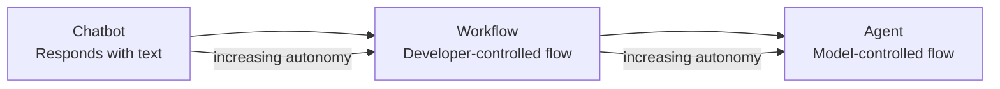

The central architectural question is:

> **Does this task require runtime judgment, or can its control flow be authored and tested in advance?**

- If the path is predictable, prefer a **workflow**.
- If the path to the goal cannot be scripted in advance, an **agent** may be warranted.
- If only one portion requires runtime judgment, use a **hybrid**: keep deterministic structure and make only the problematic step agentic.

Higher autonomy increases capability **and** risk surface, so the deck bbbbbb repeatedly recommends the **minimum architectural footprint** and targeted **human-in-the-loop (HITL)** checkpoints.

---

# 1. Foundations of Agentic Architecture

## 1.1 Chatbot, Workflow, Agent

### Chatbot

A chatbot:

1. Receives a user message.
2. Processes it with an LLM.
3. Generates a response.
4. Primarily predicts the next likely tokens from learned patterns.
5. Produces text as its output.

In the deck's simplified framing, a basic chatbot does **not** inherently:

- access files,
- call APIs,
- query databases,
- run code,
- persist state,
- observe external results,
- learn from feedback during execution.

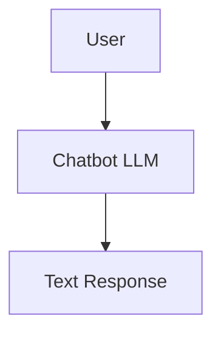

### Deterministic Workflow

A workflow is a **fixed, developer-authored sequence** of steps.

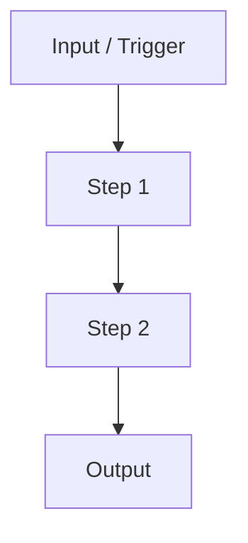

The control flow is decided at **design time**, not while the model is running.

### Agentic System

An agentic system is one in which a language model **autonomously pursues a goal** by:

- selecting actions,
- invoking tools,
- observing results,
- adapting its plan,
- iterating until the goal is reached or a termination condition is met.

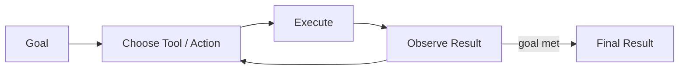

### Autonomous Agent

An autonomous agent operates without step-by-step human direction. It makes its own decisions to reach the goal.

---

## 1.2 The Augmented LLM Building Block

An **augmented LLM** is a base language model enhanced with:

- retrieval,
- tools,
- memory.

It is presented as the foundational building block of agentic systems.

### Retrieval and tools

The model can:

- generate its own search queries,
- select the tools it needs,
- use returned results in subsequent reasoning,

rather than waiting for a fixed script to hand it predetermined results.

### Memory

The model/system decides what information should be retained across steps so context can carry forward rather than resetting on every call.

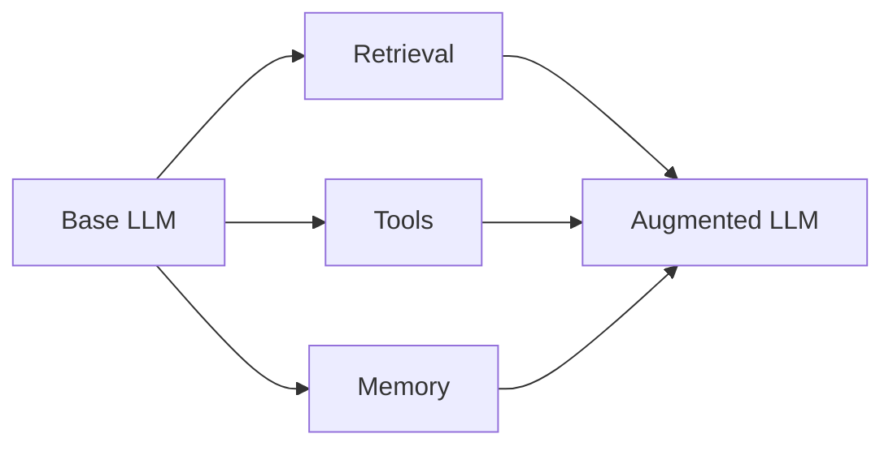

---

## 1.3 Why an LLM Alone Is Not an Agent

An LLM by itself is essentially:

> **Text in → text out**

It does not automatically have direct access to the world.

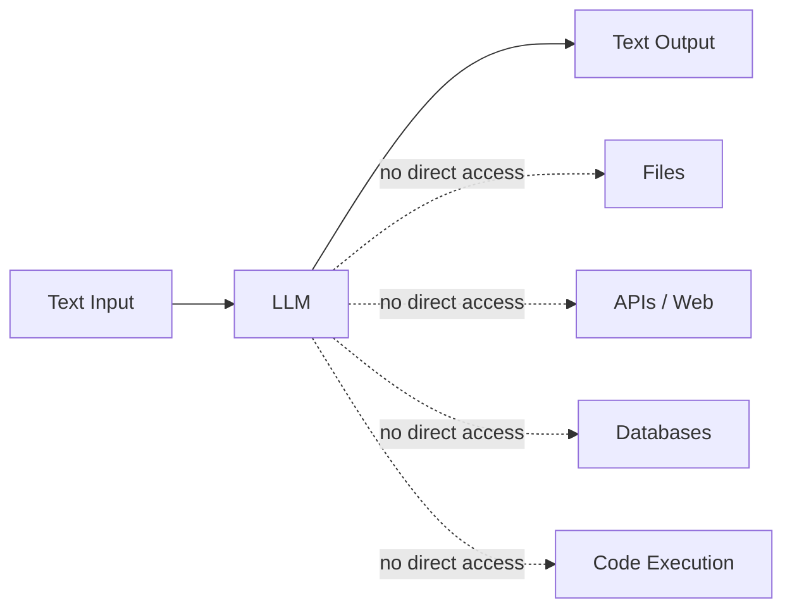

The deck identifies several missing capabilities:

| Capability | Basic LLM alone |
|---|---|
| Direct file access | No |
| API / web interaction | No |
| Database queries | No |
| Code execution | No |
| Persistent memory | No |
| Observing external results | No |
| Learning from feedback during execution | No |

**Agency emerges when the LLM is embedded in a system that can perceive state, select actions, execute them, observe the result, and iterate.**

---

## 1.4 The Four Pillars of Agency

The deck describes four continuous pillars:

| Pillar | Role |
|---|---|
| **Perception** | Sense and gather information from surroundings and internal state |
| **Selection / Reasoning** | Reason about options and select the best next action |
| **Execution / Action** | Carry out the selected action using tools, APIs, or other systems |
| **Iteration / Learning** | Learn from outcomes, update the plan, and repeat until the goal is achieved |

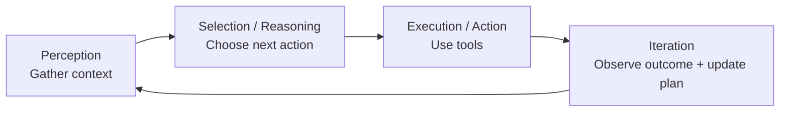

> **Agency emerges from the continuous loop of these four pillars.**

---

## 1.5 Three Core Distinctions

| Concept | Definition | Control |
|---|---|---|
| **Agentic System** | Model autonomously pursues a goal, selects actions, invokes tools, and iterates | Runtime/model |
| **Workflow** | Fixed sequence of developer-authored steps | Design time/developer |
| **Autonomous Agent** | Agent operating without step-by-step human direction | Runtime/model |

The most important boundary is **who controls the flow at inference time**.

---

# 2. Tool Use — The Foundation of Agency

Tool use turns a language model's text output into a system capable of acting in the world.

## 2.1 Tool-Call Lifecycle

Every tool interaction follows a four-phase sequence:

1. **Model emits structured tool-call output**
2. **Runtime intercepts and executes the call**
3. **Result is captured and formatted as an observation**
4. **Observation is added to context**

Then the model reads the observation and updates its plan.

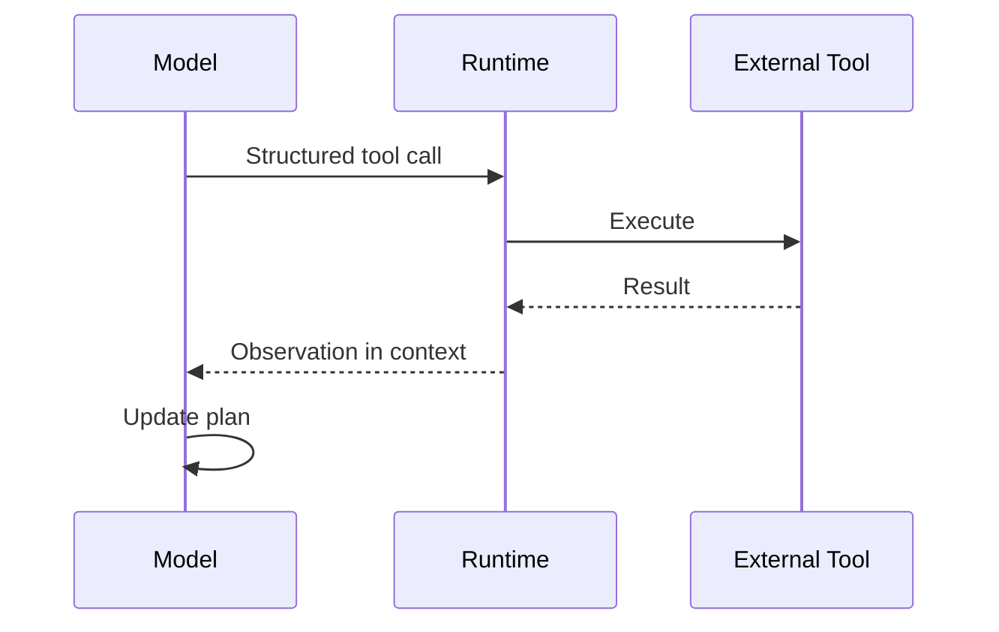

---

## 2.2 Tool Definition, Tool Call, Observation

| Building block | Meaning |
|---|---|
| **Tool Definition** | Schema supplied at inference time: name, natural-language description, parameter specification |
| **Tool Call** | Structured output emitted when the model chooses a tool; includes tool name + JSON arguments |
| **Observation** | Result returned after execution and injected into context so the model can decide its next step |

### Example tool schema

```json
{
  "name": "get_weather",
  "description": "Get the current weather",
  "parameters": {
    "location": "string"
  }
}
```

### Example tool call

```json
{
  "name": "get_weather",
  "arguments": {
    "location": "San Francisco"
  }
}
```

### Example observation

```json
{
  "temperature": 18,
  "unit": "celsius",
  "condition": "Partly cloudy"
}
```

The deck's Claude example follows:

```text
User Prompt
   ↓
Claude LLM
   ↓
Tool Call
   ↓
Runtime
   ↓
External Tool
   ↓
Observation
   ↓
Claude LLM
   ↓
Final Response
```

This loop continues until the user's goal is achieved.

---

## 2.3 Pre-Scripted vs. Model-Driven Tool Use

| Dimension | Pre-scripted / Workflow | Model-driven / Agentic |
|---|---|---|
| Tool selection | Developer chooses | Model chooses |
| Tool order | Developer chooses | Model chooses dynamically |
| Parameter filling | Model may fill parameters | Model selects tool and parameters |
| Sequence | Fixed | Can vary across runs |
| Predictability | High | Lower |
| Auditability | High | Harder |
| Adaptability | Lower | Higher |
| Risk | Lower | Higher; requires guardrails |

A key distinction:

> **Tool use alone does not make a system agentic.**

If a developer writes:

```text
Step 1 → Tool A
Step 2 → Tool B
Step 3 → Tool C
```

then the system can still be a workflow even though tools are involved.

The agentic boundary appears when the **model itself chooses what tool/action comes next at inference time**.

---

## 2.4 Description Quality Drives Tool Selection

The model selects tools using the **natural-language descriptions in the tool schema**, not by reading the implementation code.

Therefore:

- The model reads the description to decide whether and when to call a tool.
- Description quality directly affects selection reliability.
- Descriptions should be understandable enough that a non-engineer could act on them.
- Poor descriptions are a common cause of unreliable agent behavior.

### Vague vs. precise

| Vague | Precise |
|---|---|
| “Does something with data” | “Queries inventory by SKU, returns stock count” |

The vague description is ambiguous; the model cannot reliably determine when it should invoke the tool.

The precise description communicates:

- what data is queried,
- how it is queried,
- what the result represents,
- why the tool is appropriate.

---

## 2.5 Common Tool Categories

Most agentic systems compose tools from three broad categories:

| Category | Typical capabilities |
|---|---|
| **Data Access** | Read files, query databases, fetch web content, retrieve knowledge-base documents |
| **Computation** | Execute code, run calculations, parse structured data, use a sandboxed interpreter |
| **External APIs** | Send messages, create calendar events, update records, trigger workflows |

### Practical examples and failure modes

| Tool | Typical agent interaction | Example failure modes |
|---|---|---|
| **Web search** | Model calls search, receives ranked results as observation | Stale index, throttling, irrelevant results |
| **File read/write** | Model reads/edits/saves a document | File missing, permissions, encoding |
| **Code execution** | Model generates code, sandbox executes it, stdout becomes observation | Runtime errors, timeout, sandbox limits |

Every tool type has its own:

- failure modes,
- latency characteristics,
- security surface.

---

## 2.6 Observations Make the Loop Self-Correcting

An observation changes what the model knows.

| Result | Agent response |
|---|---|
| **Success** | Confirms progress; move to next step |
| **Error / unexpected result** | Trigger replanning |
| **Partial result** | May require a follow-up tool call before proceeding |

This feedback loop distinguishes an agent from a static pipeline:

> **The model responds to what it learns.**

---

## 2.7 Runtime Concepts

### Tool Result Injection

Format the tool's output as a context message so the model can incorporate the observation into its next response.

### Parallel Tool Calls

The model may emit multiple tool calls in one response. The runtime can execute them concurrently and return all observations.

### Tool Call Loop

The iterative cycle:

```text
Tool call → execution → observation → model response → next tool call
```

continues until:

- the goal is met, or
- a stop condition is reached.

---

# 3. The Canonical Agentic Loop

## 3.1 Four-Phase Loop

The deck uses:

1. **Perception**
2. **Reasoning**
3. **Action**
4. **Observation**

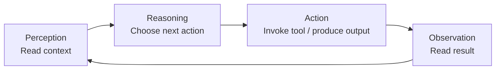

### Perception

The model scans the available context:

- instructions,
- user message,
- history,
- tool results,
- partial results.

It identifies:

- the current goal state,
- available information,
- previous observations.

### Reasoning

The model decides what to do next.

It:

- selects an action/tool,
- weighs intermediate results against the original goal,
- changes its decision as new information arrives.

Reasoning is therefore **not predetermined**.

### Action

The agent emits:

- a structured tool call, or
- a final output.

The action is the point where the system interacts with the external world.

### Observation

The runtime returns the tool result to context.

The agent reads it, updates its understanding, and feeds it into the next perception cycle.

---

## 3.2 Context Window as Working Memory

The context window contains the active working state of the agent.

| Context component | Example |
|---|---|
| **Inputs** | Instructions, user message, initial documents |
| **Actions** | Tool calls emitted during the session |
| **Observations** | Results returned after actions |
| **Reasoning / intermediate state** | Planning and decision information |

The deck characterizes this as the agent's **ephemeral working memory**.

It is immediately accessible but does not automatically provide durable persistence.

---

## 3.3 Real Example: Multi-Step Research Agent

A research agent demonstrates the loop:

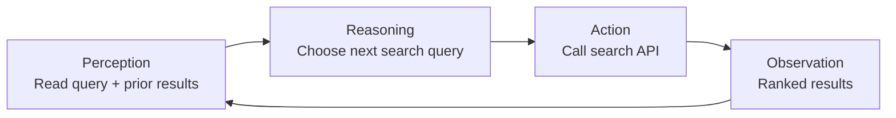

The returned search results become the next observation. The loop continues as the agent decides what to search next.

---

## 3.4 Canonical Gather → Act → Verify Framing

The deck also presents an Anthropic-style blended framing:

1. **Gather context** — pull in the information needed to decide.
2. **Take action** — use a tool to change or query the world.
3. **Verify work** — check the result against the goal.
4. **Repeat** until the goal is complete or loop control stops execution.

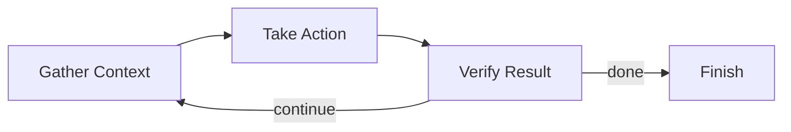

The important design question becomes:

> **When should the loop stop?**

---

# 4. Loop Control: Stop, Iterate, Escalate

Loop control converts a capable agent into a dependable system.

## 4.1 Core Vocabulary

| Concept | Meaning |
|---|---|
| **Termination condition** | Explicit rule that stops execution: task complete, error threshold, stop signal, etc. |
| **Turn budget** | Hard cap on loop iterations enforced by the runtime |
| **Escalation** | Controlled handoff to a human or fallback when the agent cannot safely proceed |

### Common termination conditions

```text
Task complete
OR
Error threshold reached
OR
Turn / token budget exhausted
OR
Explicit stop signal
OR
Safety / authorization boundary reached
```

---

## 4.2 Infinite Loop Risks

Without explicit termination, agents can loop forever.

Common causes:

- missing stop condition,
- always-failing tool calls,
- circular reasoning,
- repeated actions without new information.

> **An infinite loop is a design failure, not a feature.**

---

## 4.3 Turn Budgets and Max-Iteration Guards

The runtime should enforce a `max_iterations` limit.

Important rules:

- Set the limit before execution.
- Track iteration count in the orchestration layer, not inside the model.
- Halt when the limit is reached.
- Surface whatever progress has been made.

```text
max_iterations = N

while not done:
    if iterations >= max_iterations:
        stop()
    ...
```

> Guards belong in the runtime; do not rely on the model to self-enforce them.

---

## 4.4 Progress vs. Spinning

### Progress

Each iteration:

- produces a new observation,
- advances toward the goal,
- closes an open question,
- adds completed substeps,
- narrows the focus.

### Spinning

The agent:

- repeats similar actions,
- makes identical tool calls,
- receives the same errors,
- changes the context without getting closer to the goal.

### Detecting spinning

Track:

1. Whether successive observations are meaningfully different.
2. Repeated tool calls with identical parameters.
3. The gap between current state and goal state.

If the gap is not closing, the agent may be spinning.

---

## 4.5 Iterate vs. Escalate

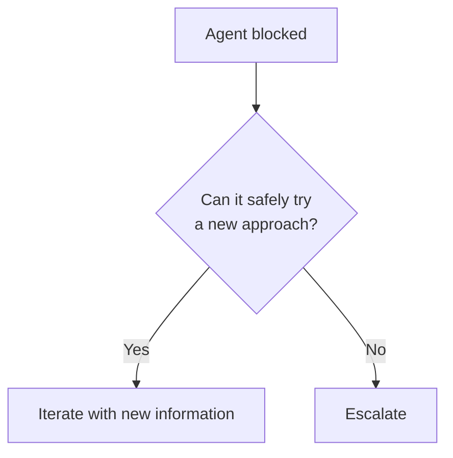

**Iterate** when:

- new information exists,
- another recovery approach is available.

**Escalate** when:

- authorization is required,
- a safety/authority boundary is reached,
- required information is missing,
- retrying would be unsafe or pointless.

> Escalation is a **designed safety valve**, not a failure.

---

## 4.6 Reliability Implications

Runaway agents can:

- consume API quotas,
- generate unexpected cost,
- make unrecoverable decisions,
- become difficult to audit.

Therefore every agent should have a defined exit condition **from day one**.

---

# 5. Choosing Workflow vs. Agent

## 5.1 The Core Trade-off

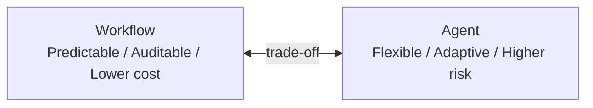

| Dimension | Workflow | Agent |
|---|---|---|
| Control flow | Fixed | Dynamic |
| Predictability | High | Lower |
| Auditability | High | Harder |
| Cost | Lower / predictable | Higher / variable |
| Latency | Usually lower | Can increase through replanning |
| Failure localization | Easier | Broader failure surface |
| Adaptability | Lower | Higher |
| Best for | Known task path | Open-ended / dynamic path |

The deck's rule is:

> **Most real tasks are closer to the workflow end of the spectrum.**

Choosing an agent when a workflow is sufficient adds complexity, cost, and risk without proportional value.

---

## 5.2 Signals a Workflow Is Enough

A workflow is usually appropriate when:

1. Input format is predictable and well-defined.
2. Output format is known and testable.
3. Every step can be specified at design time.

If all three are true, use a workflow.

---

## 5.3 Signals an Agent Is Warranted

Agentic complexity becomes justified when:

- the goal is open-ended and cannot be fully pre-specified,
- tool sequences are unpredictable,
- runtime replanning is genuinely required.

If none apply, a workflow is likely sufficient.

---

## 5.4 Four Diagnostic Questions

For a new task, ask:

1. **Can every step be authored at design time?**
2. **Is the result format known and testable?**
3. **Does the task require runtime tool selection?**
4. **Does failure require dynamic recovery mid-run?**

The deck's diagnostic framing is that multiple "no" answers indicate agentic complexity may be warranted.

---

## 5.5 Incremental Complexity

Start with the simplest architecture that solves the task.

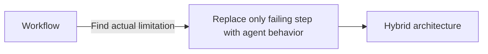

Recommended process:

1. Build and validate the workflow version.
2. Identify the exact step where it breaks down.
3. Replace only that step with agent behavior.

Benefits:

- lower complexity,
- smaller failure surface,
- easier debugging,
- controlled cost.

Starting complex and simplifying later is harder.

---

## 5.6 Hybrid Example

| Scenario | Best architecture |
|---|---|
| Extract structured data from a fixed document | Workflow |
| Research an open-ended topic from web sources | Agent |
| Route inquiries to specialists, then synthesize | Hybrid: fixed routing + dynamic synthesis |

---

## 5.7 Five Core Workflow Patterns

The deck identifies five major workflow patterns:

1. **Prompt chaining**
2. **Routing**
3. **Parallelization**
4. **Orchestrator-subagent**
5. **Evaluator-optimizer**

### Routing

A classifier routes input to a predefined processing path.

The classifier may use an LLM, but the overall topology remains fixed.

### Parallelization

Independent work is fanned out and collected at a synchronization point.

Both patterns can add useful complexity while remaining auditable.

---

# 6. Task Decomposition

## 6.1 Definition

**Task decomposition** is the skill of breaking a complex goal into actionable subtasks.

It turns:

```text
Complex goal
    ↓
Structured subtasks
    ↓
Agents / tools / workflow steps
```

---

## 6.2 Core Terms

| Term | Definition |
|---|---|
| **Task decomposition** | Break a high-level goal into smaller subtasks that can be assigned to agents, tools, or workflow steps |
| **Handoff point** | Boundary where one step's output becomes another step's input; requires an explicit schema |
| **Orchestrator** | Controller that decomposes goals, assigns subtasks, manages execution order, and synthesizes results |

---

## 6.3 Why Decompose?

Large monolithic tasks are:

- difficult to retry,
- difficult to delegate,
- difficult to debug,
- prone to complete failure if one portion fails.

Smaller subtasks enable:

- targeted recovery,
- independent testing,
- specialization,
- parallel execution,
- cleaner interfaces.

---

## 6.4 The Decomposability Spectrum

```text
Too monolithic ←──── Well decomposed ────→ Too fragmented
```

### Monolithic

One agent handles everything.

Problems:

- hard to debug,
- one error can fail the whole task,
- poor parallelism,
- difficult partial retry.

### Well decomposed

Each subtask has:

- one responsibility,
- explicit inputs,
- explicit outputs,
- bounded scope,
- testability.

### Over-decomposed

Too many tiny tasks cause:

- coordination overhead,
- more handoffs,
- more orchestration logic,
- more latency,
- more failure points,
- harder tracing.

The goal is the **middle ground**.

---

## 6.5 Decomposition Questions

Before splitting a goal, ask:

1. Can any part run independently?
2. Does one step's output feed directly into another?
3. Are there distinct capability domains that need different agents?

These reveal natural decomposition boundaries.

---

## 6.6 Characteristics of a Good Subtask

A good subtask has:

| Property | Requirement |
|---|---|
| **Single responsibility** | Does one thing |
| **Defined inputs** | Knows exactly what context/data it receives |
| **Bounded scope** | Can be retried without restarting the whole job |
| **Clean output** | Structured and explicit |
| **Testability** | Can be validated independently |

Do not assume ambient state.

---

## 6.7 Handoff Points

Handoffs are interfaces between subtasks.

Good handoffs:

- pass only what the receiver needs,
- use structured schemas,
- document what is intentionally not passed,
- minimize payload size.

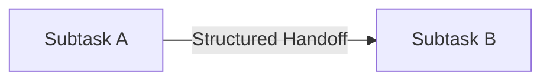

Explicit schemas prevent context loss and false assumptions.

---

## 6.8 Cost of Decomposition

Every boundary adds coordination overhead.

```text
More subtasks
    → more orchestration
    → more handoffs
    → more latency
    → more possible failure points
```

Therefore:

> Balance reliability gains against the cost of additional moving pieces.

---

# 7. Decomposition Patterns

## 7.1 Three Core Patterns

| Pattern | Structure | Best when |
|---|---|---|
| **Hierarchical** | Goal tree | Multiple levels of responsibility/specialization |
| **Sequential** | Dependency chain | Each step depends on prior output |
| **Parallel** | Independent branches + fan-in | Work can happen independently |

Real systems can combine all three.

---

## 7.2 Hierarchical Decomposition

A top-level goal becomes subgoals, then tasks.

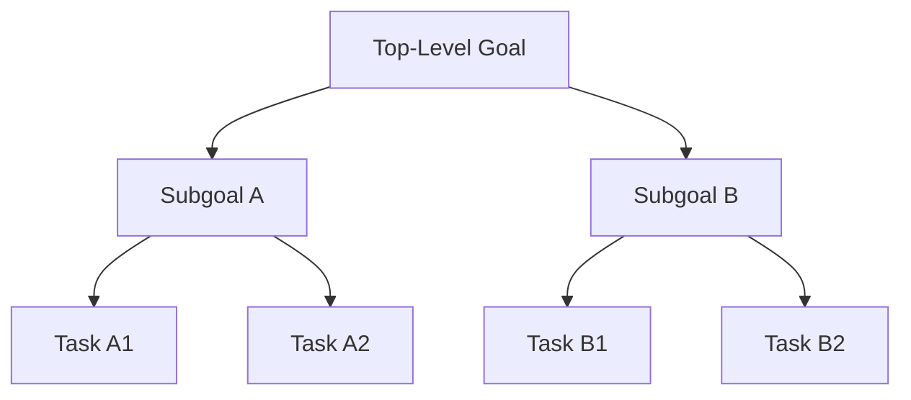

The top-level orchestrator:

- holds the overall goal,
- delegates subgoals,
- receives results,
- synthesizes upward.

This mirrors organizational delegation.

### Deep vs. flat hierarchy

Go deeper when:

- subtasks require fundamentally different capabilities,
- specialization is valuable.

Flatten when:

- subtasks are sufficiently similar to share one agent.

Every added level increases coordination and error-propagation surface.

---

## 7.3 Sequential Decomposition

A sequential decomposition creates a dependency chain:

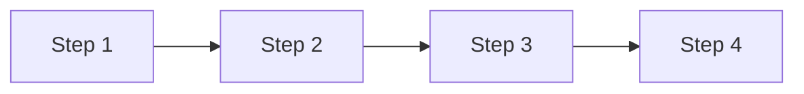

Characteristics:

- order is enforced,
- downstream steps consume upstream output,
- easier to reason about,
- easier to debug,
- a failed step blocks dependent steps.

Use it when **genuine data dependencies** exist.

---

## 7.4 Sequential vs. Parallel

| Sequential | Parallel |
|---|---|
| One step at a time | Independent branches concurrently |
| Easier tracing | More coordination |
| Total latency is sum of step latencies | Wall-clock time can approach longest branch |
| No fan-in required | Fan-in synchronization required |
| No concurrent partial-failure problem | Partial failures require explicit handling |
| Lower token rate at a moment | Higher concurrent token consumption |

---

# 8. Sequential Pipelines

## 8.1 Three Pipeline Concepts

### Sequential execution

Tasks run in order; each can use previous output.

### Prompt chaining

One LLM call's output becomes the next call's input.

### Dependency graph

A graph showing which steps depend on which others.

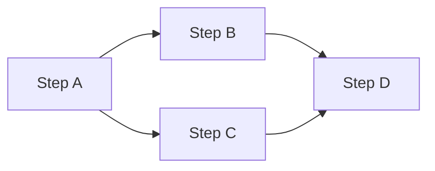

The graph exposes both:

- required ordering,
- possible parallelism.

---

## 8.2 When Sequential Is Appropriate

Use sequential execution for:

- true data dependencies,
- state accumulation,
- ordered transforms,
- workflows where simplicity/debugging/auditability matter more than raw speed.

---

## 8.3 Strengths and Costs

### Strengths

- easy step-by-step debugging,
- clear data flow,
- failures are localized,
- no synchronization logic,
- correct for real dependencies.

### Costs

- latency accumulates,
- independent steps are forced to wait,
- unnecessary sequential ordering wastes wall-clock time.

---

## 8.4 Clean Handoff Schemas

At every boundary:

> **Output schema of step N = input contract for step N+1**

Include:

- required fields,
- types,
- nullability.

Loose handoffs can cause silent data loss and downstream failures.

---

## 8.5 Error Cascades

A failed step can block every dependent downstream step.

Cascade risk grows with pipeline depth.

Mitigation:

- validate at step boundaries,
- handle errors locally,
- avoid waiting until the pipeline exit to discover bad data.

---

## 8.6 True vs. Artificial Dependencies

### True dependency

Step B genuinely needs output from Step A.

### Artificial dependency

Steps are ordered only by convention; neither actually needs the other's result.

Audit sequential pipelines for artificial dependencies. Removing them can expose parallelism.

---

# 9. Parallel Execution: Fan-Out and Fan-In

## 9.1 Definitions

| Term | Meaning |
|---|---|
| **Parallel execution** | Independent tasks run concurrently |
| **Fan-out** | One trigger dispatches multiple concurrent subtasks |
| **Fan-in** | Synchronization point that collects/merges branch results |

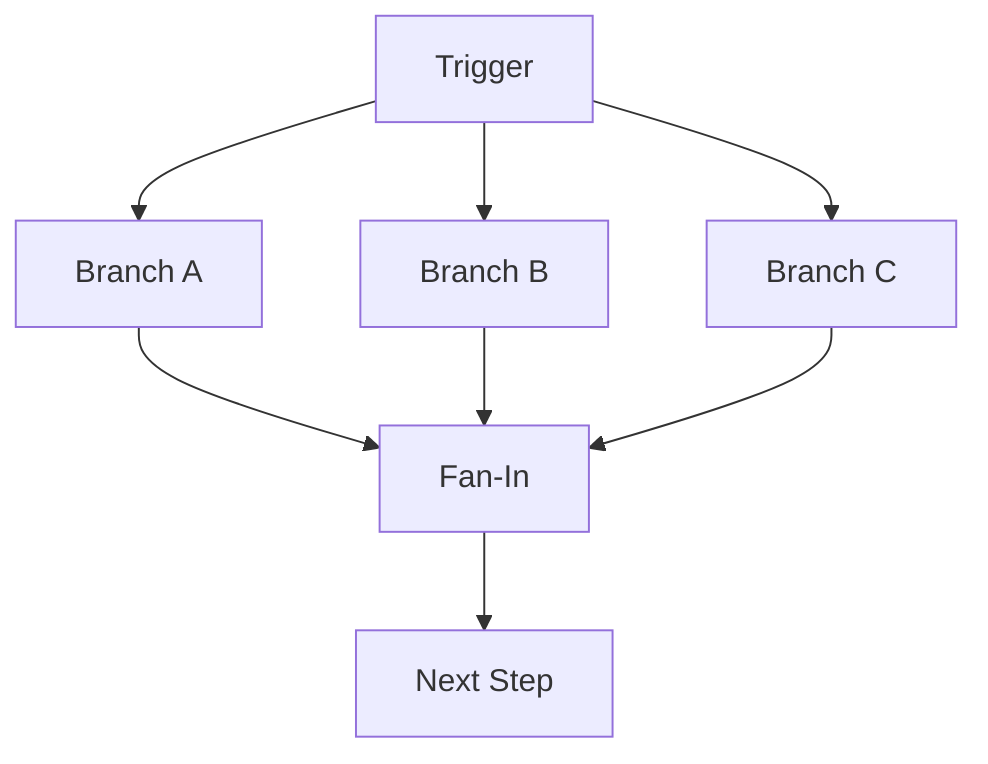

Branches can be:

- agents,
- tool calls,
- subworkflows,
- functions.

---

## 9.2 Independence Test

Before fan-out, ask:

1. Can Branch B start without Branch A's output?
2. Do branches write shared state?
3. Could concurrent execution create ordering/race problems?
4. Would branches produce conflicting results?

If hidden dependencies exist, fan-out is inappropriate.

---

## 9.3 Fan-In Responsibilities

A fan-in stage must:

1. **Collect results** from completed branches.
2. **Handle failures** and timeouts.
3. **Order results** when sequence matters.
4. **Merge and continue** with a clean aggregate output.

---

## 9.4 Partial Failure Handling

When branches have mixed outcomes:

| Strategy | Behavior |
|---|---|
| **Fail pipeline** | Any branch failure aborts the entire operation |
| **Proceed with partial results** | Continue with successes, explicitly flag failures |
| **Retry failed branches** | Re-dispatch only branches that failed |

Never silently drop failed branches.

---

## 9.5 Result Merging Strategies

| Strategy | Use |
|---|---|
| **Voting** | Multiple branches answer the same question; majority wins |
| **Concatenation** | Independent outputs become one list |
| **Structured aggregation** | Each branch contributes a named field to a shared object |

Choose the merge strategy **before** designing branches because it determines what each branch must return.

---

## 9.6 Parallel Cost vs. Latency

Parallel execution can reduce wall-clock latency but increases concurrent token consumption.

If three branches run simultaneously:

- token consumption per unit time can be ~3×,
- total token cost is the sum of all branches,
- rate limits/quotas can restrict practical concurrency.

Model the cost increase explicitly.

---

# 10. Adaptive Planning

## 10.1 Static, Dynamic, and Replanning

| Concept | Definition |
|---|---|
| **Static planning** | Fixed sequence authored before execution |
| **Dynamic planning** | Model generates/revises plan at runtime |
| **Replanning** | Revising the current plan after failure, unexpected output, or state change |

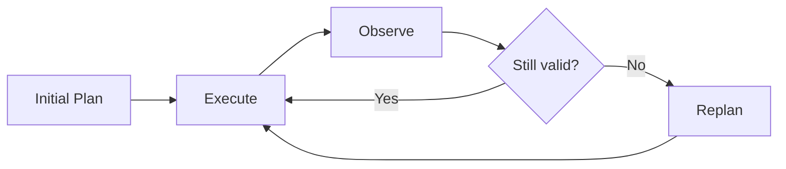

Most production systems can combine static and dynamic elements.

---

## 10.2 Static vs. Dynamic Trade-offs

| Static | Dynamic |
|---|---|
| Predictable | Adaptable |
| Auditable | Powerful for open-ended goals |
| Cost-efficient | Can consume more tokens |
| Pre-audited steps | Next steps are not fully pre-audited |
| Easier failure localization | Requires stronger monitoring |
| Best for repeatable tasks | Best where intermediate state changes the path |

---

## 10.3 Replanning Triggers

Four major triggers:

1. **Tool-call failure**
   - error,
   - timeout,
   - empty result.

2. **Unexpected output**
   - valid output contradicts assumptions.

3. **State change**
   - environment changes during execution.

4. **Constraint violation**
   - proposed action would violate a goal or safety boundary.

Each trigger requires adaptation or escalation.

---

## 10.4 Replan vs. Continue

Do not replan for every surprise.

### Replan when:

- a core assumption is invalidated,
- the original path is no longer valid,
- the goal remains achievable through another plan.

### Continue when:

- deviation is minor,
- recovery is straightforward,
- original plan remains valid.

Unnecessary replanning adds token cost and latency.

---

## 10.5 Bounded Replanning

Use:

- a maximum number of replanning cycles,
- goal-constraint validation,
- loop termination.

A revised plan should continue only when:

1. the iteration limit has not been reached, and
2. the revised plan satisfies the original goal constraints.

---

## 10.6 Preventing Goal Drift

Goal drift happens when a revised plan solves the immediate obstacle but silently abandons the original objective.

Mitigation:

- preserve the original goal,
- validate every new plan against original intent,
- preserve plan state across replanning cycles,
- log the original goal explicitly.

> **Adaptability must be bounded and goal-anchored.**

---

# 11. Ambiguity and Incomplete Specifications

Agents rarely receive perfectly specified goals.

## 11.1 Three Concepts

| Concept | Meaning |
|---|---|
| **Ambiguous goal** | Multiple valid interpretations exist |
| **Clarify-first** | Ask a human before proceeding |
| **Assume-and-proceed** | Make a reasonable inference and continue |

---

## 11.2 When to Clarify

Clarify upfront when:

- the action is irreversible,
- operations are high-cost,
- scope is unclear,
- an incorrect assumption could create major downstream errors.

Examples:

- deletion,
- external communication,
- expensive API operations,
- long batch runs.

---

## 11.3 When to Assume

Assume and proceed when:

- stakes are low,
- the action is easily reversible,
- time sensitivity makes clarification costly,
- available context makes the intended interpretation reasonably clear.

The objective is **appropriate judgment**, not maximum caution.

---

## 11.4 Decision Criteria

Use four factors:

| Factor | Question |
|---|---|
| **Reversibility** | Can the action be undone easily? |
| **Stake level** | How costly or harmful is a wrong action? |
| **Scope clarity** | Are boundaries clear? |
| **Context** | Does available information strongly imply the intended action? |

---

# 12. Evaluator-Optimizer / Iterative Refinement

When one pass is not sufficient, use a generate → evaluate → refine loop.

```mermaid
flowchart LR
    G[Generator<br/>Candidate output] --> E[Evaluator<br/>Score against rubric]
    E -->|feedback| G
    E -->|quality threshold met| D[Done]
```

### Generator

Produces the initial or revised output and applies evaluator feedback.

### Evaluator

Assesses output against a defined rubric and returns **structured critique**, not merely pass/fail.

### Convergence

The loop stops when:

- quality threshold is met, or
- iteration cap is reached.

This is a bounded refinement pattern.

---

## 12.1 Document Assumptions

When an agent proceeds using assumptions:

- state assumptions explicitly in output or logs,
- make them visible to reviewers,
- avoid forcing humans to rerun the entire task to discover what was assumed.

Precise goal specifications reduce ambiguity at the source.

---

# 13. Multi-Agent Orchestration

## 13.1 The Orchestrator

The orchestrator is the central controller that:

1. decomposes goals,
2. delegates subtasks,
3. aggregates and synthesizes results.

```mermaid
flowchart TD
    G[High-Level Goal] --> O[Orchestrator]
    O --> A[Subagent A]
    O --> B[Subagent B]
    O --> C[Subagent C]
    A --> O
    B --> O
    C --> O
    O --> F[Final Synthesis]
```

---

## 13.2 Three Orchestrator Functions

| Function | Responsibility |
|---|---|
| **Decompose** | Break the high-level goal into bounded subtasks |
| **Route** | Match each subtask to the appropriate agent/tool |
| **Aggregate** | Collect, validate, and synthesize outputs |

All three must be designed explicitly.

---

## 13.3 Task Assignment

Good assignment:

- defines a narrow subtask first,
- matches capabilities/tool access,
- considers required context,
- considers required output format.

The orchestrator owns routing logic; subagents do not self-select their roles.

> Poorly scoped subtasks are a common cause of subagent failure.

---

## 13.4 What the Orchestrator Retains

The orchestrator holds:

- master plan,
- execution state,
- error-handling logic,
- aggregation rules,
- final synthesis,
- visibility across all subtask results.

Subagents hold only what is explicitly provided:

- their task,
- task-specific context,
- required tools,
- required output constraints.

---

## 13.5 Result Aggregation

Aggregation is a three-step process:

```mermaid
flowchart LR
    C[Collect] --> V[Validate] --> S[Synthesize]
```

1. **Collect** all completed outputs.
2. **Validate** each against expected format/schema.
3. **Synthesize** validated results into a coherent answer to the original goal.

---

## 13.6 Orchestrator Error Handling

When a subagent fails:

| Response | Meaning |
|---|---|
| **Retry** | Reissue with same/adjusted instructions |
| **Substitute** | Route task to alternate agent/tool |
| **Escalate** | Surface failure to a human |

Error-handling logic belongs at the orchestration layer rather than being hidden inside individual subagents.

---

## 13.7 Observability

Log:

- task assignment,
- routing rationale,
- progress after completion,
- errors,
- context surrounding errors.

Example audit trail:

```text
Assign Task A → Subagent 1
Task A completed
Assign Task B → Subagent 2
Error while handling Task B
```

Observability turns the orchestrator from a black box into an audit trail.

---

# 14. Subagent Design

## 14.1 Definition

A subagent is a separate agent instance spawned by a parent orchestrator to handle a delegated subtask.

It should operate with:

- its own context,
- bounded tools,
- bounded authority.

---

## 14.2 Context Isolation

A subagent **does not automatically inherit the orchestrator's context**.

Only explicitly passed information is visible.

```mermaid
flowchart LR
    O[Orchestrator Context<br/>history + state] -->|explicit handoff only| S[Subagent Context]
```

Nothing from the orchestrator's history/state is visible unless passed.

### Why isolation is beneficial

| Benefit | Explanation |
|---|---|
| **Less bloat** | Irrelevant history is excluded |
| **Less leakage** | Other agents' data does not automatically propagate |
| **Lower cost** | Smaller context per subagent |
| **Better testability** | Subagent can be tested independently |

---

## 14.3 What to Pass vs. Withhold

### Pass explicitly

- task-specific instructions,
- necessary data/content,
- required output format,
- success criteria,
- relevant constraints.

### Withhold by default

- full orchestrator conversation,
- outputs from unrelated subagents,
- system prompts,
- credentials,
- irrelevant context.

---

## 14.4 Least-Privilege Authority

Subagents should receive only the permissions necessary for their task.

Three rules:

1. **Least privilege**
2. **Explicit boundaries**
3. **No unauthorized side effects**

Example:

```text
allowed_tools: ["read_file", "search"]
deny: ["write", "delete", "shell"]
```

A subagent should not modify shared state or act outside its assigned scope without orchestrator approval.

---

## 14.5 Effective Subagent Instructions

A good instruction specifies:

- narrow task scope,
- precise output format,
- explicit success criteria.

Example:

```text
Task: extract all dates
Output: JSON list of dates
Done: every date captured
```

Vague instructions produce inconsistent outputs and make aggregation unreliable.

---

## 14.6 Independent Testing

A well-designed subagent should work with only its explicit inputs.

Test it through a dedicated harness:

```text
Input → Subagent → Output
```

There should be:

- no hidden orchestrator state,
- no hidden cross-agent dependency,
- interchangeable implementations.

> If a subagent cannot be tested alone, it may be doing too much.

---

## 14.7 Subagent Anti-Patterns

| Anti-pattern | Failure |
|---|---|
| **Overly broad scope** | Agent is asked to do too much |
| **Underpowered context** | Critical information was not passed |
| **Unclear success criteria** | Agent cannot tell when it is done |

Reliable subagents have:

- narrow scope,
- bounded authority,
- explicit complete context,
- clear outputs,
- explicit completion conditions.

---

# 15. Multi-Agent Topologies

The topology determines:

- coordination style,
- failure handling,
- auditability,
- resilience,
- latency.

## 15.1 Three Core Topologies

### Hub-and-Spoke

Central orchestrator routes all work.

```mermaid
flowchart TD
    O[Orchestrator]
    O --> A[Agent A]
    O --> B[Agent B]
    O --> C[Agent C]
    O --> D[Agent D]
```

### Pipeline

Agents form a linear transformation chain.

```mermaid
flowchart LR
    A[Agent 1] --> B[Agent 2] --> C[Agent 3] --> D[Agent 4]
```

### Peer-to-Peer

Agents communicate directly without a central coordinator.

```mermaid
graph LR
    A[Agent A] --- B[Agent B]
    B --- C[Agent C]
    C --- D[Agent D]
    D --- A
    A --- C
```

---

## 15.2 Hub-and-Spoke

### Strengths

- centralized state management,
- straightforward failure handling,
- clear audit trail,
- consistent delegation policies.

### Failure modes / costs

- hub is a single point of failure,
- hub becomes throughput bottleneck,
- hub context grows with every active spoke,
- more spokes amplify bottleneck and context/token risk.

Use when:

- there is a natural hierarchy,
- centralized state/control is genuinely required,
- compliance/auditability requires one decision log,
- spokes do not need to communicate directly.

Do **not** force hub-and-spoke when no natural hierarchy exists.

---

## 15.3 Pipeline Topology

### Strengths

- narrow agent responsibilities,
- modular stages,
- easy to swap/test/replace stages,
- each stage produces a clean artifact.

Best for strictly ordered transformations.

### Failure modes

- total latency accumulates,
- a mid-stage failure blocks downstream stages,
- cascade risk increases with depth.

Every boundary needs explicit error handling.

---

## 15.4 Peer-to-Peer

### Strengths

- low message-routing latency,
- no central bottleneck,
- no single point of failure,
- resilient when individual agents fail.

### Costs

- distributed state,
- harder auditability,
- harder behavior prediction,
- more difficult testing/control.

Use when:

- agents are loosely coupled,
- no shared state is required,
- no strict ordering is required,
- resilience and speed matter more than centralized auditability.

Avoid P2P when a complete audit trail is a regulatory/operational requirement.

---

## 15.5 Topology Comparison

| Topology | Best for | Strengths | Main risks |
|---|---|---|---|
| **Hub-and-spoke** | Hierarchical work, centralized control | Auditability, simple coordination | Single point of failure, bottleneck |
| **Pipeline** | Ordered transformations | Modularity, clear handoffs | Latency/failure cascades |
| **P2P** | Loose coupling, resilient low-latency systems | Resilience, no hub | Harder audit/debugging |
| **Evaluator-optimizer** | Generate + critique | Quality improvement | Iteration cost / loop risk |
| **Hybrid** | Mixed task structures | Matches multiple subsystem needs | Boundary complexity |

---

## 15.6 Evaluator-Optimizer Topology

One agent generates a result; another evaluates it.

```mermaid
flowchart LR
    G[Generator] --> E[Evaluator]
    E -->|Structured feedback| G
    E -->|quality threshold| D[Done]
    G -->|revision| E
```

Termination must be explicit, typically through:

- quality threshold,
- maximum iteration count.

---

## 15.7 Hybrid Topologies

Real systems may combine patterns:

```mermaid
flowchart TD
    O[Orchestrator] --> P[Internal Pipeline]
    P --> X[P2P Parallel Subtasks]
    P --> E[Evaluator]
```

Examples:

- hub-and-spoke orchestrator → internal pipeline,
- pipeline stage → P2P agents for independent subtasks,
- evaluator-optimizer inside a larger workflow.

Every topology boundary needs an explicit handoff.

---

## 15.8 Topology Selection Framework

Map the natural task structure first:

| Question | Preferred topology |
|---|---|
| Natural hierarchy: one controller delegates to specialists? | Hub-and-spoke |
| Strict ordered transformation: each step depends on previous output? | Pipeline |
| Loosely coupled, no shared state/order? | P2P |
| Generate + critique + refine? | Evaluator-optimizer |
| Different parts have different structures? | Hybrid |

Choosing the wrong topology is a design-level mistake that can be expensive to undo.

---

# 16. Agent-to-Agent Handoff Schemas

Freeform agent handoffs are brittle. Structured schemas make coordination reliable.

## 16.1 Required Handoff Elements

A well-designed handoff contains:

1. **Task description** — what the receiver must produce.
2. **Relevant context** — only facts required to execute.
3. **Output format** — exact result structure.
4. **Constraints** — boundaries, scope, safety rules.

Example:

```json
{
  "schema_version": "2.1",
  "task": "extract all dates",
  "context": ["document text", "relevant section"],
  "format": "json",
  "constraints": [
    "return every date",
    "do not infer missing dates"
  ]
}
```

---

## 16.2 Include vs. Exclude

### Include

- task,
- relevant facts,
- output format,
- explicit constraints.

### Exclude

- full conversation history,
- internal deliberation,
- sender state,
- redundant context,
- unrelated agent outputs,
- credentials/system prompts unless explicitly required.

Two opposite failures exist:

| Failure | Problem |
|---|---|
| **Under-specified** | Receiver lacks context and guesses/fails |
| **Over-specified** | Receiver receives excessive context, increasing cost/noise |

---

## 16.3 Schema Versioning

Handoff schemas should evolve without breaking receivers.

Principles:

- tag every message with a schema version,
- receivers should handle missing optional fields gracefully,
- new required fields need a migration path,
- design for forward compatibility.

Example:

```json
{
  "schema_version": "2.1",
  "task": "...",
  "optional_metadata": "..."
}
```

---

## 16.4 Schema Testing

Validate the message **before** the receiver runs.

Useful tests:

- required-field contract tests,
- schema-only receiver simulation,
- missing-field tests,
- graceful-degradation tests.

A schema test suite is a simple form of inter-agent integration testing.

---

## 16.5 Substitutability

Design protocols around an **interface**, not a specific receiver implementation.

```mermaid
flowchart LR
    S[Sender] --> P[Stable Protocol / Schema]
    P --> A[Receiver A]
    P --> B[Receiver B]
    P --> C[Receiver C]
```

Benefits:

- implementations can be swapped,
- callers do not need rewriting,
- multi-agent systems remain maintainable.

Avoid fields that only one specific agent understands.

---

# 17. Reliable Handoff Protocols

Passing a message is not a complete handoff.

A reliable handoff requires:

1. verification,
2. error propagation,
3. continuity,
4. audit logging.

## 17.1 Handoff Verification

```mermaid
sequenceDiagram
    participant S as Sender
    participant R as Receiver
    S->>R: Send handoff
    R-->>S: Acknowledge receipt/readiness
    S->>S: Release responsibility
```

Without acknowledgment, the sender may assume success when the receiver never actually became ready.

---

## 17.2 Structured Error Propagation

Subagents should return structured errors rather than null/empty output.

Example:

```json
{
  "type": "timeout",
  "context": {
    "tool": "search",
    "query": "..."
  },
  "recovery": "retry"
}
```

Include:

- failure type,
- context,
- recovery hints.

---

## 17.3 Transparent vs. Silent Failure

| Failure | Behavior |
|---|---|
| **Transparent** | Structured error reaches orchestrator; it can retry/halt |
| **Silent** | Handoff looks successful but critical information was lost |

### Anti-patterns

**Swallowing errors**

```text
exception → empty output → orchestrator assumes success
```

**Undifferentiated errors**

```text
every failure → generic "error"
```

This prevents the orchestrator from distinguishing:

- retryable timeout,
- permanent validation failure,
- safety violation.

---

## 17.4 Continuity Across Handoff Failures

Before initiating a handoff:

1. Save task state.
2. Record the last **confirmed good** checkpoint.
3. If handoff fails, resume from that checkpoint.

```mermaid
flowchart LR
    C[Checkpoint] --> H[Handoff]
    H -->|success| N[Continue]
    H -->|failure| R[Resume from checkpoint]
```

Without checkpointing, a failed handoff may force the entire workflow to restart.

---

## 17.5 Audit Logging

Log:

- sender,
- receiver,
- timestamp,
- payload/summary,
- verification result,
- acknowledgement,
- timeout/error context.

Example:

```text
handoff A → B: ok
verify ack: ok
handoff B → C: timeout
```

Inspectable handoffs turn silent failures into diagnosable failures.

---

# 18. Memory and State

## 18.1 In-Context vs. External Memory

Agents can keep state:

- inside the active context,
- outside the model in persistent systems.

| | In-context | External |
|---|---|---|
| Speed | Very fast | Requires retrieval |
| Persistence | Temporary | Durable |
| Retrieval | Already in context | Explicit read/query |
| Limit | Context window | Storage/system limits |
| Best use | Active/transient state | Durable/shared state |

---

## 18.2 In-Context State

Advantages:

- zero retrieval latency,
- no fetch step,
- simple.

Limitations:

- bounded by context window,
- lost when session ends,
- lost when context is truncated.

---

## 18.3 External Memory

External memory:

- survives sessions,
- survives truncation/restarts,
- is queryable,
- requires explicit reads/writes,
- adds latency and tool calls.

Example conceptual interface:

```text
memory.write(key, value)
memory.read(key)
```

---

## 18.4 External Memory Types

| Store | Best access pattern | Examples |
|---|---|---|
| **Key-value store** | Exact lookup by ID | User profile, session state |
| **Relational DB** | Structured queries, joins, filtering | Audit logs, records |
| **Vector index** | Semantic similarity | Document/history recall |

Choose storage based on **how the agent queries and updates state**.

---

## 18.5 Where Should State Live?

Core question:

> **Does this state need to survive beyond the current context?**

### Hot state

Keep in context when:

- actively changing,
- referenced frequently,
- needed for the current turn.

Examples:

- active plan,
- current step,
- recent tool results.

### Cold state

Persist externally when:

- rarely read,
- needed across sessions,
- must survive interruption,
- must be shared,
- must be durable.

---

## 18.6 Four State-Survival Questions

Ask:

1. Does state survive interruption?
2. Does it need semantic retrieval?
3. Must it be shared across sessions?
4. Can it be cheaply reconstructed from source data/tools?

If durability is unnecessary, keep it in context.

---

## 18.7 Hot/Cold Hybrid

Most production systems can combine both:

```mermaid
flowchart LR
    H[Hot Tier<br/>Active plan<br/>Current step<br/>Recent results]
    C[Cold Tier<br/>Completed results<br/>Configuration<br/>History]
    H <--> C
```

A useful rule:

> Keep active state hot; move durable state cold.

---

# 19. Session Continuity and Checkpoints

Sessions can be interrupted at any point. A reliable agent must resume without repeating completed work.

## 19.1 Session Resumption

A checkpoint is a saved snapshot of task progress at a phase boundary.

State versioning tracks which environment version the checkpoint represents.

---

## 19.2 What Resumption Requires

The agent must know:

1. **Completed steps**
2. **Current inputs**
3. **Prior results**

Without these, it may:

- repeat completed work,
- lose required context,
- restart from scratch.

---

## 19.3 Checkpoint Design

Persist at the end of each major phase, not necessarily after every tool call.

A checkpoint should contain:

```json
{
  "phase": 3,
  "steps_done": 12,
  "next_phase_inputs": {},
  "timestamp": "14:02",
  "environment_version": "..."
}
```

Write the checkpoint **before irreversible actions**.

---

## 19.4 Minimum Checkpoint Contents

| Field | Purpose |
|---|---|
| **Phase marker** | Identifies completed phase |
| **Step outputs** | Preserves results required downstream |
| **Task inputs** | Allows reconstruction of original task context |
| **Timestamp** | Ordering/conflict detection |
| **Environment version/hash** | Detects stale state |

---

## 19.5 Coarse vs. Fine-Grained Checkpoints

| Coarse | Fine-grained |
|---|---|
| Save at phase boundaries | Save after every step |
| Fewer writes | More writes |
| Simpler state | More complex state |
| May repeat work in current phase | Minimal repeated work |
| Default for most workflows | Justified when steps are very costly |

---

## 19.6 Recovery Flow

```mermaid
flowchart TD
    S[Start / Resume] --> C{Checkpoint exists?}
    C -->|No| F[Begin fresh]
    C -->|Yes| V[Verify integrity]
    V --> L[Load checkpoint]
    L --> K[Skip completed phases]
    K --> R[Resume]
```

---

## 19.7 State Version Conflicts

The world can change between checkpoint creation and resume.

Mitigation:

- version checkpoints,
- store timestamp/environment hash,
- compare current environment with recorded version,
- flag conflicts instead of blindly continuing on stale state.

---

## 19.8 Memory Hygiene

Stored state can become stale.

Pruning process:

1. Identify state no longer relevant.
2. Decide whether it should be archived.
3. Remove stale state from active context.
4. Prune external storage where appropriate.

Stale state can cause an agent to act on outdated facts.

---

# 20. Multi-Agent Economics

More agents can improve capability but add significant token and coordination overhead.

## 20.1 Basic Models

### Single agent

One model:

- loops,
- calls tools,
- holds task in one context.

### Orchestrator + subagents

A lead agent:

- plans,
- spawns workers,
- combines results.

Each worker handles a scoped slice in its own context.

---

## 20.2 Token Economics

The deck gives approximate relative costs:

| System | Approximate relative token use |
|---|---:|
| Plain chat turn | **1× baseline** |
| Single agent | **~4× chat** |
| Multi-agent | **~15× chat** |

These are presented as rough architectural cost comparisons, not universal constants.

---

## 20.3 Where Multi-Agent Cost Comes From

### Orchestrator overhead

The lead agent spends tokens:

- planning,
- delegating,
- merging.

### Parallel fan-out

Every worker:

- receives/setup its own context,
- reasons independently.

### Result stitching

Combining many worker outputs often requires another model pass.

### Coordination latency

The system must:

- decompose work,
- wait for results,
- reconcile outputs.

Agents can also:

- duplicate effort,
- drift from task boundaries,
- produce inconsistent outputs.

---

## 20.4 Good vs. Poor Multi-Agent Fit

### Good fit

Breadth-first work with many independent directions.

Example:

> Research many separate sources in parallel.

### Poor fit

Tightly coupled work where:

- all steps depend on one shared context,
- each step depends heavily on the last.

A single agent may be:

- cleaner,
- faster,
- cheaper.

### Coding trap

The deck specifically notes that many coding tasks have fewer naturally independent pieces than research, so they often fit a single agent better.

---

## 20.5 Multi-Agent Decision Checklist

Ask:

1. Can work split into independent parallel directions?
2. Can each piece fit its own context?
3. Is there little shared state?
4. Is the value high enough to justify the token bill?

If not, avoid multi-agent complexity.

---

## 20.6 Matching Models to Roles

Use stronger models where orchestration quality matters most and lighter models for routine worker tasks.

The deck illustrates:

```text
Strong model → Orchestrator
Lighter model → Subagents / workers
```

Example model assignment shown in the deck:

- Orchestrator: **Opus 4.8**
- Workers: **Sonnet 4.6 / Haiku 4.5**

The underlying principle is more important than the specific model names:

> **Match model capability to role and reserve expensive reasoning for work that repays it.**

---

# 21. Reliability: Error Taxonomy

Agentic systems fail in three major ways:

1. **Tool errors**
2. **Reasoning errors**
3. **Environment errors**

```mermaid
flowchart TD
    F[Failure] --> T[Tool Error]
    F --> R[Reasoning Error]
    F --> E[Environment Error]
```

---

## 21.1 Tool Error

Failure reported by:

- API,
- tool,
- external service.

Examples:

- timeout,
- rate limit,
- invalid input,
- permission denied,
- resource not found.

---

## 21.2 Reasoning Error

The model itself is wrong.

Examples:

- wrong plan,
- wrong tool selected,
- result misinterpreted,
- incorrect reasoning.

Retrying identical input generally fails again because the model's context has not changed.

Recovery usually requires:

- prompt/context correction,
- different information,
- revised plan,
- escalation.

---

## 21.3 Environment Error

The infrastructure beneath the tool fails.

Examples:

- network partition,
- database down,
- file-system failure,
- permissions in the execution environment.

The tool logic and model plan may be correct; infrastructure prevents execution.

These failures are often transient.

---

## 21.4 Classification Rule

Ask:

> **Where did the failure originate?**

| Origin | Category | Typical recovery |
|---|---|---|
| Tool/API itself | Tool error | Retry/backoff, fallback |
| Model plan/interpretation | Reasoning error | Correct context/plan; escalate if needed |
| Infrastructure below tool | Environment error | Wait/retry, infrastructure recovery |

Misclassification wastes resources and can cause cascading failures.

---

# 22. Tool Errors: Transient vs. Permanent

## 22.1 Transient

The same call may succeed later.

Examples:

- network timeout,
- rate limit,
- temporary unavailability,
- service overload.

Recovery:

- retry with backoff,
- respect retry headers,
- cap retries.

## 22.2 Permanent

Retrying the identical call will not help.

Examples:

- invalid input,
- permission denied,
- authentication failure,
- resource not found.

Recovery:

- change input,
- use fallback,
- escalate.

The deck notes a common HTTP heuristic:

- **5xx** → typically transient,
- **4xx** → typically permanent.

This is a heuristic, not an absolute rule.

---

# 23. Retry Logic

## 23.1 Core Retry Question

Before retrying:

> **Is this failure likely to resolve if we try again?**

```mermaid
flowchart TD
    E[Failure] --> Q{Likely to resolve on retry?}
    Q -->|Yes| T[Transient → Retry policy]
    Q -->|No| P[Persistent → Abort / fallback / escalate]
```

Retrying a persistent error only adds:

- token cost,
- latency,
- noise,
- delay in addressing the root cause.

---

## 23.2 Retry Policies

| Error | Policy |
|---|---|
| Rate limit | Exponential backoff + jitter; respect `Retry-After` |
| Timeout | Short/fixed delay or exponential backoff; cap retries |
| Temporary network/service failure | Backoff + bounded retries |
| Invalid input | Abort / correct input |
| Permission failure | Abort / escalate |
| Reasoning error | Modify context/plan; do not blindly repeat |

---

## 23.3 Immediate vs. Delayed Retry

### Immediate retry

Useful only for extremely short-lived glitches.

Rarely the right default because repeated immediate retries can worsen overload.

### Fixed delay

Simple, better than immediate retry, but does not adapt well to bursts.

### Exponential backoff with jitter

The deck calls this the gold-standard policy for most transient failures.

Typical schedule:

```text
1s → 2s → 4s → 8s → ... → cap
```

Jitter adds randomness to avoid synchronized retry storms.

Apply it to transient errors, not persistent ones.

---

## 23.4 Retry Budgets

Uncapped retries are a design flaw.

A retry budget:

- caps attempts,
- bounds latency,
- bounds token cost.

Example:

```text
MAX_ATTEMPTS = 3
```

Design the budget around acceptable:

- cost,
- latency,
- risk.

---

## 23.5 Abort Conditions

Abort when:

1. retry budget is exhausted, or
2. failure is known to be persistent.

Abort should not silently disappear.

It should:

- surface the error upstream,
- trigger fallback or escalation.

---

# 24. Error Detection and Silent Failures

## 24.1 Silent Failure

A silent failure returns something that looks successful but is:

- wrong,
- incomplete,
- corrupted.

No exception is raised.

This is dangerous because downstream steps continue using bad data.

---

## 24.2 Validation Gate

A validation gate inspects output before allowing execution to proceed.

```mermaid
flowchart LR
    A[Agent Step] --> V{Validation Gate}
    V -->|Valid| N[Next Step]
    V -->|Invalid| R[Retry / Fallback / Escalate]
```

---

## 24.3 Three Detection Strategies

### 1. Output validation

Check:

- required fields,
- types,
- nullability,
- numeric ranges,
- completeness,
- output length.

### 2. State verification

Verify the real world changed as intended.

Examples:

| Action | Verification |
|---|---|
| Write | Confirm record persisted |
| Transform | Confirm output reflects intended change |
| API call | Confirm side effect actually occurred |

A successful API response alone does not prove the intended effect happened.

### 3. Sanity checks

Ask whether the result is plausible.

Examples:

- Is output length reasonable?
- Are key entities from the input present?
- Does the output contradict known facts?

---

## 24.4 Schema vs. Semantic Validation

| Schema validation | Semantic validation |
|---|---|
| Structure | Meaning |
| Required fields | Plausibility |
| Types | Expected ranges |
| Nulls | Logical correctness |
| Fast/automatable | Catches silent logical errors |

Schema validation can pass while content is still wrong.

---

## 24.5 Validation Gate Responsibilities

A validation gate should:

1. Inspect output.
2. Trigger retry if invalid.
3. Trigger fallback when retry is exhausted.
4. Trigger escalation if fallback fails or risk requires human review.

---

# 25. Logging and Observability

Structured logging and execution traces make silent failures diagnosable.

Log:

- inputs,
- outputs,
- stage boundaries,
- tool calls,
- outcomes,
- errors,
- timing.

Use structured formats so fields can be queried and filtered.

Execution traces should reconstruct the full sequence:

```text
Input
→ decision
→ tool call
→ tool result
→ validation
→ next decision
→ final output
```

Anomaly detection can flag unusual patterns before users report failures.

---

# 26. Fallback Chains and Graceful Degradation

When the primary action fails and retrying will not help, use an alternative path.

## 26.1 Fallback Chain

A fallback chain is an ordered set of alternatives:

```mermaid
flowchart TD
    P[Primary Action] -->|fail| F1[Fallback 1]
    F1 -->|fail| F2[Fallback 2]
    F2 -->|fail| F3[Fallback 3]
    F3 --> E[Escalate / Terminal]
```

Examples of alternatives:

- alternate tool,
- cached result,
- simplified approach.

Every fallback should be **pre-validated**.

---

## 26.2 Graceful vs. Silent Degradation

| Graceful degradation | Silent degradation |
|---|---|
| Returns partial/lower-quality result | Returns degraded result without warning |
| Explicit signal is propagated | Downstream assumes full success |
| Downstream can adjust/escalate | Errors compound silently |
| Safe when risk allows | Dangerous |

---

## 26.3 Degradation Signal

When a fallback fires, include a flag/metadata field:

```json
{
  "result": "...",
  "degraded": true,
  "degradation_reason": "primary_tool_unavailable"
}
```

Downstream components should:

- lower confidence,
- alter routing,
- escalate where appropriate.

---

## 26.4 Untested Fallbacks

A fallback that has never been validated can introduce new failures exactly when the system is already failing.

Validate:

- it works under primary failure conditions,
- its output meets minimum quality,
- downstream systems understand its output.

---

## 26.5 Partial Success vs. Full Failure

```mermaid
flowchart TD
    F[Fallback returns partial result] --> Q{Safe to use?}
    Q -->|Yes| P[Partial success + degradation signal]
    Q -->|No| X[Full failure + escalation]
```

The decision depends on downstream harm.

---

## 26.6 Escalate vs. Degrade

| Risk | Reversibility | Response |
|---|---|---|
| Low | Reversible | Degrade + signal + continue |
| High | Irreversible | Escalate to human |

Examples requiring higher thresholds:

- deletions,
- payments,
- external communications.

---

# 27. Prompt Guardrails Are Not Enough

Prompt guardrails are useful, but probabilistic.

## 27.1 Prompt vs. Code

Example:

### Prompt guidance

```text
You must never issue a refund over $100
without manager sign-off.
```

### Programmatic enforcement

```text
if refund > 100:
    require_approval()
else:
    process(refund)
```

The difference:

- prompts **guide behavior**,
- code **enforces constraints**.

---

## 27.2 Why Prompt-Only Guardrails Fail

Three major failure modes:

1. **Adversarial inputs**
   - crafted prompts can steer the model away from instructions.

2. **Context drift**
   - long conversations can reduce the salience of earlier constraints.

3. **Edge-case coverage**
   - unusual inputs can produce non-compliant behavior.

Rare failures are still unacceptable for high-stakes paths.

---

## 27.3 When Prompt Guardrails Are Sufficient

Appropriate for low-stakes cases:

- tone,
- style,
- formatting,
- reversible actions,
- no meaningful legal/financial/safety consequence.

---

## 27.4 When Code Must Enforce

Use deterministic enforcement for:

- financial limits,
- authorization checks,
- PII redaction/masking,
- safety-critical actions,
- irreversible operations.

> **When the cost of one failure is high, enforcement belongs in code.**

---

# 28. Layered Enforcement

Reliable high-stakes systems use multiple layers.

```mermaid
flowchart TD
    P[Prompt Layer<br/>Intent + behavioral guidance]
    P --> PRE[Pre-Execution Validation<br/>Schema + range + permission]
    PRE --> ACT[Agent / Tool Action]
    ACT --> POST[Post-Execution Validation<br/>Schema + business rules + anomaly detection]
    POST --> RUN[Runtime Monitoring<br/>Cost + scope + iteration + anomalies]
    RUN --> NEXT[Continue / Escalate]
```

## 28.1 Three Major Layers

| Layer | Role |
|---|---|
| **Prompt** | Behavioral guidance |
| **Validation** | Deterministic schema/business-rule checks |
| **Runtime** | Live monitoring of cost, scope, iterations, anomalies |

No single layer is sufficient for high-stakes reliability.

---

## 28.2 Pre-Execution Validation

Check inputs before an action occurs:

- schema,
- range,
- permission.

Examples:

- expected structure/types,
- numeric parameter bounds,
- caller authorization.

Invalid inputs are cheaper to stop early than invalid actions later.

---

## 28.3 Post-Execution Validation

Check outputs before downstream use:

- output schema,
- business rules,
- semantic anomalies.

It catches failures that input validation cannot anticipate.

---

## 28.4 Pre vs. Post Gates

| Pre-execution | Post-execution |
|---|---|
| Before agent acts | After output generated |
| Invalid inputs | Invalid outputs |
| Out-of-range params | Business-rule violations |
| Unauthorized requests | Semantic anomalies |
| Usually lower cost | Catches model/output errors |

---

## 28.5 Hard Block vs. Soft Warning

### Hard block

Reject/stop/retry.

Use for:

- financial limits,
- permissions,
- safety constraints,
- non-negotiable boundaries.

### Soft warning

Flag and log, but continue.

Use for advisory constraints where human judgment can add value.

---

## 28.6 Runtime Checks

Runtime monitoring can enforce:

- token budgets,
- API spend caps,
- maximum iterations,
- scope boundaries,
- anomaly detection.

Runtime checks provide a safety net when pre/post gates are insufficient.

---

## 28.7 Strictness Calibration

Overly strict enforcement creates friction.

Use:

- hard blocks for non-negotiable constraints,
- soft warnings for advisory constraints,
- escalation for ambiguous/high-risk cases.

The response should match the actual risk level.

---

# 29. Claude Code Hooks

The deck includes a lifecycle-oriented explanation of Claude Code hooks.

## 29.1 Hook Concepts

| Concept | Meaning |
|---|---|
| **Hook** | Command registered to run automatically at a lifecycle event |
| **Lifecycle event** | Named event such as session start, prompt submission, tool call |
| **Blocking hook** | Can stop an action; signaled by exit code 2 |

---

## 29.2 Hook Cadence

```mermaid
flowchart TD
    SS[SessionStart] --> UP[UserPromptSubmit]
    UP --> PT[PreToolUse]
    PT --> TOOL[Tool]
    TOOL --> POST[PostToolUse]
    POST --> STOP[Stop]
    STOP --> SE[SessionEnd]
```

The deck groups events by cadence:

- once per session,
- once per turn,
- every tool call.

---

## 29.3 Session Events

### SessionStart

Runs when a session starts/resumes.

### SessionEnd

Runs when a session terminates.

The deck describes these as **observe-only**, so they cannot block actions.

Use them to:

- load context,
- set up state,
- clean up.

---

## 29.4 Turn Events

### UserPromptSubmit

Fires when a prompt is submitted, before Claude reads it.

It can block, so it can:

- reject a prompt,
- reshape/modify the prompt.

### Stop

Fires when Claude finishes responding.

It can block, allowing additional work to be required.

---

## 29.5 Tool Events

### PreToolUse

Runs before a tool.

It **can block** the call and is therefore a gate for dangerous/unwanted tool use.

### PostToolUse

Runs after a tool succeeds.

It cannot prevent the tool action because the tool has already executed.

Use it for:

- logging,
- checking output,
- reactions such as formatting/linting.

---

## 29.6 Other Events

### PreCompact

Runs before context compaction and can block compaction.

Use it to protect important state from being summarized away.

### Notification

Observes notifications and is useful for alerting.

### Permission events

Run around permission prompts; a blocking hook can deny a permission request.

---

## 29.7 Hook Exit Codes

| Exit code | Meaning |
|---|---|
| **0** | Success; structured output is read and execution continues |
| **2** | Blocking signal for hooks that support blocking |
| **Other** | Usually treated as non-blocking error for most events |

---

## 29.8 Block vs. Observe

The most useful distinction is:

> **Can this hook stop the action?**

| Event | Blocking? | Typical use |
|---|---|---|
| SessionStart | No | Load/setup |
| SessionEnd | No | Cleanup |
| UserPromptSubmit | Yes | Prompt gate |
| Stop | Yes | Force additional work |
| PreToolUse | Yes | Guard risky tool calls |
| PostToolUse | No | React/log/check output |
| PreCompact | Yes | Protect context |
| Notification | No | Observe/alert |

### Hook selection rule

Ask:

1. **When** should intervention happen? → choose cadence.
2. **Can** intervention stop the action? → choose blocking vs. observing event.

Examples:

- Guard dangerous command → `PreToolUse`
- Auto-format after edit → `PostToolUse`
- Load project context → `SessionStart`

---

# 30. Human-in-the-Loop (HITL) Escalation

Human review is presented as a **risk-mitigation strategy**, not a generic fallback.

## 30.1 HITL Concepts

| Concept | Meaning |
|---|---|
| **Human-in-the-loop** | Human placed at defined checkpoint to review/approve |
| **Escalation trigger** | Condition that pauses the agent for human review |
| **Programmatic enforcement** | Code-layer constraint the model cannot override |

---

## 30.2 Why HITL?

Use targeted HITL where:

- consequences are high,
- errors are hard to reverse,
- authority boundaries are reached,
- model confidence is insufficient.

Do not use HITL everywhere.

> Misusing HITL as a general uncertainty fallback trains reviewers to approve reflexively.

---

## 30.3 Strongest Valid Trigger: Irreversible + High Stakes

Examples:

- financial transactions,
- data deletion,
- account changes.

A strong trigger exists when:

> **The cost of a mistake exceeds the cost of a human review cycle, and the agent cannot self-correct after the fact.**

---

## 30.4 Other Valid Triggers

### Low confidence

Model uncertainty exceeds the safe operating range.

### Scope boundary

The task drifts outside authorized parameters.

### Retry exhaustion

Repeated failure after the defined retry budget indicates a structural problem.

All share the same feature:

> **The agent has reached the limit of its authority or safe operating range.**

---

## 30.5 Invalid Escalation Triggers

Avoid escalating for:

- every uncertain step,
- low-stakes reversible actions,
- actions already safely covered by code,
- ungrounded “gut feel”.

Over-escalation creates friction and reviewer fatigue.

---

## 30.6 Under vs. Over Escalation

| Under-escalation | Over-escalation |
|---|---|
| High-stakes actions proceed without review | Constant interruptions |
| Irreversible mistakes reach users | Reviewers become fatigued |
| Low friction | High operational friction |
| High tail risk | Reviewers may approve reflexively |

The target is **calibrated escalation**.

---

## 30.7 Condition-Based Triggers

Triggers should be explicit, testable conditions.

Good:

```text
confidence < 0.7
```

Not:

```text
when it seems unsure
```

Good:

```text
estimated_cost > $500
```

Not:

```text
when it feels expensive
```

Good:

```text
third retry failed
```

Not:

```text
when it keeps failing
```

Condition-based triggers are:

- auditable,
- adjustable,
- consistent.

---

## 30.8 Threshold Calibration

Thresholds require iterative tuning.

### Too tight

- excessive interruptions,
- automation value decreases.

### Too loose

- risk goes unchecked,
- safety gates lose effectiveness.

Monitor production escalation rates and tune using reviewer feedback.

---

# 31. Interruption Points and Review Workflows

Where the interruption occurs determines whether human review improves safety or merely slows the system.

## 31.1 Review Concepts

| Concept | Meaning |
|---|---|
| **Interruption point** | Defined point where the agent pauses for human input |
| **State management** | Persist progress and decisions outside transient context |
| **Fallback chain** | Pre-validated alternatives after primary action failure |

---

## 31.2 Where to Interrupt

Preferred points:

1. **Before irreversible actions**
2. **At phase boundaries**
3. **On anomaly detection**
4. **When scope/authority shifts**

The most critical placement is **before** irreversible actions.

Interrupting after an irreversible action provides little safety value.

---

# 32. Designing Human Handoff Messages

Do not dump raw tool output on a reviewer.

The agent should translate its work into a concise decision request.

A useful handoff includes:

1. **Context**
2. **Decision required**
3. **Consequences**
4. **Deadline / timeout**

Example structure:

```text
Context:
The agent was attempting to transfer $8,000 to Vendor X because ...

Decision required:
Approve or reject the transfer.

Consequences:
Approve → payment is submitted.
Reject → task stops / alternate path begins.

Deadline:
Review within 10 minutes; otherwise safe fallback applies.
```

Reviewers decide faster when the message performs the analysis/translation work first.

---

# 33. State During Human Interruption

An agent that cannot resume after approval is effectively disposable.

Persist:

- completed steps,
- outputs,
- agent decisions,
- branch choices,
- interruption point.

Do not rely solely on in-context state because:

- context can be truncated,
- sessions can end,
- approval may arrive later.

---

# 34. Synchronous vs. Asynchronous Escalation

## Synchronous

The agent halts and waits for approval.

### Advantages

- simple,
- clear control flow.

### Cost

- entire dependent workflow is blocked.

Best when downstream work cannot proceed without the decision.

## Asynchronous

The agent queues review and continues independent work elsewhere.

### Advantages

- non-blocking,
- better throughput.

### Costs

- more state management,
- explicit timeout handling,
- more complex resumption.

Best when independent branches can proceed while review is pending.

---

# 35. Resumption After Approval

When approval arrives:

1. Load persisted state.
2. Apply the reviewer's decision.
3. Preserve reviewer notes.
4. Resume from the interruption point.
5. Do not rerun completed steps.

The approval message should include:

- decision,
- reviewer notes where relevant.

Re-running completed steps wastes time and may generate different results.

> Design the resumption path explicitly; do not assume the agent can reconstruct context.

---

# 36. Async Escalation and Timeouts

Async escalation requires explicit handling when the human does not respond.

Possible patterns:

### Queue and continue

Continue independent branches while review is pending.

### Timeout threshold

Define how long the review may remain pending.

### Timeout action

Choose one explicitly:

- escalate further,
- abort,
- apply a safe default.

Never silently hang.

> An unhandled timeout is itself a silent failure.

---

# 37. End-to-End Reliability Blueprint

The deck's concepts combine into a layered architecture:

```mermaid
flowchart TD
    U[User Goal] --> G[Goal Specification]
    G --> D[Architecture Decision]

    D -->|Predictable| W[Deterministic Workflow]
    D -->|Dynamic| A[Agentic Loop]

    A --> P[Perception]
    P --> R[Reasoning / Planning]
    R --> V1[Pre-Execution Validation]
    V1 --> X[Tool / Action Execution]
    X --> O[Observation]
    O --> V2[Post-Execution Validation]
    V2 --> Q{Goal complete?}

    Q -->|No| LC[Loop Control]
    LC --> R
    Q -->|Yes| F[Final Result]

    X --> ERR[Error Classification]
    ERR --> RT[Retry / Backoff]
    ERR --> FB[Fallback]
    ERR --> HITL[Human Escalation]

    RT --> X
    FB --> V1
    HITL --> RS[Resume from Persisted State]
    RS --> R

    P -.-> M[Memory / State]
    O -.-> M
    M -.-> P

    LOG[Structured Logs + Traces] -.-> P
    LOG -.-> X
    LOG -.-> O
    LOG -.-> HITL
```

---

# 38. Architectural Decision Checklist

Use this checklist before introducing agentic complexity.

## Problem shape

- [ ] Is the goal open-ended?
- [ ] Can the complete path be authored at design time?
- [ ] Are inputs predictable?
- [ ] Is output structure known?
- [ ] Does the task require dynamic tool selection?
- [ ] Does failure require dynamic replanning?

## Tool layer

- [ ] Are tool descriptions precise?
- [ ] Are tool parameters explicitly typed?
- [ ] Are tool calls structured?
- [ ] Are observations injected into context?
- [ ] Are tool failure modes understood?
- [ ] Are high-risk tools guarded?

## Loop control

- [ ] Is there an explicit termination condition?
- [ ] Is `max_iterations` enforced by runtime?
- [ ] Is spinning detected?
- [ ] Are retry budgets bounded?
- [ ] Is escalation defined?

## Decomposition

- [ ] Does every subtask have a single responsibility?
- [ ] Are inputs explicit?
- [ ] Are outputs structured?
- [ ] Are handoff schemas defined?
- [ ] Are there artificial dependencies that could be parallelized?
- [ ] Is the system over-decomposed?

## Multi-agent

- [ ] Is multi-agent actually worth the token cost?
- [ ] Are subtasks genuinely independent?
- [ ] Is context isolation intentional?
- [ ] Are permissions least-privilege?
- [ ] Can each subagent be tested independently?
- [ ] Is the topology matched to task structure?

## Reliability

- [ ] Are tool/reasoning/environment errors classified?
- [ ] Are outputs schema-validated?
- [ ] Are semantic/sanity checks present?
- [ ] Is state verified after important actions?
- [ ] Are logs and traces structured?
- [ ] Are fallback paths tested?
- [ ] Are degradation signals propagated?

## Guardrails

- [ ] Are prompts treated as guidance rather than hard enforcement?
- [ ] Are financial/PII/safety constraints enforced in code?
- [ ] Are pre-execution gates present?
- [ ] Are post-execution gates present?
- [ ] Are runtime budgets and scope checks present?
- [ ] Are hard blocks limited to non-negotiable constraints?

## Human oversight

- [ ] Are HITL triggers explicit and testable?
- [ ] Are interruptions placed before irreversible actions?
- [ ] Are handoff messages concise and decision-oriented?
- [ ] Is progress persisted externally?
- [ ] Is synchronous vs. asynchronous review intentional?
- [ ] Are approval and timeout paths defined?
- [ ] Can the agent resume without repeating work?

---

# 39. Compact Reference Tables

## 39.1 Architecture Selection

| Need | Choose |
|---|---|
| Predictable path | Workflow |
| Known steps + strong auditability | Workflow |
| Open-ended goal | Agent |
| Runtime tool selection | Agent |
| Dynamic replanning | Agent |
| Mostly deterministic with one dynamic step | Hybrid |

## 39.2 Decomposition Selection

| Situation | Pattern |
|---|---|
| Multiple levels of responsibility | Hierarchical |
| Genuine data dependency | Sequential |
| Independent work | Parallel |
| Mixed task structures | Combine patterns |

## 39.3 Multi-Agent Topology

| Situation | Pattern |
|---|---|
| Central control/audit | Hub-and-spoke |
| Ordered transformation | Pipeline |
| Loose coupling/resilience | P2P |
| Generate + critique | Evaluator-optimizer |
| Multiple subsystem shapes | Hybrid |

## 39.4 Error Recovery

| Error | First response |
|---|---|
| Transient tool error | Bounded retry + backoff |
| Permanent tool error | Fallback / corrected input / escalation |
| Reasoning error | Correct context/plan; don't repeat blindly |
| Environment error | Retry after delay / infrastructure recovery |
| Silent failure | Validation gate |
| Retry exhaustion | Fallback or escalation |

## 39.5 Enforcement

| Risk | Preferred mechanism |
|---|---|
| Tone/style | Prompt |
| Formatting | Prompt + schema |
| Business rules | Code |
| Financial limit | Code hard block |
| PII | Code filtering |
| Safety-critical action | Code + HITL |
| Ambiguous high-stakes action | HITL |
| Low-stakes advisory issue | Soft warning |

---

# 40. Core Principles to Remember

1. **An LLM is not automatically an agent.**
2. **Tool use is the bridge from text generation to action.**
3. **Agenticity is primarily about model-controlled flow at runtime.**
4. **Use workflows when the path is predictable.**
5. **Use agents when the path genuinely cannot be scripted.**
6. **Start simple and introduce agentic behavior only where deterministic design fails.**
7. **Good decomposition means meaningful subtasks, not maximum fragmentation.**
8. **Handoffs are APIs: define explicit schemas and contracts.**
9. **Context isolation is a feature, not a limitation.**
10. **Subagents should have least privilege and explicit success criteria.**
11. **Choose topology from the task's natural data flow.**
12. **Dynamic planning must be bounded and anchored to the original goal.**
13. **Retry based on error classification, not hope.**
14. **Use exponential backoff with jitter for most transient failures.**
15. **Never silently drop partial failures or degraded results.**
16. **Prompt guardrails guide; code enforces.**
17. **High-stakes paths require layered enforcement.**
18. **Validation must catch silent failures, not just exceptions.**
19. **Persist state when work must survive interruption.**
20. **HITL should be targeted at risk boundaries, not used everywhere.**
21. **Human handoffs should ask for a specific decision and explain consequences.**
22. **Every paused workflow needs an explicit resumption path.**
23. **Every asynchronous escalation needs a timeout action.**
24. **Multi-agent systems should earn their additional token and coordination cost.**

---

# 41. Slide-to-Topic Coverage Map

| Slides | Covered topic |
|---:|---|
| 1–11 | Chatbots, workflows, agents, augmented LLMs, agency |
| 12–21 | Tool use, lifecycle, tool descriptions, tool categories, observations |
| 22–31 | Agentic loop, context, perception, reasoning, action, observation |
| 32–42 | Loop control, termination, budgets, spinning, escalation |
| 43–62 | Workflow vs. agent, trade-offs, workflow patterns, incremental complexity |
| 63–82 | Task decomposition and hierarchical/sequential/parallel patterns |
| 83–102 | Sequential pipelines, dependency graphs, fan-out/fan-in |
| 103–122 | Dynamic planning, replanning, ambiguity, evaluator-optimizer |
| 123–142 | Orchestrators and subagent design |
| 143–162 | Multi-agent topologies and topology selection |
| 163–182 | Agent-to-agent schemas, handoffs, verification, error propagation |
| 183–202 | Memory, state, checkpoints, session continuity |
| 203–212 | Multi-agent economics and fit |
| 213–252 | Error taxonomy, detection, retries, fallbacks, degradation |
| 253–272 | Prompt guardrails, code enforcement, layered validation |
| 273–283 | Claude Code hooks and lifecycle events |
| 284–303 | HITL escalation, interruption, review, state, async/sync workflows |

---

# 42. Final Architectural Mental Model

The deck ultimately describes agentic architecture as a collection of interacting design decisions rather than a single "agent" component:

```mermaid
flowchart TD
    GOAL[Goal]
    GOAL --> ARCH{Architecture}
    ARCH --> WF[Workflow]
    ARCH --> AG[Agent]

    AG --> DECOMP[Decomposition]
    DECOMP --> PLAN[Planning]
    PLAN --> ORCH[Orchestration]
    ORCH --> TOPO[Topology]
    TOPO --> HANDOFF[Handoff Contracts]

    HANDOFF --> LOOP[Agentic Loop]
    LOOP --> TOOLS[Tools]
    TOOLS --> OBS[Observations]
    OBS --> LOOP

    LOOP --> MEM[Memory / State]
    MEM --> CHECK[Checkpoints]

    LOOP --> REL[Reliability]
    REL --> DETECT[Detection]
    REL --> RETRY[Retry]
    REL --> FALLBACK[Fallback]
    REL --> GUARD[Programmatic Enforcement]

    GUARD --> HITL[Human Oversight]
    HITL --> RESUME[Resumption]
    RESUME --> LOOP
```

The key architectural philosophy is:

> **Do not maximize autonomy. Maximize the capability you need while minimizing unnecessary complexity, cost, failure surface, and human friction.**

That means:

**Choose the simplest architecture → define explicit boundaries → give the model only the autonomy it needs → observe outcomes → validate continuously → bound failure → persist state where necessary → escalate at real risk boundaries → resume cleanly.**
